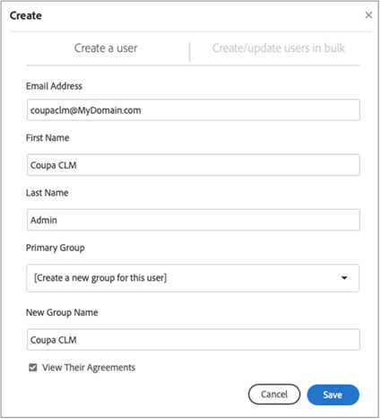
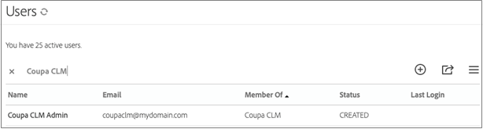
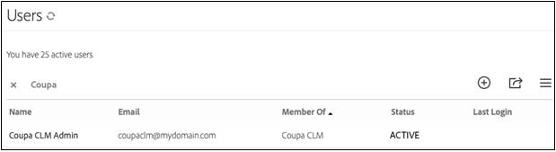
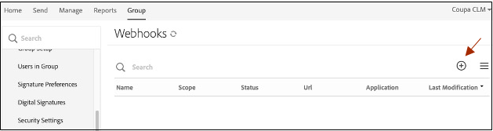
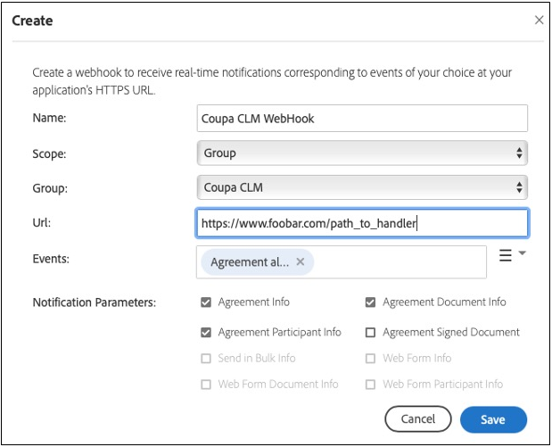
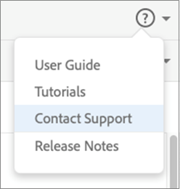

# [!DNL Coupa] Guide d’installation{#coupa-installation-guide}

[**Contacter le support technique Adobe Sign**](https://adobe.com/go/adobesign-support-center_fr)

## Présentation {#overview}

Ce document explique comment configurer votre compte Adobe Sign pour l’intégrer [!DNL Coupa BSM Suite] pour obtenir des signatures.

Conditions préalables:

* Abonnement à Adobe Sign Enterprise, [Adobe Sign édition Developer](https://www.adobe.com/sign/developer-form.html), ou [Essai d’Adobe Sign Enterprise](https://www.adobe.com/sign/business.html)
* Accès administrateur Adobe Sign
* [!DNL Coupa BSM Suite] Instance standard ou avancée

Les étapes générales pour terminer l’intégration sont les suivantes :

* Configuration d’un groupe Adobe Sign pour une utilisation avec [!DNL Coupa BSM Suite]
* Connect [!DNL Coupa BSM Suite] vers Adobe Sign
* Création d’un webhook Adobe Sign pour notifier votre [!DNL Coupa BSM Suite] instance

## Configurer le groupe Adobe Sign pour [!DNL Coupa BSM Suite] {#configure-adobe-sign-for-coupa}

Pour avoir une utilisation dédiée d’Adobe Sign pour [!DNL Coupa] au sein d’une organisation, les administrateurs doivent créer un groupe Adobe Sign spécifiquement pour [!DNL Coupa BSM Suite] utilisation. Ce groupe Adobe Sign doit avoir un seul compte d’utilisateur administrateur de groupe qui agit en tant que compte de service. Ce compte de service étant utilisé pour toutes les demandes de signature, il doit rester anonyme, par exemple, `Legal@xyz.com`, `Purchasing@xyz.com`, ou `CoupaCLM@xyz.com`, plutôt que personnel, tel que `Bob.Smith@xyz.com`.

### Création d’un groupe et d’un utilisateur dans Adobe Sign {#create-sign-user-group}

Création d’un utilisateur dans Adobe Sign :

1. Connectez-vous à Adobe Sign en tant qu’administrateur de compte.
1. Accédez à **[!UICONTROL Compte]** > **[!UICONTROL Utilisateurs]**.
1. Pour créer un nouvel utilisateur, cliquez sur le bouton  s’affiche.
1. Dans la boîte de dialogue qui s’ouvre, indiquez les détails du nouvel utilisateur :

   1. Fournissez une adresse e-mail fonctionnelle à laquelle vous pouvez accéder.

      * Cet utilisateur établit et gère la relation OAuth.
      * L’adresse électronique doit être une adresse réelle pour la vérification.
   1. Saisissez les valeurs appropriées pour [!UICONTROL Prénom] et [!UICONTROL Nom].
   1. Dans le [!UICONTROL Groupe principal] , sélectionnez **[!UICONTROL Créer un groupe pour cet utilisateur]**.
   1. Dans le [!UICONTROL Nouveau nom de groupe] , fournissez un nom de groupe intuitif tel que *[!DNL Coupa BSM Suite]*.

   

1. Sélectionner **[!UICONTROL Enregistrer]**.

   Une fois que vous avez enregistré les détails, la boîte de dialogue [!UICONTROL Utilisateurs] affiche le nouvel utilisateur avec un [!UICONTROL CRÉÉ] état.

   

   La [!UICONTROL CRÉÉ] indique que l’utilisateur n’a pas encore vérifié son adresse électronique.

1. Pour vérifier l’adresse électronique :
   1. Connectez-vous à l’adresse e-mail du nouvel utilisateur.
   2. Recherchez l’e-mail &quot;Bienvenue dans Adobe Sign&quot;. Vérifiez les dossiers de spam/courrier indésirable si nécessaire.
   3. Cliquez sur le lien **[!UICONTROL Cliquez ici pour définir votre mot de passe]**.
   4. Saisissez votre mot de passe..

   Une fois que vous avez vérifié l’adresse électronique, l’état de l’utilisateur change de [!UICONTROL CRÉÉ] à [!UICONTROL ACTIVE].

   

### Définition de l’utilisateur authentifiant {#define-authenticating-user}

Une fois que vous avez créé un groupe et un utilisateur dans ce groupe, vous devez faire de l’utilisateur un &quot;Administrateur de groupe&quot;.

Pour promouvoir le nouvel utilisateur dans le [!DNL Coupa BSM Suite] groupe :

1. Accédez à l’onglet [!UICONTROL Utilisateurs] (si ce n’est pas déjà fait).
2. Cliquez deux fois sur l’utilisateur.

   Cela ouvre un [!UICONTROL Modifier] pour les autorisations utilisateur.

3. Dans la section Appartenance au groupe , sélectionnez l’option **[!UICONTROL Administrateur de groupe]** et **[!UICONTROL Peut envoyer]** options.
4. Désélectionnez la **[!UICONTROL L’utilisateur est administrateur du compte]** et **[!UICONTROL L’utilisateur peut signer des documents]** options.
5. Cliquez sur **[!UICONTROL Enregistrer]**.

   

## Configurez le fichier [!DNL Coupa BSM Suite] instance {#configure-coupa}

Pour terminer la connexion entre le [!DNL Coupa BSM Suite ] et Adobe Sign, une relation de confiance doit être établie entre les services.

Pour configurer le fichier [!DNL Coupa BSM Suite]:

1. Connectez votre [!DNL Coupa BSM Suite] à votre compte de service Adobe Sign que vous avez créé ci-dessus.
1. Créez une instance de webhook Adobe Sign pour informer votre instance Coupa BSM Suite des mises à jour des accords.

Pour plus d’informations sur la connexion du [!DNL Coupa BSM Suite] et comment créer et enregistrer un webhook, consultez [Documentation de support pour Adobe Sign Coupa BSM Suite Instance](https://success.coupa.com/Support/Docs/Power_Apps/CLM_Standard/Signing_and_Approvals/Enable_E-Signatures_Through_Adobe_Sign_and_DocuSign){target=&quot;_blank&quot;}.

## Créer [!DNL Webhook] dans Adobe Sign {#create-webhook}

L’intégration Coupa CLM utilise des notifications webhook d’Adobe Sign pour envoyer des mises à jour sur l’état de l’accord. Il est essentiel de terminer la configuration du webhook. Sinon, les accords envoyés pour signature restent incomplets ou les accords signés ne sont pas renvoyés à Coupa CLM.

Pour créer un webhook dans Adobe Sign :

1. Connectez-vous à Adobe Sign à l’aide de l’utilisateur administrateur de groupe créé ci-dessus, par exemple `coupaclm@MyDomain.com`.

1. Accédez à **Groupes** > **Webhooks**.

   

1. Pour créer une connexion, sélectionnez l&#39;option  s’affiche.

1. Dans la boîte de dialogue Créer qui s’ouvre, renseignez les champs requis.

   **Remarque :** Vous devez obtenir l’URL du gestionnaire de webhook auprès de Coupa.

   

1. Sélectionnez les paramètres de notification requis.

1. Sélectionner **Enregistrer**.

## Assistance technique {#support}

### [!DNL Coupa BSM Suite] support {#coupa-support}

[!DNL Coupa BSM Suite ] est le propriétaire de l’intégration et doit être votre premier point de contact pour toute question concernant l’étendue de l’intégration, les demandes de fonctionnalités ou les problèmes liés au fonctionnement quotidien de l’intégration.

Pour toute question, contactez [Support Coupa](https://success.coupa.com/Support/Welcome_to_Coupa_Support){target=&quot;_blank&quot;}.

### Support Adobe Sign {#adobe-sign-support}

Adobe Sign est le partenaire de l’intégration et doit être contacté si l’intégration ne parvient pas à obtenir des signatures ou si la notification des signatures en attente échoue.

Pour obtenir de l’aide sur l’utilisation ou la configuration d’Adobe Sign, vous pouvez contacter votre responsable du succès client (CSM) ou contacter [Support Adobe Sign](https://adobe.com/go/adobesign-support-center).

Les administrateurs Adobe Sign peuvent également ouvrir des tickets et obtenir de l’aide via le menu Aide (?) dans le coin supérieur droit du portail Adobe Sign.

