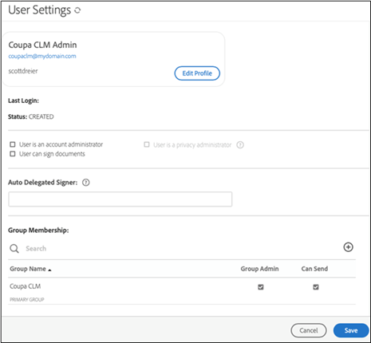

# [!DNL Coupa] Guide d’installation{#coupa-installation-guide}

[**Contacter le support technique Adobe Sign**](https://adobe.com/go/adobesign-support-center_fr)

## Présentation {#overview}

Ce document explique comment configurer votre compte Adobe Sign afin d’intégrer [!DNL Coupa BSM Suite] l’instance pour obtenir des signatures.

Conditions préalables:

* Abonnement à Adobe Sign Enterprise, [Adobe Sign Developer Edition](https://www.adobe.com/sign/developer-form.html) ou [Adobe Sign Enterprise Trial](https://www.adobe.com/sign/business.html)
* Accès administrateur Adobe Sign
* [!DNL Coupa BSM Suite] Instance standard ou avancée

Les étapes de haut niveau permettant de terminer l’intégration sont les suivantes :

* Configurer un groupe Adobe Sign pour une utilisation avec [!DNL Coupa BSM Suite]
* Connecter [!DNL Coupa BSM Suite] à Adobe Sign
* Créer un webhook Adobe Sign pour notifier votre instance [!DNL Coupa BSM Suite]

## Configurer le groupe Adobe Sign pour [!DNL Coupa BSM Suite] {#configure-adobe-sign-for-coupa}

Pour avoir une utilisation dédiée d&#39;Adobe Sign pour [!DNL Coupa] au sein d&#39;une organisation, les administrateurs doivent créer un groupe Adobe Sign spécifique pour l&#39;utilisation de [!DNL Coupa BSM Suite]. Ce groupe Adobe Sign doit avoir un compte d&#39;utilisateur administrateur de groupe unique qui agit comme compte de service. Étant donné que ce compte de service est utilisé pour toutes les demandes de signature, il doit être conservé anonyme, par exemple, `Legal@xyz.com`, `Purchasing@xyz.com` ou `CoupaCLM@xyz.com`, plutôt que personnel, tel que `Bob.Smith@xyz.com`.

### Création d’un groupe et d’un utilisateur dans Adobe Sign {#create-sign-user-group}

Création d’un utilisateur dans Adobe Sign :

1. Connectez-vous à Adobe Sign en tant qu’administrateur de compte.
1. Accédez à **[!UICONTROL Compte]** > **[!UICONTROL Utilisateurs]**.
1. Pour créer un nouvel utilisateur, cliquez sur l’icône .
1. Dans la boîte de dialogue qui s’ouvre, fournissez les détails du nouvel utilisateur :

   1. Fournissez un courrier électronique fonctionnel auquel vous pouvez accéder.

      * Cet utilisateur établit et conserve la relation OAuth.
      * L’adresse électronique doit être une adresse réelle à vérifier.
   1. Entrez les valeurs appropriées pour [!UICONTROL Prénom] et [!UICONTROL Nom].
   1. Dans le champ [!UICONTROL Groupe principal], sélectionnez **[!UICONTROL Créer un groupe pour cet utilisateur]**.
   1. Dans le champ [!UICONTROL Nouveau nom de groupe], indiquez un nom de groupe intuitif tel que *[!DNL Coupa BSM Suite]*.

   

1. Sélectionnez **[!UICONTROL Enregistrer]**.

   Une fois que vous avez enregistré les détails, la page [!UICONTROL Utilisateurs] affiche le nouvel utilisateur avec un état [!UICONTROL CREATED].

   

   L&#39;état [!UICONTROL CREATED] indique que l&#39;utilisateur n&#39;a pas encore vérifié son adresse électronique.

1. Pour vérifier l’adresse électronique :
   1. Connectez-vous à l’adresse e-mail du nouvel utilisateur.
   2. Recherchez l’e-mail &quot;Bienvenue dans Adobe Sign&quot;. Si nécessaire, vérifiez les dossiers spam/junk.
   3. Cliquez sur le lien **[!UICONTROL Cliquez ici pour définir votre mot de passe]**.
   4. Saisissez votre mot de passe..

   Une fois l’adresse électronique vérifiée, l’état de l’utilisateur passe de [!UICONTROL CREATED] à [!UICONTROL ACTIVE].

   

### Définition de l’utilisateur d’authentification {#define-authenticating-user}

Une fois que vous avez créé un groupe et un utilisateur dans ce groupe, vous devez faire de l’utilisateur un &quot;administrateur de groupe&quot;.

Pour promouvoir le nouvel utilisateur dans le groupe [!DNL Coupa BSM Suite] :

1. Accédez à la page [!UICONTROL Utilisateurs] (si ce n&#39;est pas déjà fait).
2. Cliquez deux fois sur l’utilisateur.

   Il ouvre une page [!UICONTROL Modifier] pour les autorisations utilisateur.

3. Dans la section Appartenance au groupe, sélectionnez les options **[!UICONTROL Administrateur de groupe]** et **[!UICONTROL Droits d’envoi]**.
4. Désélectionnez les options **[!UICONTROL L’utilisateur est un administrateur de compte]** et **[!UICONTROL L’utilisateur peut signer des documents]**.
5. Cliquez sur **[!UICONTROL Enregistrer]**.

   

## Configuration de l&#39;instance [!DNL Coupa BSM Suite] {#configure-coupa}

Pour terminer la connexion entre l&#39;instance [!DNL Coupa BSM Suite ] et Adobe Sign, une relation de confiance doit être établie entre les services.

Pour configurer [!DNL Coupa BSM Suite] :

1. Connectez votre instance [!DNL Coupa BSM Suite] à votre compte de service Adobe Sign que vous avez créé ci-dessus.
1. Créez une instance de webhook Adobe Sign pour informer votre instance Coupa BSM Suite des mises à jour des accords.

Pour plus d&#39;informations sur la connexion de [!DNL Coupa BSM Suite] et sur la création et l&#39;enregistrement du webhook, consultez la [documentation de support de l&#39;instance de suite Adobe Sign Coupa BSM](https://success.coupa.com/Support/Docs/Power_Apps/CLM_Standard/Signing_and_Approvals/Enable_E-Signatures_Through_Adobe_Sign_and_DocuSign){target=&quot;_blank&quot;}.

## Créer [!DNL Webhook] dans Adobe Sign {#create-webhook}

L’intégration Coupa CLM utilise des notifications de webhook d’Adobe Sign pour envoyer des mises à jour sur l’état de l’accord. Il est essentiel de finaliser la configuration du webhook, faute de quoi les accords envoyés pour signature restent incomplets ou les accords signés ne sont pas renvoyés dans Coupa CLM.

Pour créer un webhook dans Adobe Sign :

1. Connectez-vous à Adobe Sign à l’aide de l’utilisateur administrateur de groupe créé ci-dessus, par exemple `coupaclm@MyDomain.com`.

1. Accédez à **Groupes** > **Webhooks**.

   

1. Pour créer une connexion, sélectionnez l’icône .

1. Dans la boîte de dialogue Créer qui s’ouvre, renseignez les champs requis.

   **Remarque :** Vous devez obtenir l’URL du gestionnaire de webhook auprès de Coupa.

   

1. Sélectionnez les paramètres de notification requis.

1. Sélectionnez **Enregistrer**.

## Assistance technique {#support}

### [!DNL Coupa BSM Suite] support {#coupa-support}

[!DNL Coupa BSM Suite ] est le propriétaire de l’intégration et doit être votre premier point de contact pour les questions sur l’étendue de l’intégration, les demandes de fonctionnalités ou les problèmes dans la fonction quotidienne de l’intégration.

Pour toute question, contactez le [Support Coupa](https://success.coupa.com/Support/Welcome_to_Coupa_Support){target=&quot;_blank&quot;}.

### Prise en charge d’Adobe Sign {#adobe-sign-support}

Adobe Sign est le partenaire de l’intégration et doit être contacté si l’intégration n’obtient pas les signatures ou si la notification des signatures en attente échoue.

Pour obtenir de l’aide sur l’utilisation ou la configuration d’Adobe Sign, vous pouvez contacter votre responsable clientèle (CSM) ou contacter le [support Adobe Sign](https://adobe.com/go/adobesign-support-center).

Les administrateurs Adobe Sign peuvent également ouvrir des tickets et obtenir de l’aide via l’aide (?) en haut à droite du portail Adobe Sign.

