# [!DNL NetSuite] Guide d’installation et de personnalisation (v4.0.4) {#install-customize-NetSuite}

## Présentation {#overview}

Adobe Sign pour [!DNL NetSuite] fournit une intégration complète de la signature électronique avec [!DNL NetSuite]. Vous pouvez utiliser Adobe Sign pour [!DNL NetSuite] intégration pour envoyer des accords tels que des contrats, des devis et d’autres documents, qui nécessitent des signatures électroniques, aux destinataires directement à partir de [!DNL NetSuite]. Vous pouvez créer et envoyer des accords Adobe Sign à partir d’un client, d’un prospect, d’un devis et d’autres [!DNL NetSuite] enregistrements. Mises à jour Adobe Sign [!DNL NetSuite] avec l’état des accords et stocke les accords avec les [!DNL NetSuite] une fois qu’ils ont été entièrement exécutés. Vous pouvez afficher l’historique de tous les accords envoyés depuis [!DNL NetSuite] depuis le produit.

Reportez-vous à la section [Adobe Sign pour [!DNL NetSuite] notes de mise à jour](https://experienceleague.adobe.com/docs/sign-integrations/using/netsuite/release-notes.html?lang=en) pour plus d’informations.

## Installation de l’offre groupée et configuration d’OAuth {#install}

Seulement un [!DNL NetSuite] l’administrateur peut installer ou mettre à jour le regroupement. Pour configurer OAuth, le noeud [!DNL NetSuite] l’administrateur doit avoir un accès administrateur à Adobe Sign. Avant d’installer l’offre groupée dans votre compte Production, vous devez installer et tester l’offre groupée dans un fichier [!DNL NetSuite] Compte Sandbox.

Voir [Création d’un accord Adobe Sign](#createagreement) pour plus d’informations sur les tests.

>[!CAUTION]
>
>Les clients effectuant une mise à niveau vers la version 4.0.4 NE DOIVENT PAS supprimer leur clé d’API existante.
>
>Voir [Définition des préférences personnalisées](#configure) pour plus d’informations sur l’utilisation de la clé d’API.

### Installer l’offre groupée pour la première fois

1. Accédez à [!UICONTROL **Personnalisation > SuiteBundler > Rechercher et installer une offre groupée**].

1. Sur la *Recherche et installation de packs* , saisissez **Adobe Sign** comme mot-clé et sélectionnez **[!UICONTROL Rechercher]**.

1. Sélectionnez l’option **Adobe Sign** nom du regroupement.

   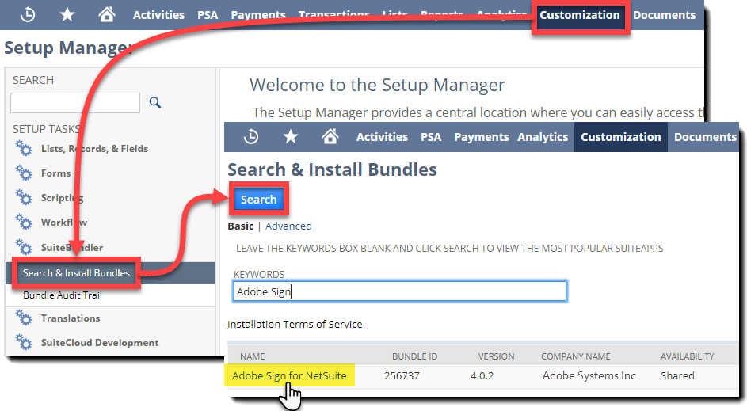

1. Sur la *[!UICONTROL Détails du lot]* , sélectionnez **[!UICONTROL Installer]**.
1. Dans la boîte de dialogue *[!UICONTROL Aperçu de l’installation du lot]* , sélectionnez **[!UICONTROL Installer le regroupement]**.

   (Il n’est pas nécessaire de modifier les valeurs par défaut sur la page)

   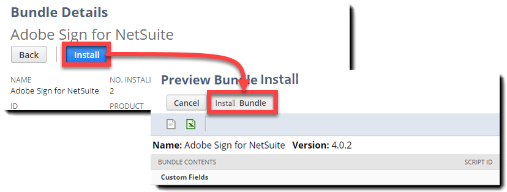

1. Dans la boîte de dialogue Installer qui s’affiche, sélectionnez **[!UICONTROL OK]** pour continuer.

   Pendant le processus d’installation, l’offre groupée affiche le statut *[!UICONTROL En attente]*.

   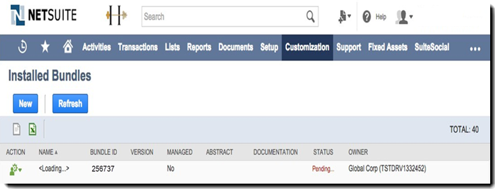

1. Pour afficher un état mis à jour, sélectionnez **[!UICONTROL Actualiser]**.

   Une fois l’installation de l’offre groupée terminée, *Adobe Sign pour[!DNL NetSuite]* s’affiche sur la page *[!UICONTROL Offres groupées installées]*.

   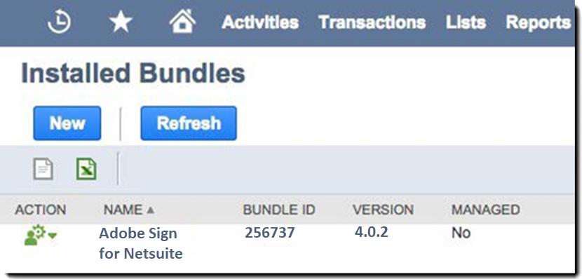

1. Si vous êtes déjà un compte client Adobe Sign, suivez les étapes pour  [Configuration d’OAuth après l’installation ou la mise à niveau](#oauth).

   Si vous n’avez pas de compte Adobe Sign, vous pouvez [abonnement Entreprise version d’évaluation](https://esign.adobe.com/adobe-sign-)[!DNL NetSuite]-trial-registration.html) pour tester le système. Suivez les étapes d’enregistrement en ligne pour activer votre compte Adobe Sign.

## Configuration d’OAuth après l’installation ou la mise à niveau {#oauth}

Adobe Sign utilise Oauth 2.0 pour authentifier votre compte Adobe Sign dans [!DNL NetSuite].

Ce protocole autorise votre installation [!DNL NetSuite] pour communiquer avec Adobe Sign sans demander votre mot de passe. Dans la mesure où les informations sensibles ne sont pas directement partagées entre les applications, votre compte est moins susceptible d’être piraté.

Cette authentification n’a aucune incidence sur votre mise en oeuvre, mais vous devez effectuer une configuration unique après avoir installé ou mis à niveau l’offre groupée dans votre compte Production ou Sandbox.

Le [!DNL NetSuite] l’administrateur qui configure OAuth doit également disposer d’un accès administrateur au niveau du compte pour Adobe Sign.

1. Entrée [!DNL NetSuite], accédez à la section *Adobe Sign Config* page de liste.

1. Rechercher **[!UICONTROL Adobe Sign Config]** (type d’enregistrement personnalisé) à l’aide du champ Rechercher dans l’en-tête.

1. Dans la page Résultats de la recherche, sélectionnez **Affichage** pour la *Adobe Sign Config* enregistrement.

   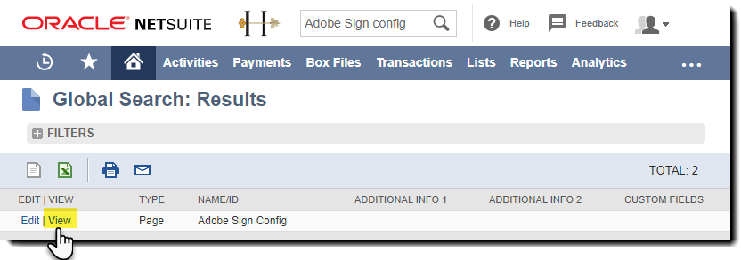.

1. Sur la page Adobe Sign Config List, sélectionnez **[!UICONTROL Affichage]** pour la *Utilisation d’OAuth pour accéder aux API Adobe Sign* enregistrement.

   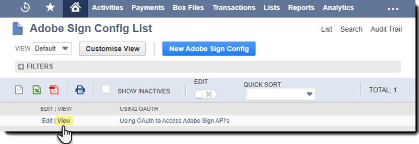

1. Sur la page Adobe Sign Config, sélectionnez **[!UICONTROL Connexion avec Adobe Sign]**

   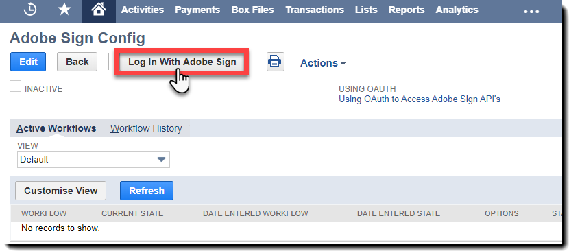

1. Dans la page de connexion Adobe Sign qui s’affiche, entrez vos informations d’identification et sélectionnez **[!UICONTROL Se connecter]**.

   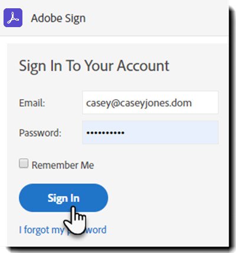

1. Dans la page Confirmer l’accès (pour OAuth) qui s’affiche, sélectionnez **[!UICONTROL Autoriser l&#39;accès]**

   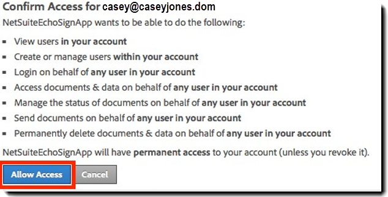

1. Une fois l’autorisation terminée, vous êtes redirigé vers la page Adobe Sign Config d’dans [!DNL NetSuite], comme indiqué ci-dessous.

   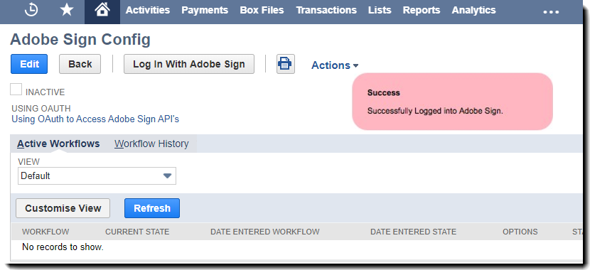

   >[!NOTE]
   >
   >Lorsque vous configurez OAuth dans votre compte Sandbox, vous risquez de rencontrer l’erreur &quot;Impossible de déterminer l’ID de composition du client&quot; une fois l’autorisation terminée.
   >
   >
   >Pour continuer, vous devez modifier la partie du domaine du compte de l’URL (système).[!DNL NetSuite].com) dans votre navigateur pour renvoyer à la [!DNL NetSuite] Sandbox comme suit :
   >
   >
   >Changer:
   >
   >
   >system.[!DNL NetSuite].com/app/site/hosting/scriptlet.nl?script=745&amp;ployer=1&amp;web_access_point=https://echosign.com
   >
   >
   >À :
   >
   >
   >système.**sandbox.**[!DNL NetSuite].com/app/site/hosting/scriptlet.nl?script=745&amp;ployer=1&amp;web_access_point=https://echosign.com

## Mettre à jour le regroupement (utilisateurs existants)

[!DNL NetSuite] les mises à jour groupées sont publiées régulièrement par Adobe. Utilisateurs existants de l’Adobe Sign pour [!DNL NetSuite] l’intégration peut être mise à jour vers la dernière offre groupée.

>[!CAUTION]
>
>Les clients effectuant une mise à niveau vers une version plus récente ne doivent PAS supprimer leur clé API existante.
>
>Voir [Définition des préférences personnalisées ](#configure)pour plus d’informations sur l’utilisation de la clé API.

### Conditions préalables {#prerequisites}

Le temps requis pour la mise à jour vers l’offre groupée v4.0.4 dépend du nombre d’accords qui ont actuellement l’état &quot;Émis pour signature&quot;. En général, la mise à jour de 100 accords prend entre 7 et 10 minutes. Notez le nombre d’enregistrements pour estimer le temps de mise à jour.

Pour déterminer le nombre d’accords envoyés pour signature :

1. Accédez à **[!UICONTROL Personnalisation > Listes, enregistrements et fichiers > Types d’enregistrement]**, puis localisez *Accord Adobe Sign.*

   Ou recherchez les accords Adobe Sign dans la barre de recherche.

1. Pour [!UICONTROL Accords Adobe Sign] enregistrement, sélectionnez **[!UICONTROL Rechercher]**.

   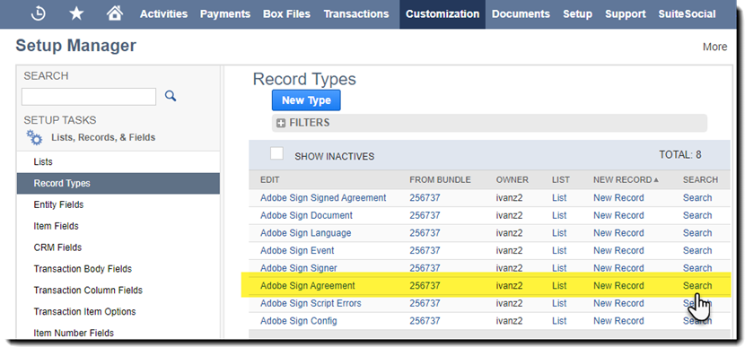

1. De **[!UICONTROL Statut]** , sélectionnez **[!UICONTROL Émis pour signature]** puis sélectionnez **[!UICONTROL Envoyer]**.

   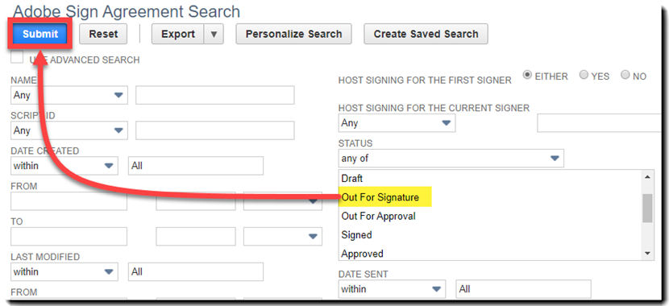

   Notez le nombre d’enregistrements pour estimer le temps de mise à jour.

   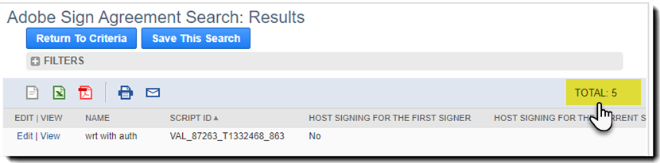

### Mettre à jour l’offre groupée {#updating-the-bundle}

1. Accédez à **[!UICONTROL Personnalisation > SuiteBundler > Recherche et installation > Liste]** et localisez votre offre groupée actuelle, comme illustré ci-dessous.

   >[!NOTE]
   >
   >S’il existe une nouvelle version de l’offre groupée, une icône de point d’exclamation s’affiche à droite de la *Version* numéro de votre offre groupée actuelle.

1. Dans le menu déroulant Action, sélectionnez **[!UICONTROL Mettre à jour]**.

   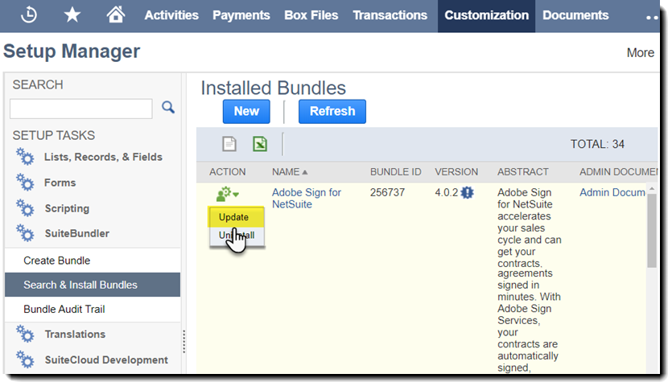

1. Sur la page Aperçu de la mise à jour de l’offre groupée, sélectionnez **[!UICONTROL Mettre à jour le regroupement]** sans modifier les valeurs par défaut affichées sur la page.

   Pendant l’installation, le statut de l’offre groupée s’affiche comme *En attente*.

   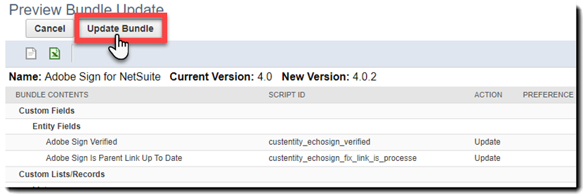.

   >[!NOTE]
   >
   >Lors de la mise à jour de l’offre groupée, un message d’avertissement peut s’afficher, comme illustré ci-dessous. Si vous n’avez pas personnalisé votre [!DNL NetSuite] Enregistrements de signature électronique, vous pouvez continuer. Si vous n’êtes pas sûr, il est recommandé d’installer l’offre groupée sur un compte Sandbox pour la tester en premier avant de mettre à jour l’offre groupée dans un compte de production.

   

1. Pour afficher un état mis à jour, sélectionnez **[!UICONTROL Actualiser]**.

   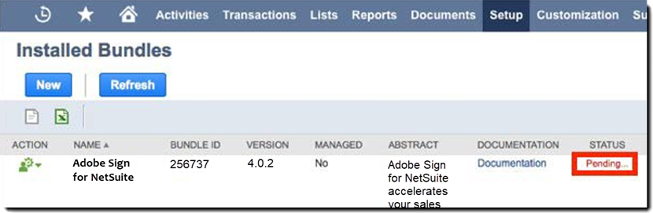

   >[!NOTE]
   >
   >Si la mise à jour prend du temps en raison de plusieurs accords avec un *Émis pour signature* , vous pouvez vérifier la **[!UICONTROL Journal d&#39;exécution]** sous-onglet pour le *Installation du lot Adobe Sign* pour déterminer la progression de votre mise à jour. Voir [Détermination de la progression de la mise à jour ](#determineprogress)pour plus d’informations.

   Une fois la mise à jour de l’offre groupée terminée, *Adobe Sign pour[!DNL NetSuite]* s’affiche sur la page *Offres groupées installées*.

   

## Configuration de l’offre groupée {#configure}

### Définition des préférences personnalisées  {#set-custom-preferences}

Vous pouvez utiliser des préférences personnalisées pour spécifier la façon dont les accords sont créés et stockés dans [!DNL NetSuite]. En outre, la préférence *Configurer automatiquement l’utilisateur dans Adobe Sign*[!DNL NetSuite] vous permet de spécifier si les utilisateurs de sont configurés automatiquement dans les services Sign lorsqu’ils envoient des accords depuis [!DNL NetSuite].

1. Accédez à **[!UICONTROL Configuration > Société > Préférences générales]**.
1. Faites défiler la page vers le bas, puis sélectionnez l’option **[!UICONTROL Préférences personnalisées]** sous-onglet.

   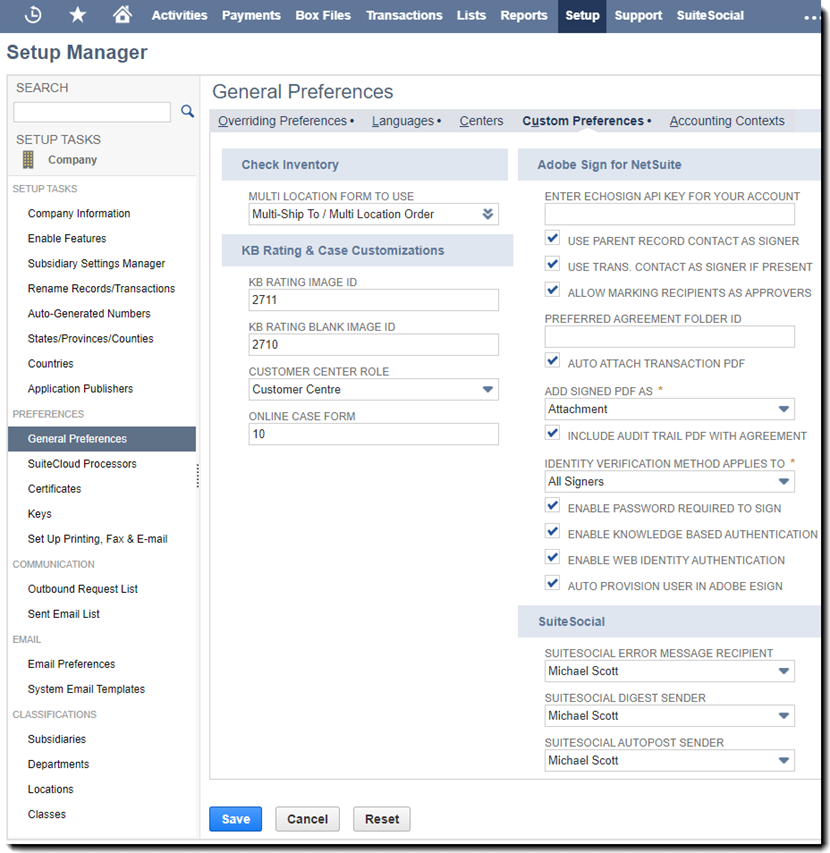

1. Activez et configurez vos préférences Adobe Sign selon vos besoins :

   * **Entrez la clé d’API EchoSign pour votre compte.**: N’ajoutez ou ne modifiez aucune valeur dans ce champ.
   * **Utiliser le contact d’enregistrement parent comme signataire**: Si cette option est activée, le contact de l’enregistrement parent est le premier signataire par défaut lors de la création des accords. L’expéditeur peut facilement supprimer ou modifier le signataire par défaut ou ajouter des signataires supplémentaires à l’accord avant l’envoi.
   * **Utiliser le contact de transaction S’il est présent, contacter en tant que signataire**: Cette préférence n’est valide que si la *Utiliser le contact d’enregistrement parent comme signataire* est également activée. Si cette option est activée, lors de la génération d’un accord à partir d’un enregistrement de transaction (par exemple, Devis), le contact de transaction principal est le premier signataire par défaut. Pour plus d’informations, voir[ Enregistrements de transaction. ](#transrecords) S&#39;il n&#39;y a pas de contact de transaction principal ou si l&#39;envoi de [!DNL NetSuite] enregistrement d’objet (par exemple, enregistrement client, enregistrement partenaire), le destinataire par défaut est le contact principal de l’adresse électronique du client. L’expéditeur peut facilement supprimer ou modifier le signataire par défaut ou ajouter des signataires supplémentaires à l’accord avant l’envoi.
   * **Autoriser le marquage des destinataires en tant qu’approbateurs**: Si cette option est activée, les expéditeurs peuvent marquer les destinataires comme des approbateurs. Les destinataires marqués comme approbateurs peuvent réviser et approuver les accords, mais ils ne sont pas tenus de les signer. Les approbateurs peuvent être tenus de saisir des données dans les champs pendant le processus d’approbation.
   * **ID de dossier d’accord préféré**: Permet de spécifier le dossier dans lequel sont stockés les accords signés définitifs. Si vous ne définissez pas de valeur pour ce champ, les accords signés finaux sont enregistrés par défaut dans le même dossier que le fichier du document d’origine. L’ID de dossier doit être un nombre.
   * **Joindre automatiquement le PDF de transactions**: Si cette option est activée, les PDF de transaction sont automatiquement joints aux accords lorsque de nouveaux accords sont créés à partir d’enregistrements de transaction.
   * **Ajouter un PDF signé en tant que (pièce jointe ou lien)**: Si *Liste* est sélectionné dans la liste déroulante, le PDF signé est automatiquement ajouté en tant que lien vers le fichier. Si l’option *Pièce jointe* est sélectionnée dans la liste déroulante, le fichier PDF signé est stocké dans en tant que pièce jointe dans l’enregistrement de l’accord.[!DNL NetSuite]
   * **Inclure le PDF de piste d’audit avec l’accord**: Si cette option est activée, les PDF de piste d’audit sont automatiquement joints aux enregistrements d’accord une fois les accords signés.
   * **La méthode de vérification de l’identité s’applique à**: L’activation de l’une des méthodes de vérification de l’identité détermine à qui la méthode de vérification de l’identité est appliquée. Les options disponibles sont les suivantes : *Tous les signataires, signataires externes uniquement*, ou *Signataires internes uniquement*.

   **Méthodes de vérification de l’identité** {#identity-verification-methods}

   La ou les méthodes de vérification de l’identité activées peuvent être sélectionnées lors de la création d’un accord. Si plusieurs méthodes de vérification de l’identité sont activées ici, la page Accord Adobe Sign affiche un **[!UICONTROL Vérifier l’identité des signataires]** option.

   * **Activer le mot de passe requis pour la signature**: Demandez aux signataires de saisir un mot de passe unique que vous spécifiez.

   * **Activer l’authentification fondée sur les connaissances**: Demander aux signataires de fournir leur nom, adresse et éventuellement les quatre derniers chiffres de leur numéro d’identification unique, puis de répondre à une liste de questions vérifiant les informations qu’ils ont fournies. Disponible uniquement aux États-Unis.

   * **Activer l&#39;authentification d&#39;identité Web**: Demandez aux signataires de vérifier leur identité en se connectant à l’un des sites suivants : Facebook, Google, LinkedIn, Microsoft Live, Twitter, ou Yahoo !

   * **Configuration automatique des utilisateurs dans Adobe Sign**: Si cette option est activée, les utilisateurs qui envoient des accords dans [!DNL NetSuite] sont automatiquement configurés avec un compte utilisateur Adobe Sign.

1. Sélectionner **[!UICONTROL Enregistrer]** pour enregistrer vos préférences.

## Configuration des mises à jour d’état automatiques {#asu}

L’offre groupée d’intégration Adobe Sign vous permet de recevoir automatiquement des mises à jour dans [!DNL NetSuite] concernant l’état des accords qui ont été envoyés depuis [!DNL NetSuite]. Lorsque cette fonction est activée, [!DNL NetSuite] reflète toujours le statut de vos accords. Vous pouvez activer les mises à jour automatiques de statut comme suit :

1. Accédez à **[!UICONTROL Configuration > Société > Activer les fonctionnalités].**
1. Sélectionnez l’option **[!UICONTROL SuiteCloud]** sous-onglet.
1. Activez les options suivantes :

   * Dans la section SuiteBuilder, activez l’option **[!UICONTROL Enregistrements personnalisés]**.

   * Dans la section SuiteScript, activez les options **[!UICONTROL Client SuiteScript]** et **[!UICONTROL Serveur SuiteScript]** et acceptez les conditions d’utilisation pour les deux.

1. Sélectionner **[!UICONTROL Enregistrer]**.

   Vos options sont définies comme illustré dans l’image.

   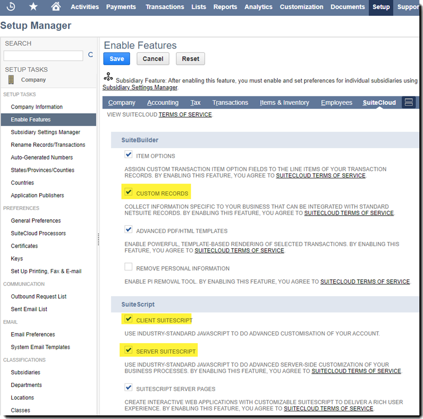

## Objets et types d’enregistrement {#objects}

Le regroupement d’intégration Adobe Sign expose déjà l’objet Accord Adobe Sign avec de nombreuses normes [!DNL NetSuite] objets, y compris : Enregistrements client, estimation, piste, opportunité et partenaire. Vous pouvez également utiliser l’offre groupée Adobe Sign avec d’autres types d’enregistrements, y compris des enregistrements personnalisés.

L’onglet Accord peut s’afficher avec deux types de [!DNL NetSuite] enregistrements : Enregistrements d&#39;entité et de transaction. Nous supposons généralement qu&#39;un enregistrement de transaction est un enregistrement (tel qu&#39;un devis) qui peut être converti en document PDF ; alors qu&#39;un enregistrement d&#39;entité ne peut pas être converti en PDF.

## Enregistrements de transactions {#transrecords}

Si l’accord est créé à partir d’un enregistrement de transaction, le premier document de l’enregistrement de l’accord est la version PDF de l’enregistrement d’où il provient et le premier destinataire est l’adresse électronique de l’enregistrement. Si vous ne souhaitez pas que le premier document soit une version PDF de l’enregistrement d’origine, accédez à la section **[!UICONTROL Configuration > Société > Préférences générales > Sous-onglet Préférences personnalisées]** et désactivez la **[!UICONTROL Joindre automatiquement le PDF de transactions]** option. Voir [Définition des préférences personnalisées](#configure) pour plus d’informations.

Sous Préférences personnalisées, vous pouvez également activer la préférence **[!UICONTROL Utiliser le contact de transaction comme premier signataire]** si vous souhaitez que le contact de transaction principal soit automatiquement ajouté en tant que premier signataire. Lorsqu’il est associé à un enregistrement de transaction, il affiche la **[!UICONTROL Accords]** et **[!UICONTROL Send for Signature]** boutons.

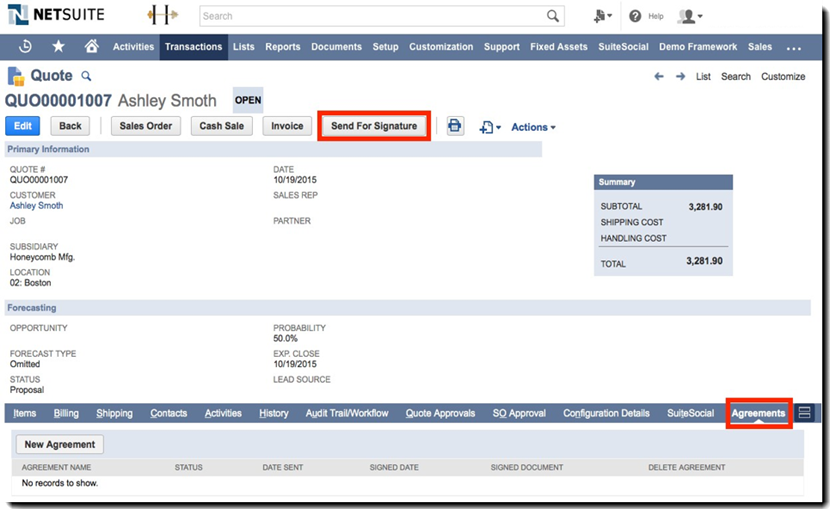

## Enregistrements d’entités {#entity-records}

Si l’accord est créé à partir d’un enregistrement d’entité, le premier destinataire est l’adresse électronique de l’enregistrement. Lorsqu’il est associé à un enregistrement d’entité, seul l’onglet Accords s’affiche.

## Personnalisation de l’offre groupée {#customize}

La personnalisation de l’offre groupée comprend les éléments suivants :

* Déploiement des scripts pour le sous-onglet Accords  et le bouton Envoyer pour signature pour les types d’enregistrement appropriés.
* Définition des autorisations de rôle pour vos types d’enregistrements Adobe Sign.
* Modification des autorisations pour accorder l’accès au sous-onglet *Accords* et au bouton *Envoyer pour signature*.

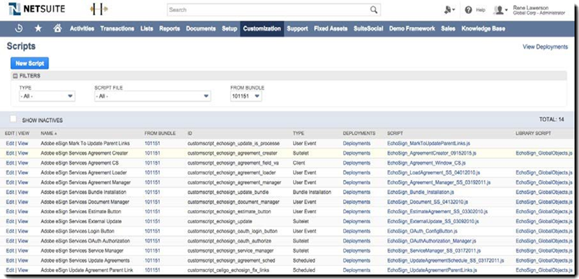

### Configuration des accords Adobe Sign pour d’autres types d’enregistrements  {#configuring-adobe-sign-agreements-for-additional-record-types}

Pour déployer le *Accords* sous-onglet et *Send for Signature* pour les types d’enregistrements appropriés :

1. Accédez à **[!UICONTROL Personnalisation > Génération de scripts > Scripts].**

1. Sur la *Scripts* qui s’affiche, recherchez le script à déployer, puis sélectionnez ****[!UICONTROL Affichage]****.

   * Pour ajouter l’attribut *Send for Signature* bouton, sélectionnez **[!UICONTROL Bouton d&#39;estimation Adobe Sign]** script.

   * Pour ajouter l’attribut *Accords* , sélectionnez **[!UICONTROL Chargeur d’accords Adobe Sign]** script.

1. Sur la page Script, sélectionnez **[!UICONTROL Déployer le script]**.

   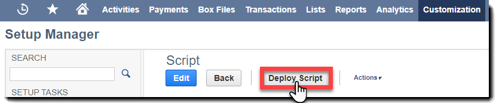

1. Sur la page Déploiement du script, procédez comme suit :

   * Dans la liste *S’applique à*, sélectionnez le type d’enregistrement.
   * Si vous le souhaitez, entrez l’ID de déploiement du script.

      Reportez-vous à la section *Création d’un ID de déploiement de script personnalisé* dans la section [!DNL NetSuite] Centre d’aide pour plus d’informations. Si vous ne saisissez pas d’ID, celui-ci est généré.

   * Cochez la case **[!UICONTROL Déployé]**.

   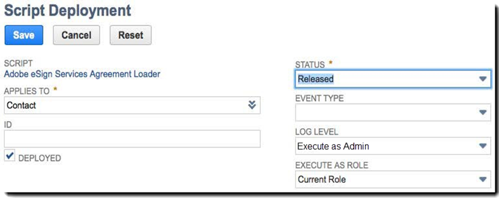

   * Définissez *Statut* sur **[!UICONTROL Publié]**.

      Vous ne devez pas spécifier de *Type d’événement* ou *Niveau du journal*.

   * De [!UICONTROL *Exécuter en tant que rôle]* , sélectionnez **[!UICONTROL Exécuter en tant qu’administrateur]**.

   * Avec la **[!UICONTROL Public]** sous-onglet actif (actif par défaut), sélectionnez les rôles spécifiques ou les utilisateurs auxquels vous souhaitez accorder l’accès. Si vous souhaitez accorder l’accès à tous les rôles et utilisateurs, activez les options **[!UICONTROL Tout sélectionner]** correspondantes.

   * Sélectionner **[!UICONTROL Enregistrer]**. Lorsque la confirmation de modification s’affiche, sélectionnez **[!UICONTROL Retour]**.

1. sélectionner **[!UICONTROL Liste]** en haut de la page Déploiement de scripts pour revenir au dossier *Scripts* page de liste.
1. Répétez les étapes 2 et 3 ci-dessus pour l’autre script.

## Définition des autorisations de rôle pour les types d’enregistrements Adobe Sign {#setting-role-permissions-for-adobe-sign-record-types}

Le plus [!DNL NetSuite] doivent avoir l’autorisation d’utiliser Adobe Sign sans personnalisation supplémentaire. Cependant, vous pouvez être amené à accorder des autorisations pour tout autre rôle personnalisé qui a été créé.

1. Accédez à&#x200B;**[!UICONTROL Personnalisation > Listes, enregistrements et fichiers > Types d’enregistrement]**.

   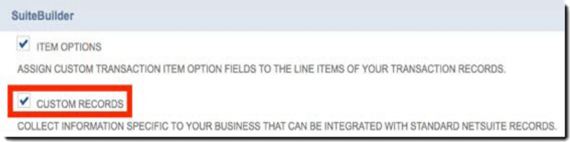

   >[!NOTE]
   >
   >Si vous ne voyez pas l’élément *Types d’enregistrement*, accédez à l’onglet **[!UICONTROL Configuration > Société > Activer les fonctionnalités > Suite Cloud]** et activez l’option *Enregistrements personnalisés*.

1. Sur la *Types d’enregistrement* , sélectionnez **[!UICONTROL Accord Adobe Sign]** pour le sélectionner

   

1. Sur la *Type d’enregistrement personnalisé* , sélectionnez **[!UICONTROL Utiliser la liste des autorisations]** de *Type d’accès* du menu déroulant.

   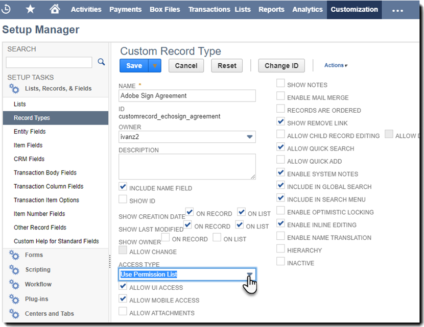

   >[!NOTE]
   >
   >Le type d’enregistrement *Accord Adobe Sign* est le seul type d’enregistrement Adobe Sign qui requiert le type d’accès *Utiliser la liste d’autorisations*.
   >
   >
   >Voir l’étape 6 pour obtenir des instructions sur la définition du type d’accès pour les autres types d’enregistrements Adobe Sign.

1. Sélectionnez l’option **[!UICONTROL Autorisations]** sous-onglet.

   La liste des rôles et des autorisations s’affiche.

   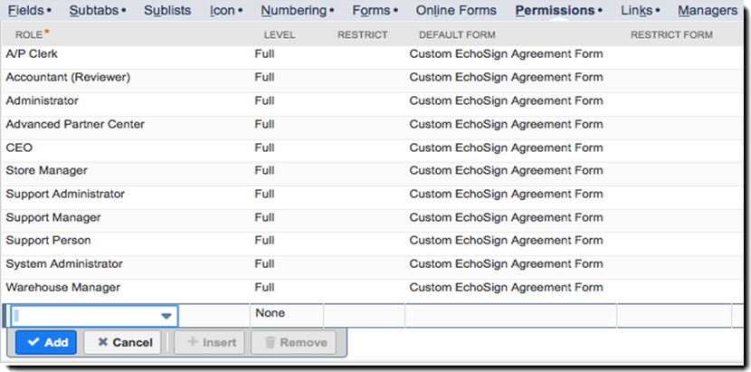

1. Définissez les autorisations comme suit pour les rôles personnalisés supplémentaires ajoutés au[!UICONTROL Accord Adobe Sign]&quot; type d&#39;enregistrement.

   >[!NOTE]
   >
   >Voir la section *[Configuration d’une liste d’autorisations pour un type d’enregistrement personnalisé](https://system.[!DNL NetSuite].com/app/help/helpcenter.nl?fid=section_N2879931.html)* dans la section [!DNL NetSuite] Centre d’aide pour plus d’informations

   1. Sélectionnez le rôle dans la liste *Rôle*.
   1. Définir *Niveau* à **[!UICONTROL Intégrale]**.
   1. Définir *Formulaire par défaut* à **[!UICONTROL Formulaire d’accord EchoSign personnalisé]**.
   1. Sélectionner **[!UICONTROL Restreindre le formulaire]** case à cocher.
   1. Sélectionner **[!UICONTROL Ajouter]** pour enregistrer les modifications pour la ligne de rôle.

   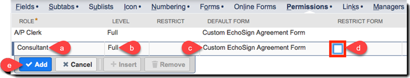

   La nouvelle ligne s’affiche comme indiqué ci-dessous :

   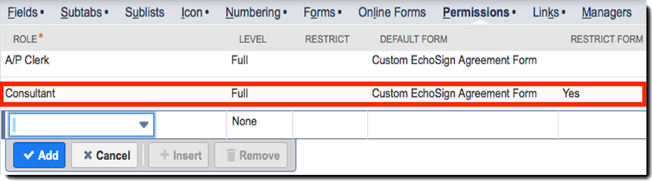

   Répétez les étapes a à e ci-dessus pour tous les autres rôles personnalisés.

   * sélectionner **[!UICONTROL Enregistrer]** sur *Type d’enregistrement personnalisé* lorsque les autorisations pour tous les rôles ont été définies.
   Le *[!UICONTROL Type d&#39;enregistrement client]* s’affiche à nouveau.

1. Répétez les étapes 1 à 3 ci-dessus pour définir le *type d’accès* pour tous les autres types d’enregistrements Adobe Sign sur

   **[!UICONTROL Aucune autorisation requise].** Cela s’applique aux types d’enregistrement suivants :

   * Configuration Adobe Sign
   * Document Adobe Sign
   * Événement Adobe Sign
   * Langue Adobe Sign
   * Erreurs de script Adobe Sign
   * Accord signé Adobe Sign
   * Signataire Adobe Sign

### Octroi de l’accès à l’onglet Accord et au bouton Send for Signature  {#granting-access-to-the-agreement-tab-and-send-for-signature-button}

Le regroupement d’intégration Adobe Sign expose déjà l’objet Accord Adobe Sign avec de nombreuses normes [!DNL NetSuite] objets (Client, Estimer [Devis], Piste, etc.). Le sous-onglet *Accord* est automatiquement activé pour les types d’objets suivants : Client, Client potentiel, Opportunité, Partenaire, Prospect, Devis et Facture fournisseur.

Le *[!UICONTROL Send for Signature]* bouton activé automatiquement **o[!UICONTROL uniquement pour l’objet Devis]**.

[!DNL NetSuite]Les administrateurs peuvent étendre la possibilité de créer des accords sur d’autres objets CRM en modifiant les autorisations d’ajout du sous-onglet *Accord*, du bouton *Envoyer pour signature* ou des deux à ces objets.

#### Modification des autorisations d’accès au bouton Envoyer pour signature  {#modifying-permissions-to-grant-access-to-the-send-for-signature-button}

1. Accédez à **[!UICONTROL Personnalisation > Génération de scripts > Scripts]**.

   La page de la liste *Scripts* s’affiche.

   * Si nécessaire, utilisez les filtres pour localiser les scripts Adobe Sign

1. Sur la *Scripts* , recherchez *Bouton d&#39;estimation Adobe Sign* (contrôle la *Send for Signature* ), puis sélectionnez **Affichage**.

   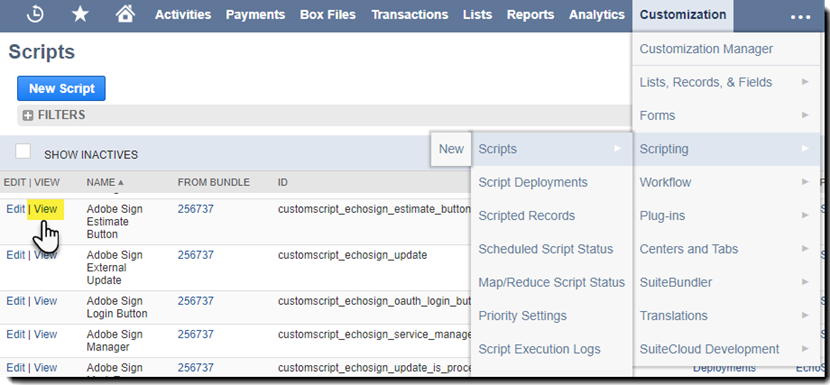

1. Sur la page *Script*, procédez comme suit :

   * sélectionnez l’option **[!UICONTROL Déploiements]** sous-onglet

   * Sous &quot;*S’applique à*&quot; sélectionnez le lien de l&#39;entité que vous souhaitez modifier.

      * **[!UICONTROL Devis]** dans cet exemple

   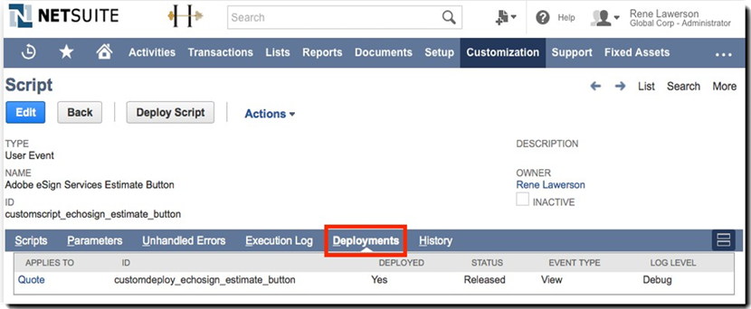

   * sélectionnez l’option **[!UICONTROL Modifier]** sur le bouton *Déploiement de scripts* page

   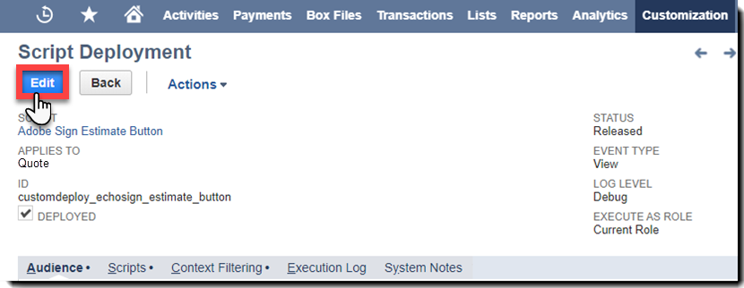

   * Avec le sous-onglet **[!UICONTROL Public]** actif, sélectionnez les rôles ou utilisateurs spécifiques auxquels vous souhaitez accorder l’accès.

      * Si vous souhaitez accorder l’accès à tous les rôles et utilisateurs, activez les options **[!UICONTROL Tout sélectionner]** correspondantes
   * sélectionner **[!UICONTROL Enregistrer]**

   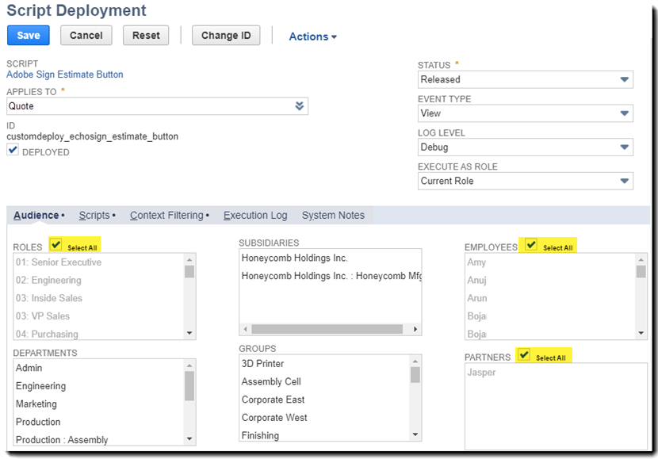

#### Modification des autorisations pour accorder l’accès à l’onglet Accords  {#modifying-permissions-to-grant-access-to-the-agreements-tab}

1. Accédez à **[!UICONTROL Personnalisation > Génération de scripts > Scripts]**.
1. Sur la [!UICONTROL Scripts] , recherchez *[!UICONTROL Chargeur d’accords Adobe Sign]* (contrôle la *Onglet Accords*), puis sélectionnez **[!UICONTROL Affichage]**.
1. Sur la page *Script*, procédez comme suit :

   1. Sélectionnez l’option **[!UICONTROL Déploiements]** sous-onglet
   1. Sous &quot;*[!UICONTROL S’applique à]*&quot; sélectionnez le lien pour l&#39;entité pour laquelle vous souhaitez modifier l&#39;accès pour
   1. Sur la *[!UICONTROL Déploiement de scripts]* , sélectionnez **[!UICONTROL Modifier]** bouton
   1. Avec le sous-onglet **[!UICONTROL Public]** actif (il est actif par défaut), sélectionnez les rôles ou utilisateurs spécifiques auxquels vous souhaitez accorder l’accès. Si vous souhaitez accorder l’accès à tous les rôles et utilisateurs, activez les options **[!UICONTROL Tout sélectionner]** correspondantes
   1. sélectionner **[!UICONTROL Enregistrer]**

## Utilisation de Adobe Sign pour [!DNL NetSuite] enchaînement

Pour envoyer des accords depuis [!DNL NetSuite] et recevoir des mises à jour sur ces accords, les utilisateurs doivent avoir le même ID de connexion (adresse e-mail) dans [!DNL NetSuite] et en Adobe Sign.

### Création d’un accord Adobe Sign

Après avoir installé une nouvelle offre groupée dans un compte Sandbox ou de production, vous devez tester l’offre groupée en créant un nouvel accord. Vous pouvez créer des accords Adobe Sign à partir d’un enregistrement d’entité, d’un enregistrement de transaction ou d’un accord autonome.

>[!NOTE]
>
>Le processus de création d’un accord diffère légèrement selon la manière dont il est créé. Le processus général consiste à spécifier les options de votre accord, à ajouter un ou plusieurs documents d’accord et à indiquer les destinataires. Le processus décrit ci-dessous suppose que vous créez l’accord à partir d’un enregistrement client.

1. Sélectionnez ou créez un enregistrement de client à partir duquel vous souhaitez envoyer un accord, ou vous pouvez sélectionner un autre [!DNL NetSuite] type d’enregistrement pour lequel l’onglet Accords est activé.

1. Dans l’enregistrement, sélectionnez l’option **[!UICONTROL Accords]** sous-onglet.
1. Sélectionner **[!UICONTROL Nouvel accord]**.

   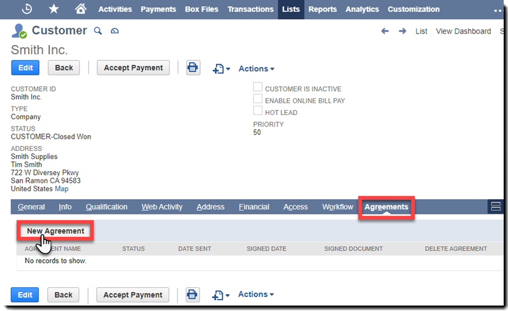

1. Sur la *[!UICONTROL Accord Adobe Sign]* , sélectionnez **[!UICONTROL Modifier]**.

   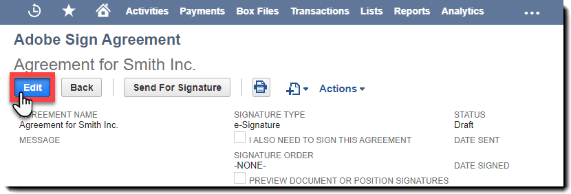

1. Spécifiez les options de votre accord comme suit :

   * **Nom de l’accord** — Saisissez un nom pour l’accord.
   * **Message**-Saisissez un message personnalisé pour le destinataire.
   * **Type de signature** : sélectionnez le type de signature accepté pour le document. Les options disponibles sont les suivantes : *Signature électronique* et *Signature par fax*.

   * **Je dois également signer cet accord.** — Activez cette option pour indiquer que l’expéditeur doit également signer l’accord.
   * **Ordre de signature**-Si la *Je dois également signer cet accord.* est activée, sélectionnez l’ordre dans lequel l’expéditeur et les destinataires doivent signer. Les options disponibles sont « Je signe, puis les destinataires signent », « Les destinataires signent, puis je signe » et « Aucun ».

   * **Aperçu d’un document ou positionnement des signatures (ou champs de formulaire)** — Activez cette option pour permettre aux expéditeurs de prévisualiser l’accord et de leur permettre d’ajouter des champs (glisser-déposer de signature, champs initiaux et autres champs de formulaire) à l’accord avant de l’envoyer aux destinataires.
   * **Vérifier l’identité des signataires** — Activez cette option, puis sélectionnez l’une des options de vérification d’identité suivantes :

      * Cette option s’affiche uniquement lorsque plusieurs des trois méthodes de vérification de l’identité des signataires répertoriées ci-dessous sont activées dans Préférences personnalisées. (voir [Définition des préférences personnalisées](#customize) pour plus d’informations.) Si une seule préférence est activée, l’option **[!UICONTROL Vérification de l’identité du signataire]** ne s’affiche pas.

   **Méthodes de vérification de l’identité**

   * **Mot de passe requis pour la signature** — Demandez aux signataires de saisir un mot de passe unique que vous spécifiez.
   * **Authentification fondée sur les connaissances** — Demandez aux signataires de fournir leur nom, adresse et éventuellement les quatre derniers chiffres de leur numéro d&#39;identification unique, puis de répondre à une liste de questions vérifiant les informations qu&#39;ils ont fournies. Disponible uniquement aux États-Unis.
   * **Authentification de l&#39;identité Web** — Demandez aux signataires de vérifier leur identité en se connectant à l’un des sites suivants : Facebook, Google, LinkedIn, Twitter, Yahoo ! ou Microsoft Live.
   * **Mot De Passe Requis Pour Afficher Le PDF** : activez cette option pour exiger qu’un destinataire saisisse un mot de passe avant d’ouvrir un PDF de l’accord ou de l’accord signé. Le fichier PDF envoyé à tous est chiffré et nécessite le mot de passe pour l’ouvrir. Ne perdez pas votre mot de passe car il est irrécupérable. Si vous perdez le mot de passe, vous devez supprimer cette transaction et recommencer.
   * **Mot de passe/Confirmer le mot de passe** — Si la *Mot De Passe Requis Pour Afficher Le PDF* est activée, saisissez le mot de passe à utiliser pour afficher l’accord.
   * **Rappeler aux destinataires de signer** — Indiquez si et à quelle fréquence des rappels sont envoyés aux destinataires. Les options disponibles sont *Jamais*, *Quotidien* ou *Hebdomadaire*.
   * **Langue :** Spécifiez la langue dans laquelle la page de signature et les notifications électroniques sont affichées aux destinataires.
   * **Héberger la signature pour le premier signataire** — Activez cette option pour autoriser l’hôte de l’expéditeur à signer en personne pour le premier signataire.
   * **Jours avant l’échéance de signature** — Saisissez un numéro entier pour indiquer la date limite de signature de l’accord (date du jour + nombre de jours).
   * **Enregistrement parent** — Si vous le souhaitez, sélectionnez un enregistrement parent pour le lier à l’accord.

   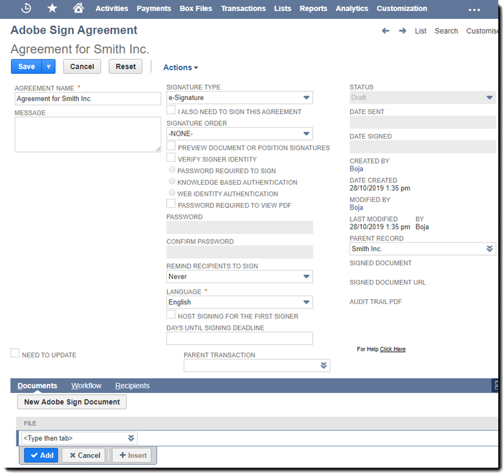

1. Sélectionnez l’option **[!UICONTROL Documents]** .

   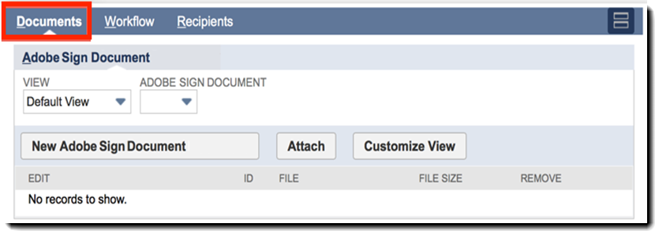

1. Sur la *Documents* sous-onglet, joignez un document existant à partir de l’armoire de fichiers à l’aide de l’option *Document Adobe Sign* , puis sélectionnez **[!UICONTROL Joindre]**.

   Ou cliquez sur **[!UICONTROL Nouveau document Adobe Sign]** pour accéder au *[!UICONTROL Document Adobe Sign]* , puis tapez le nom d’un document dans votre [!DNL NetSuite] , sélectionnez des fichiers dans votre enregistrement de transaction (le cas échéant) ou joignez un nouveau document.

   Vous pouvez ajouter plusieurs documents à un accord.

1. Sélectionner **[!UICONTROL Destinataires]** sous-onglet et indiquez le destinataire en le sélectionnant dans la liste de contacts ou en saisissant une adresse électronique.

   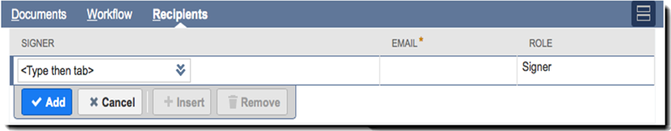

   Chacun de vos destinataires peut être marqué comme signataire ou destinataire en copie. Si la préférence personnalisée *Autoriser le marquage des destinataires comme signataires approbateurs* est activée, les destinataires peuvent être également marqués comme approbateurs. Voir [Définition des préférences personnalisées](#customize) pour plus d’informations.

   * Les **Signataires** doivent signer l’accord.
   * **Approbateurs** doit approuver, mais ne pas signer l’accord et peut éventuellement ajouter des données à un accord.
   * **Destinataires CC** sont avertis des mises à jour de l’accord et lorsque l’accord est signé et complété. Les destinataires en copie ne prennent pas part au processus de signature ou d’approbation.

      Si la préférence personnalisée *Utiliser le contact de l’enregistrement parent comme signataire* est activée seule ou conjointement avec la préférence *Utiliser le contact de transaction comme signataire*, le premier destinataire est défini par défaut, mais peut être modifié.

1. Sélectionner **[!UICONTROL Ajouter]** après avoir saisi chaque destinataire.

1. Sélectionner **[!UICONTROL Enregistrer]** pour enregistrer l’accord.

### Envoi d’accords pour signature

Lorsque l’accord est prêt à être envoyé, sélectionnez l’option **[!UICONTROL Send for Signature]** bouton.

* Si la *Aperçu des signatures d’un document ou positionnement des signatures* est activée, cliquez sur **[!UICONTROL Send for Signature]**. Dans la fenêtre qui s’ouvre, prévisualisez le document ou faites glisser les champs de formulaire vers le document avant de l’envoyer. Sélectionner **[!UICONTROL Envoyer]** pour envoyer l’accord au destinataire.

* Si la *[!UICONTROL Héberger la signature pour le premier signataire]* est activée, cliquez sur **[!UICONTROL Send for Signature]**. Dans la fenêtre qui s’ouvre, autorisez le signataire à signer le document avec l’expéditeur présent.

   Un lien *Héberger signature pour le signataire actuel* pour le signataire actuel s’affiche également en regard du champ *Héberger signature pour 1er signataire*, accessible jusqu’à ce que le document soit signé. Utilisez ce lien pour héberger la signature de l’accord pour plusieurs signataires ou pour rouvrir la fenêtre contextuelle si elle a été fermée par erreur.

Une fois l’accord envoyé, les destinataires reçoivent un courrier électronique les informant des documents en attente de leur signature.

Une fois que les destinataires ont signé le document, l’expéditeur reçoit une notification par e-mail pour l’informer que le document a été signé.

#### Envoyer à partir d&#39;un devis

Adobe Sign a une intégration directe avec les guillemets dans [!DNL NetSuite] afin qu’un PDF du devis soit automatiquement généré et joint à l’enregistrement de l’accord.

Lorsque vous affichez un devis, sélectionnez **[!UICONTROL Send for Signature]**. Il génère et affiche le devis joint à l’accord. Vous pouvez également ajouter le bouton *Envoyer pour signature* à d’autres types d’enregistrements de transaction. Pour plus d’informations, voir [Objets et types d’enregistrements.](#objects)

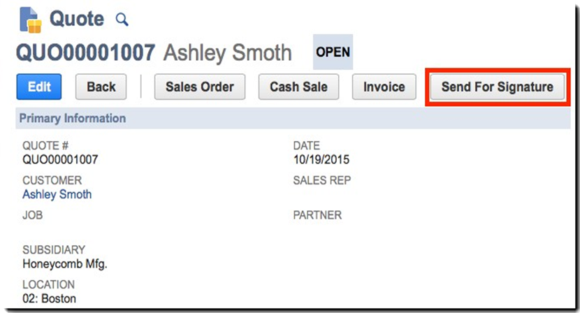

### Suivi de l’état et envoi de rappels

Après avoir envoyé un accord :

* Le statut du document est remplacé par *Émis pour signature* dans la section Détails de l’accord.
* Le *Send for Signature* est remplacé par les trois boutons suivants :

   * **État de la mise à jour** — Pour mettre à jour manuellement l&#39;état si les mises à jour d&#39;état n&#39;ont pas été configurées. Pour plus d’informations, voir [Configuration des mises à jour automatiques de statut.](#asu)
   * **Envoyer un rappel** — Pour envoyer un rappel au signataire actuel.
   * **Annuler l’accord** — Pour annuler un accord. Un accord peut être annulé après avoir été envoyé pour signature si tous les destinataires n’ont pas encore signé.

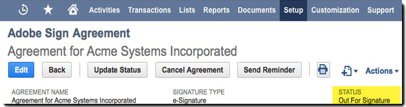

Un nouveau sous-onglet *Événements* s’affiche dans l’enregistrement de l’accord, dans lequel vous pouvez suivre le statut de l’accord.

Vous pouvez afficher l’historique des événements de l’accord, qui inclut des informations sur le moment où l’accord a été envoyé, affiché et signé.

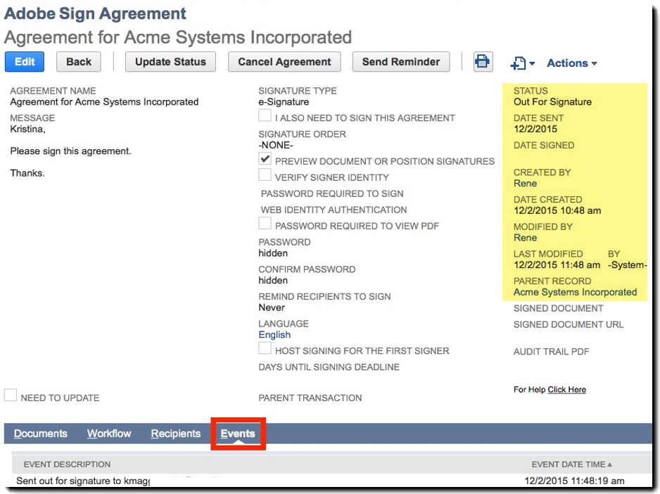

Une fois l’accord signé :

* Son statut est remplacé par *Signé*..
* Vous pouvez créer un lien vers l’enregistrement parent de cet accord à l’aide du lien.
* Vous pouvez utiliser les liens &quot;télécharger&quot; sous Document signé et Piste d’audit pour accéder à ces documents.
* Une *Document signé* sous-onglet s’affiche pour afficher les vignettes du document signé.

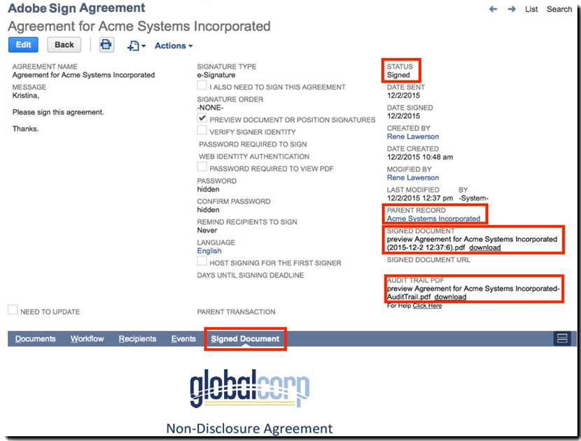

>[!NOTE]
>
>Une fois qu’un accord a été envoyé pour signature, vous ne pouvez pas modifier l’enregistrement. Ceci est prévu pour conserver l’enregistrement des événements.

## Désinstaller le regroupement

Pour désinstaller l’offre groupée, suivez les étapes indiquées dans la section [!DNL NetSuite] Aide. Voir la section *[Désinstallation d’un lot](https://docs.oracle.com/cloud/latest/)[!DNL NetSuite]cs_gs/NSBDL/NSBDL.pdf)* dans la section [!DNL NetSuite] Centre d’aide pour plus d’informations.

Lorsque vous désinstallez le regroupement, les accords non signés sont supprimés. Les accords signés et leurs fichiers de PDF d’audit correspondants ne sont pas affectés.

Ne désinstallez PAS l’offre groupée si vous devez conserver vos accords non signés.

## Résolution des problèmes

### Détermination de la progression de la mise à jour

Si la mise à jour prend du temps, vous pouvez vérifier le sous-onglet Journal d’exécution du script Installation de l’offre groupée Adobe Sign pour déterminer la progression de votre mise à jour comme suit :

1. Accédez à **[!UICONTROL Personnalisation > Génération de scripts > Scripts]**.
1. Sur la [!UICONTROL Scripts] , recherchez *[!UICONTROL Installation du lot Adobe Sign]* script, puis sélectionnez **[!UICONTROL Modifier]**.
1. Sur la [!UICONTROL Scripts] , sélectionnez **Journal d&#39;exécution** sous-onglet.
1. sélectionner **Actualiser**.

   Le journal d&#39;exécution est mis à jour pour refléter l&#39;état. La colonne *Détails* affiche la progression des mises à jour de vos accords.

   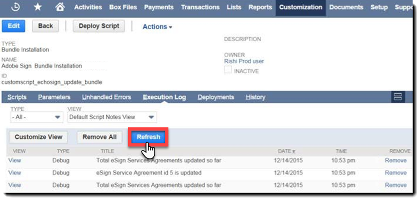

### Résolution des problèmes de jeton d’accès

Il se peut que vous rencontriez un message &quot;Le jeton d’accès fourni n’est pas valide ou a expiré&quot; lors de l’interaction avec des accords.

Cela peut se produire pour les raisons suivantes :

* Le [!DNL NetSuite]/Administrateur Adobe Sign qui a configuré OAuth a révoqué le jeton d’accès
* Le jeton d’accès a expiré car aucun accord n’a été envoyé depuis [!DNL NetSuite] au cours des 60 derniers jours
* Le [!DNL NetSuite]/Adobe Sign Administrator n&#39;a pas terminé la configuration initiale OAuth

Pour résoudre ce problème, exécutez à nouveau le processus de configuration OAuth. Pour plus d’informations, voir [Configuration d’OAuth après l’installation ou la mise à niveau](#oauth).

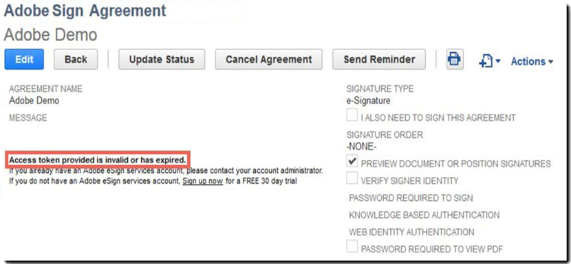

### Résolution des problèmes d’état du document {#resolvestatus}

Si [mises à jour d&#39;état automatiques](#asu) sont configurés mais l’état de l’accord n’est pas mis à jour après l’envoi des accords, essayez les opérations suivantes :

1. Consultez le journal d’exécution du déploiement du script *Mise à jour externe d’Adobe Sign* pour voir si vous recevez des appels d’Adobe Sign comme suit :

   1. Accédez à **[!UICONTROL Personnalisation > Génération de scripts > Déploiements de scripts.]**
   1. Sur la *Déploiements de scripts* , recherchez *Mise à jour externe Adobe Sign* script, puis sélectionnez **[!UICONTROL Modifier]**
      1. Sur la *[!UICONTROL Déploiement de scripts]* , sélectionnez **[!UICONTROL Journal d&#39;exécution]** sous-onglet.
      * Vous devriez voir un *Enregistrement d’accord mis à jour* entrée pour chaque ID d’accord

1. Consultez le journal d’exécution du déploiement du script *Accords de mise à jour d’Adobe Sign* pour voir si des erreurs sont présentes. Pour ce faire, procédez comme suit :

   1. Accédez à **[!UICONTROL Personnalisation > Scripts > Déploiements de scripts]**.
   1. Sur la [!UICONTROL Déploiements de scripts] , recherchez *[!UICONTROL Accords de mise à jour Adobe Sign]* avec le[!UICONTROL Planification]&quot;, puis sélectionnez **[!UICONTROL Modifier]**.
   1. Sur la [!UICONTROL Déploiement de scripts] , sélectionnez **[!UICONTROL Journal d&#39;exécution]** sous-onglet.
   1. Sous [!UICONTROL Type], sélectionnez **[!UICONTROL Erreur]** pour filtrer les résultats.

1. Enfin, vérifiez si des erreurs sont présentes dans le journal d’exécution du script *Gestionnaire Adobe Sign* en suivant les instructions de l’étape 2 ci-dessus.

### Résolution des erreurs de type MIME  {#resolving-mime-type-errors}

Si vous recevez une erreur de type MIME lors de l’envoi d’un accord, cela peut être dû au fait que le nom dans le champ Nom de fichier ne correspond pas au nom de fichier et à l’extension du fichier chargé. Si vous laissez le champ Nom de fichier vide, il est automatiquement rempli avec le nom de fichier et l’extension appropriés.

### Affichage des journaux de script {#viewing-script-logs}

Vous pouvez également afficher les journaux d’exécution de déploiement pour les scripts qui ne sont pas liés à des problèmes de statut de document. Pour plus d’informations, voir [Résolution des problèmes liés au statut du document.](#resolvestatus)

1. Accédez à **[!UICONTROL Personnalisation > Génération de scripts > Scripts]**.

   La page de la liste *Scripts* s’affiche. Si nécessaire, utilisez les filtres pour localiser le script approprié.

1. Sélectionnez **[!UICONTROL Affichage]** pour le script correspondant.

1. Sélectionnez l’option **[!UICONTROL Journal d&#39;exécution]** sous-onglet de la page pour afficher le journal de script.

## Assistance technique {#support}

Accédez à la section [Portail d’assistance Adobe Sign](https://adobe.com/go/adobesign-support-center_fr) pour accéder aux questions fréquentes, à la documentation, aux articles de la base de connaissances ou pour contacter l’assistance Adobe.
