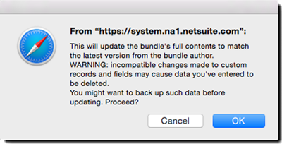

# Guide d&#39;installation et de personnalisation d&#39;Adobe Sign for NetSuite (v4.0.4){#install-customize-netsuite}

## Présentation {#overview}

Adobe Sign pour NetSuite fournit une intégration complète des signatures électroniques avec NetSuite. Vous pouvez utiliser l’intégration Adobe Sign for Netsuite pour envoyer des accords tels que des contrats, des devis et d’autres documents, qui nécessitent des signatures électroniques, aux destinataires directement à partir de NetSuite. Vous pouvez créer et envoyer des accords Adobe Sign à partir d’enregistrements NetSuite de clients, de prospects, de devis et autres. Adobe Sign met à jour NetSuite avec le statut actuel des accords et stocke les accords avec les enregistrements NetSuite associés une fois qu’ils sont entièrement exécutés. Vous pouvez afficher l’historique de tous les accords envoyés depuis NetSuite à partir du produit.

Pour plus d&#39;informations, reportez-vous aux [notes de mise à jour Adobe Sign for NetSuite](https://experienceleague.corp.adobe.com/docs/sign-integrations/using/netsuite/release-notes.html?lang=en).

## Installation de l’offre groupée et configuration d’OAuth {#install}

Seul un administrateur NetSuite peut installer ou mettre à jour l’offre groupée. Pour configurer OAuth, l’administrateur NetSuite doit disposer d’un accès administrateur à Adobe Sign. Avant d’installer l’offre groupée dans votre compte Production, vous devez installer et tester l’offre groupée dans un compte Sandbox NetSuite.

Pour plus d&#39;informations sur le test, voir [Création d&#39;un accord Adobe Sign](#createagreement).

>[!CAUTION]
>
>Les clients effectuant une mise à niveau vers la version 4.0.4 NE DOIVENT PAS supprimer leur clé d’API existante.
>
>Pour plus d&#39;informations sur l&#39;utilisation de la clé d&#39;API, voir [Définition des préférences personnalisées](#configure).

### Installer l’offre groupée pour la première fois

1. Accédez à **Personnalisation > SuiteBundler > Rechercher et installer une offre groupée**.

1. Sur la page *Rechercher et installer des packs*, entrez **Adobe Sign** comme mot-clé et sélectionnez **Rechercher**.

1. Sélectionnez le nom du regroupement **Adobe Sign**.

   

1. Sur la page *Détails du lot*, sélectionnez **Installer**.
1. Dans la page *Aperçu de l&#39;installation du lot*, sélectionnez **Installer le lot**.

   (Il n’est pas nécessaire de modifier les valeurs par défaut sur la page.)

   

1. Dans la boîte de dialogue Installer qui s’affiche, sélectionnez **OK** pour continuer.

   Pendant le processus d’installation, l’offre groupée affiche le statut *En attente*.

   

1. Pour afficher un état mis à jour, sélectionnez **Actualiser**.

   Une fois l’installation de l’offre groupée terminée, *Adobe Sign pour NetSuite* s’affiche sur la page *Offres groupées installées*.

   

1. Si vous êtes déjà un compte client Adobe Sign, suivez les étapes de [Configuration d’OAuth après l’installation ou la mise à niveau](#oauth).

   Si vous ne disposez pas d’un compte Adobe Sign, vous pouvez vous [inscrire pour une version d’essai de compte](https://esign.adobe.com/fr/adobe-sign-netsuite-trial-registration.html) d’entreprise afin de tester le système. Suivez les étapes d’enregistrement en ligne pour activer votre compte Adobe Sign.

## Configuration d’OAuth après l’installation ou la mise à niveau {#oauth}

Adobe Sign utilise Oauth 2.0 pour authentifier votre compte Adobe Sign dans NetSuite.

Ce protocole autorise votre offre groupée NetSuite installée à communiquer avec Adobe Sign sans demander votre mot de passe. Dans la mesure où les informations sensibles ne sont pas directement partagées entre les applications, votre compte est moins susceptible d’être piraté.

Cette authentification n’a aucune incidence sur votre mise en oeuvre, mais vous devez effectuer une configuration unique après avoir installé ou mis à niveau l’offre groupée dans votre compte Production ou Sandbox.

L’administrateur NetSuite qui configure OAuth doit également disposer d’un accès administrateur au niveau du compte pour Adobe Sign.

1. Dans NetSuite, accédez à la page de liste *Adobe Sign Config*.

1. Recherchez **Adobe Sign Config** (type d&#39;enregistrement personnalisé) à l&#39;aide du champ Rechercher dans l&#39;en-tête.

1. Dans la page Résultats de la recherche, sélectionnez **Afficher** pour l&#39;enregistrement *Adobe Sign Config*.

   .

1. Sur la page Liste des configurations Adobe Sign, sélectionnez **Afficher** pour l&#39;enregistrement *Utilisation d&#39;OAuth pour accéder aux API Adobe Sign*.

   

1. Sur la page Adobe Sign Config, sélectionnez **Connexion avec Adobe Sign**.

   

1. Dans la page de connexion Adobe Sign qui s’affiche, entrez vos informations d’identification et sélectionnez **Se connecter**.

   

1. Dans la page Confirmer l’accès (pour OAuth) qui s’affiche, sélectionnez **Autoriser l’accès**.

   

1. Une fois l’autorisation terminée, vous êtes redirigé vers la page Adobe Sign Config d’dans NetSuite, comme indiqué ci-dessous.

   

   >[!NOTE]
   >
   >Si vous configurez OAuth dans votre compte Sandbox, vous rencontrerez l’erreur « Impossible de déterminer le compid client » une fois l’autorisation terminée.
   >
   >
   >Pour continuer, vous devez modifier la partie du domaine de compte de l’URL (system.netsuite.com) dans votre navigateur pour la renvoyer vers le compte Sandbox NetSuite comme suit :
   >
   >
   >Changer:
   >
   >
   >system.netsuite.com/app/site/hosting/scriptlet.nl?script=745&amp;deploy=1&amp;web_access_point=https://echosign.com
   >
   >
   >À :
   >
   >
   >system.**sandbox.**netsuite.com/app/site/hosting/scriptlet.nl?script=745&amp;deploy=1&amp;web_access_point=https://echosign.com

## Mettre à jour le regroupement (utilisateurs existants)

Les mises à jour de l’offre groupée NetSuite sont publiées régulièrement par Adobe. Les utilisateurs existants de l’intégration Adobe Sign for NetSuite peuvent effectuer une mise à jour vers la dernière offre groupée.

>[!CAUTION]
>
>Les clients effectuant une mise à niveau vers une version plus récente ne doivent PAS supprimer leur clé API existante.
>
>Voir [Définition des préférences personnalisées ](#configure)pour plus d’informations sur l’utilisation de la clé API.

### Conditions préalables {#prerequisites}

Le temps requis pour la mise à jour vers l’offre groupée v4.0.4 dépend du nombre d’accords qui ont actuellement l’état &quot;Émis pour signature&quot;. En général, la mise à jour de 100 accords prend entre 7 et 10 minutes. Notez le nombre d’enregistrements pour estimer le temps de mise à jour.

Pour déterminer le nombre d’accords envoyés pour signature :

1. Accédez à **Personnalisation > Listes, enregistrements et fichiers > Types d’enregistrement**, puis localisez *Accord Adobe Sign.*

   Ou recherchez les accords Adobe Sign dans la barre de recherche.

1. Pour l’enregistrement des accords Adobe Sign, sélectionnez **Rechercher**.

   

1. Dans la liste déroulante **État**, sélectionnez **Émis pour signature**, puis **Soumettre**.

   

   Notez le nombre d’enregistrements pour estimer le temps de mise à jour.

   

### Mettre à jour l’offre groupée {#updating-the-bundle}

1. Accédez à **Personnalisation > SuiteBundler > Recherche et installation > Liste** et localisez votre offre groupée actuelle, comme illustré ci-dessous.

   >[!NOTE]
   >
   >S’il existe une nouvelle version du regroupement, une icône de point d’exclamation s’affiche à droite du numéro *Version* de votre regroupement actuel.

1. Dans le menu déroulant Action, sélectionnez **Mettre à jour**.

   

1. Sur la page Aperçu de la mise à jour du lot, sélectionnez **Mettre à jour le lot** sans modifier les valeurs par défaut affichées sur la page.

   Lors de l’installation, le statut de l’offre groupée s’affiche sous la forme *En attente*.

   .

   >[!NOTE]
   >
   >Lors de la mise à jour de l’offre groupée, un message d’avertissement peut s’afficher, comme illustré ci-dessous. Si vous n’avez pas personnalisé vos enregistrements de signature électronique NetSuite, vous pouvez continuer. Si vous n’êtes pas sûr, il est recommandé d’installer l’offre groupée sur un compte Sandbox pour la tester en premier avant de mettre à jour l’offre groupée dans un compte de production.
   

1. Pour afficher un état mis à jour, sélectionnez **Actualiser**.

   

   >[!NOTE]
   >
   >Si la mise à jour prend beaucoup de temps en raison d’un grand nombre d’accords *Émis pour signature*, vous pouvez vérifier le sous-onglet **Journal d’exécution** du script *Installation de l’offre groupée Adobe Sign* pour déterminer la progression de votre mise à jour. (Voir [Détermination de la progression de la mise à jour ](#determineprogress)pour plus d’informations.)

   Une fois la mise à jour de l’offre groupée terminée, *Adobe Sign pour NetSuite* s’affiche sur la page *Offres groupées installées*.

   

## Configuration de l’offre groupée {#configure}

### Définition des préférences personnalisées  {#set-custom-preferences}

Vous pouvez utiliser des préférences personnalisées pour spécifier la façon dont les accords sont créés et stockés dans NetSuite. En outre, la préférence *Configurer automatiquement l’utilisateur dans Adobe Sign* vous permet de spécifier si les utilisateurs de NetSuite sont configurés automatiquement dans les services Sign lorsqu’ils envoient des accords depuis NetSuite.

1. Accédez à **Configuration > Société > Préférences générales**.
1. Faites défiler la page vers le bas, puis sélectionnez le sous-onglet **Préférences personnalisées**.

   

1. Activez et configurez vos préférences Adobe Sign selon vos besoins :

   * **Entrez la clé d’API EchoSign pour votre compte** : N’ajoutez ou ne modifiez aucune valeur dans ce champ.
   * **Utiliser le contact d’enregistrement parent comme signataire** : Si cette option est activée, le contact de l’enregistrement parent est le premier signataire par défaut lors de la création des accords. L’expéditeur peut facilement supprimer ou modifier le signataire par défaut ou ajouter des signataires supplémentaires à l’accord avant l’envoi.
   * **Utiliser le contact de transaction Contactez en tant que signataire s’il est présent** : Cette préférence n’est valide que si la préférence *Utiliser le contact d’enregistrement parent comme signataire* est également activée. Si cette option est activée, lors de la génération d’un accord à partir d’un enregistrement de transaction (par exemple, un devis), le contact de transaction principal est par défaut le premier signataire. (Pour plus d’informations, voir[ Enregistrements de transaction](#transrecords).) S’il n’existe pas de contact de transaction principal ou s’il s’agit d’un envoi à partir de l’enregistrement d’objet NetSuite (par exemple, un enregistrement client, un enregistrement partenaire), le destinataire par défaut est le contact principal de l’adresse e-mail du client. L’expéditeur peut facilement supprimer ou modifier le signataire par défaut ou ajouter des signataires supplémentaires à l’accord avant l’envoi.
   * **Autoriser le marquage des destinataires en tant qu’approbateurs** : Si cette option est activée, les expéditeurs peuvent marquer les destinataires comme des approbateurs. Les destinataires marqués comme approbateurs peuvent réviser et approuver les accords, mais ils ne sont pas tenus de les signer. Les approbateurs peuvent être tenus de saisir des données dans les champs pendant le processus d’approbation.
   * **ID** du dossier de l’accord préféré : Permet de spécifier le dossier dans lequel seront stockés les accords signés définitifs. Si vous ne définissez pas de valeur pour ce champ, les accords signés finaux sont enregistrés par défaut dans le même dossier que le fichier du document d’origine. L’ID de dossier doit être un nombre.
   * **Joindre automatiquement le PDF** de transaction : Si cette option est activée, les fichiers PDF de transaction sont automatiquement joints aux accords lorsque de nouveaux accords sont créés à partir d’enregistrements de transaction.
   * **Ajouter un PDF signé en tant que (pièce jointe ou lien)** : Si  ** Liste est sélectionnée dans la liste déroulante, le fichier PDF signé est automatiquement ajouté en tant que lien vers le fichier. Si l’option *Pièce jointe* est sélectionnée dans la liste déroulante, le fichier PDF signé est stocké dans NetSuite en tant que pièce jointe dans l’enregistrement de l’accord.
   * **Inclure le fichier PDF de piste d’audit avec l’accord** : Si cette option est activée, les fichiers PDF de piste d’audit sont automatiquement joints aux enregistrements d’accord une fois les accords signés.
   * **La méthode de vérification de l’identité s’applique** à : L’activation de l’une des méthodes de vérification de l’identité détermine à qui la méthode de vérification de l’identité est appliquée. Les options disponibles sont *Tous les signataires, Signataires externes uniquement, *ou *Signataires internes uniquement*.

   **Méthodes de vérification de l’identité** {#identity-verification-methods}

   La ou les méthodes de vérification de l’identité activées peuvent être sélectionnées lors de la création d’un accord. Si plusieurs méthodes de vérification de l’identité sont activées ici, la page Accord Adobe Sign affiche une option **Vérifier l’identité des signataires**.

   * **Activer le mot de passe requis pour signer** : Demandez aux signataires de saisir un mot de passe unique que vous spécifiez.

   * **Activer l’authentification** fondée sur les connaissances : Demander aux signataires de fournir leur nom, adresse et éventuellement les quatre derniers chiffres de leur numéro d’identification unique, puis de répondre à une liste de questions vérifiant les informations qu’ils ont fournies. Disponible uniquement aux États-Unis.

   * **Activer l&#39;authentification** d&#39;identité Web : Demandez aux signataires de vérifier leur identité en se connectant à l’un des sites suivants : Facebook, Google, LinkedIn, Microsoft Live, Twitter ou Yahoo !.

   * **Configuration automatique des utilisateurs dans Adobe Sign** : Si cette option est activée, les utilisateurs qui envoient des accords dans NetSuite sont automatiquement configurés avec un compte d’utilisateur Adobe Sign.

1. Sélectionnez **Enregistrer** pour enregistrer vos préférences.

## Configuration des mises à jour d’état automatiques {#asu}

L’offre d’intégration Adobe Sign vous permet de recevoir automatiquement des mises à jour dans NetSuite concernant le statut des accords qui ont été envoyés depuis NetSuite. Lorsque cette fonctionnalité est activée, NetSuite reflète toujours le statut actuel de vos accords. Vous pouvez activer les mises à jour automatiques de statut comme suit :

1. Accédez à **Configuration > Société > Activer les fonctionnalités**.
1. Sélectionnez le sous-onglet **SuiteCloud**.
1. Activez les options suivantes :

   * Dans la section SuiteBuilder, activez l’option **Enregistrements personnalisés**.

   * Dans la section SuiteScript, activez les options **Client SuiteScript** et **Serveur SuiteScript** et acceptez les conditions d’utilisation pour les deux.

1. Sélectionnez **Enregistrer**.

   Vos options sont définies comme illustré dans l’image.

   

## Objets et types d’enregistrement {#objects}

L’ensemble d’intégration Adobe Sign expose déjà l’objet Accord Adobe Sign avec de nombreux objets NetSuite standard, notamment : Enregistrements client, estimation, piste, opportunité et partenaire. Vous pouvez également utiliser l’offre groupée Adobe Sign avec d’autres types d’enregistrements, y compris des enregistrements personnalisés.

L’onglet Accord peut s’afficher avec deux types d’enregistrements NetSuite : Entité et Transaction. Nous supposons généralement qu’un enregistrement de transaction est un enregistrement (tel qu’un devis) qui peut être converti en document PDF ; alors qu’un enregistrement d’entité ne peut pas être converti au format PDF.

## Enregistrements de transactions {#transrecords}

Si l’accord est créé à partir d’un enregistrement de transaction, le premier document de l’enregistrement de l’accord est la version PDF de l’enregistrement d’origine et le premier destinataire est l’adresse électronique de l’enregistrement. Si vous ne souhaitez pas que le premier document soit une version PDF de l’enregistrement d’origine, accédez à **Configuration > Société > Préférences générales > sous-onglet Préférences personnalisées** et désactivez l’option **Joindre automatiquement la transaction PDF**. Pour plus d&#39;informations, voir [Définition des préférences personnalisées](#configure).

Sous Préférences personnalisées, vous pouvez également activer la préférence **Utiliser le contact de transaction comme premier signataire** si vous souhaitez que le contact de transaction principal soit automatiquement ajouté en tant que premier signataire. Lorsqu’il est associé à un enregistrement de transaction, il affiche les boutons **Accords** et **Send for Signature**.

## Enregistrements d’entités {#entity-records}

Si l’accord est créé à partir d’un enregistrement d’entité, le premier destinataire est l’adresse électronique de l’enregistrement. Lorsqu’il est associé à un enregistrement d’entité, seul l’onglet Accords s’affiche.

## Personnalisation de l’offre groupée {#customize}

La personnalisation de l’offre groupée comprend les éléments suivants :

* Déploiement des scripts pour le sous-onglet Accords  et le bouton Envoyer pour signature pour les types d’enregistrement appropriés.
* Définition des autorisations de rôle pour vos types d’enregistrements Adobe Sign.
* Modification des autorisations pour accorder l’accès au sous-onglet *Accords* et au bouton *Envoyer pour signature*.

### Configuration des accords Adobe Sign pour d’autres types d’enregistrements  {#configuring-adobe-sign-agreements-for-additional-record-types}

Pour déployer le sous-onglet *Accords* et le bouton *Send for Signature* pour les types d&#39;enregistrements appropriés :

1. Accédez à **Personnalisation > Génération de scripts > Scripts.**

1. Sur la page de liste *Scripts* qui s&#39;affiche, recherchez le script à déployer, puis sélectionnez **Afficher**.

   * Pour ajouter le bouton *Send for Signature*, sélectionnez le script **Bouton d&#39;estimation Adobe Sign**.

   * Pour ajouter l’onglet *Accords*, sélectionnez le script **Chargeur d’accords Adobe Sign**.

1. Sur la page Script, sélectionnez **Déployer le script**.

   

1. Sur la page Déploiement du script, procédez comme suit :

   * Dans la liste *S’applique à*, sélectionnez le type d’enregistrement.
   * Si vous le souhaitez, entrez l’ID de déploiement du script.

      Pour plus d&#39;informations, consultez la rubrique *Création d&#39;un ID de déploiement de script personnalisé* du Centre d&#39;aide NetSuite. Si vous ne saisissez pas d’ID, celui-ci est généré.

   * Cochez la case **Déployé**.

   

   * Définissez *Statut* sur **Publié**.

      Vous n’avez pas besoin de spécifier le *Type d’événement* ni le *Niveau de journal*.

   * Dans la liste déroulante *Rôle d’exécution*, sélectionnez **Exécuter en tant qu’administrateur**.

   * Avec le sous-onglet **Audience** actif (actif par défaut), sélectionnez les rôles spécifiques ou les utilisateurs auxquels vous souhaitez accorder l&#39;accès. Si vous souhaitez accorder l’accès à tous les rôles et utilisateurs, activez les options **Tout sélectionner** correspondantes.

   * Sélectionnez **Enregistrer**. Lorsque la confirmation de modification s’affiche, sélectionnez **Retour**.

1. sélectionnez **Liste** en haut de la page Déploiement de script pour revenir à la page de liste *Scripts*.
1. Répétez les étapes 2 et 3 ci-dessus pour l’autre script.

## Définition des autorisations de rôle pour les types d’enregistrements Adobe Sign  {#setting-role-permissions-for-adobe-sign-record-types}

La plupart des rôles NetSuite doivent être autorisés à utiliser Adobe Sign sans personnalisation supplémentaire. Cependant, vous devrez peut-être accorder des autorisations pour tous les rôles personnalisés supplémentaires qui ont été créés.

1. Accédez à&#x200B;**Personnalisation > Listes, enregistrements et fichiers > Types d’enregistrement**.

   

   >[!NOTE]
   >
   >Si vous ne voyez pas l’élément *Types d’enregistrement*, accédez à l’onglet **Configuration > Société > Activer les fonctionnalités > Suite Cloud** et activez l’option *Enregistrements personnalisés*.

1. Sur la page *Types d’enregistrements*, sélectionnez **Adobe Sign Agreement** pour le sélectionner.

   

1. Sur la page *Type d&#39;enregistrement personnalisé*, sélectionnez **Utiliser la liste d&#39;autorisations** dans la liste déroulante *Type d&#39;accès*.

   

   >[!NOTE]
   >
   >Le type d’enregistrement *Accord Adobe Sign* est le seul type d’enregistrement Adobe Sign qui requiert le type d’accès *Utiliser la liste d’autorisations*.
   >
   >
   >Voir l’étape 6 pour obtenir des instructions sur la définition du type d’accès pour les autres types d’enregistrements Adobe Sign.

1. Sélectionnez le sous-onglet **Autorisations**.

   La liste des rôles et des autorisations s’affiche.

   

1. Définissez les autorisations comme suit pour les rôles personnalisés supplémentaires ajoutés au type d’enregistrement « Accord Adobe Sign ».

   >[!NOTE]
   >
   >Pour plus d’informations, voir la rubrique *[Setting Up a Permissions List for a Custom Record Type](https://system.netsuite.com/app/help/helpcenter.nl?fid=section_N2879931.html)* dans le Centre d’aide NetSuite.

   1. Sélectionnez le rôle dans la liste *Rôle*.
   1. Définissez *Niveau* sur **Intégral**.
   1. Définissez *Formulaire par défaut* sur **Formulaire d’accord EchoSign par défaut**.
   1. sélectionnez pour cocher la case *Restreindre le formulaire*
   1. sélectionnez **Ajouter** pour enregistrer les modifications pour la ligne de rôle.

   

   La nouvelle ligne s’affiche comme indiqué ci-dessous :

   

   Répétez les étapes a à e ci-dessus pour tous les autres rôles personnalisés.

   * sélectionnez **Enregistrer** sur la page *Type d&#39;enregistrement personnalisé* lorsque les autorisations pour tous les rôles ont été définies.

   La page *Type d&#39;enregistrement client* s&#39;affiche à nouveau.

1. Répétez les étapes 1 à 3 ci-dessus pour définir le *type d’accès* pour tous les autres types d’enregistrements Adobe Sign sur

   **Aucune autorisation requise.** Cela s’applique aux types d’enregistrement suivants :

   * Configuration Adobe Sign
   * Document Adobe Sign
   * Événement Adobe Sign
   * Langue Adobe Sign
   * Erreurs de script Adobe Sign
   * Accord signé Adobe Sign
   * Signataire Adobe Sign

### Autorisation d’accès à l’onglet Accord et au bouton Envoyer pour signature  {#granting-access-to-the-agreement-tab-and-send-for-signature-button}

Le regroupement d&#39;intégration Adobe Sign expose déjà l&#39;objet Accord Adobe Sign avec de nombreux objets NetSuite standard (Client, Estimer [Devis], Piste, etc.). Le sous-onglet *Accord* est automatiquement activé pour les types d’objets suivants : Client, Client potentiel, Opportunité, Partenaire, Prospect, Devis et Facture fournisseur.

Le bouton *Envoyer pour signature* est automatiquement activé pour l’objet **Devis** uniquement.

Les administrateurs NetSuite peuvent étendre la possibilité de créer des accords sur d’autres objets CRM en modifiant les autorisations d’ajout du sous-onglet *Accord*, du bouton *Envoyer pour signature* ou des deux à ces objets.

#### Modification des autorisations d’accès au bouton Envoyer pour signature  {#modifying-permissions-to-grant-access-to-the-send-for-signature-button}

1. Accédez à **Personnalisation > Génération de scripts > Scripts**.

   La page de la liste *Scripts* s’affiche.

   * Si nécessaire, utilisez les filtres pour localiser les scripts Adobe Sign

1. Sur la page *Scripts*, recherchez le script *Adobe Sign Estimate Button* (contrôle le bouton *Send for Signature*), puis sélectionnez **View**.

   

1. Sur la page *Script*, procédez comme suit :

   * sélectionnez le sous-onglet **Déploiements**

   * Sous &quot;*S&#39;applique à*&quot;, sélectionnez le lien de l&#39;entité que vous souhaitez modifier.

      * **Devis** dans cet exemple

   

   * sélectionnez le bouton **Modifier** sur la page *Déploiement de script*.

   

   * Avec le sous-onglet **Public** actif, sélectionnez les rôles ou utilisateurs spécifiques auxquels vous souhaitez accorder l’accès.

      * Si vous souhaitez accorder l’accès à tous les rôles et utilisateurs, activez les options **Tout sélectionner** correspondantes
   * sélectionnez **Enregistrer**

   

#### Modification des autorisations pour accorder l’accès à l’onglet Accords  {#modifying-permissions-to-grant-access-to-the-agreements-tab}

1. Accédez à **Personnalisation > Génération de scripts > Scripts**.
1. Sur la page *Scripts*, recherchez le script *Chargeur d’accords Adobe Sign* (contrôle l’onglet *Accords*).

   * sélectionnez **Afficher**

1. Sur la page *Script*, procédez comme suit :

   1. sélectionnez le sous-onglet **Déploiements**
   1. Sous &quot;*S&#39;applique à*&quot;, sélectionnez le lien pour l&#39;entité pour laquelle vous souhaitez modifier l&#39;accès pour
   1. Sur la page *Script Deployment *, sélectionnez le bouton **Modifier**.

   1. Avec le sous-onglet **Public** actif (il est actif par défaut), sélectionnez les rôles ou utilisateurs spécifiques auxquels vous souhaitez accorder l’accès. Si vous souhaitez accorder l’accès à tous les rôles et utilisateurs, activez les options **Tout sélectionner** correspondantes

   1. sélectionnez **Enregistrer**

## Utilisation de l’offre groupée Adobe Sign pour NetSuite

Pour envoyer des accords depuis NetSuite et recevoir des mises à jour sur ces accords, les utilisateurs doivent avoir le même ID de connexion (adresse e-mail) dans NetSuite et Adobe Sign.

### Création d’un accord Adobe Sign

Après avoir installé une nouvelle offre groupée dans un compte Sandbox ou de production, vous devez tester l’offre groupée en créant un nouvel accord. Vous pouvez créer des accords Adobe Sign à partir d’un enregistrement d’entité, d’un enregistrement de transaction ou d’un accord autonome.

>[!NOTE]
>
>Le processus de création d’un accord diffère légèrement selon la manière dont il est créé. Le processus général consiste à spécifier les options de votre accord, à ajouter un ou plusieurs documents d’accord et à indiquer les destinataires. Le processus décrit ci-dessous suppose que vous créez l’accord à partir d’un enregistrement client.

1. Sélectionnez ou créez un enregistrement client à partir duquel vous souhaitez envoyer un accord ou sélectionnez un autre type d’enregistrement NetSuite pour lequel l’onglet Accords est activé.

1. Dans l’enregistrement, sélectionnez le sous-onglet **Accords**.
1. sélectionnez **Nouvel accord**.

   

1. Sur la page *Adobe Sign Agreement*, sélectionnez **Edit**.

   

1. Spécifiez les options de votre accord comme suit :

   * **Nom**  de l’accord : saisissez un nom pour l’accord.
   * **Message** - Saisissez un message personnalisé pour le destinataire.
   * **Type de signature** : sélectionnez le type de signature accepté pour le document. Les options disponibles sont *Signature électronique* et *Signature par fax*.

   * **Je dois également signer cet accord** : activez cette option pour indiquer que l’expéditeur doit également signer l’accord.
   * **Ordre** de signature : si l’option  *Je dois également signer cet* accord est activée, sélectionnez l’ordre dans lequel l’expéditeur et les destinataires doivent signer. Les options disponibles sont « Je signe, puis les destinataires signent », « Les destinataires signent, puis je signe » et « Aucun ».

   * **Aperçu de document ou placer signatures (ou champs de formulaire)**  : activez cette option pour permettre aux expéditeurs de prévisualiser l’accord et de leur permettre d’ajouter des champs (glisser-déposer signature, champs initiaux et autres champs de formulaire) à l’accord avant de l’envoyer aux destinataires.
   * **Vérifier l’identité**  des signataires : activez cette option, puis sélectionnez l’une des options de vérification de l’identité suivantes.

      * Cette option s’affiche uniquement lorsque plusieurs des trois méthodes de vérification de l’identité des signataires répertoriées ci-dessous sont activées dans Préférences personnalisées. (Pour plus d&#39;informations, voir [Définition des préférences personnalisées](#customize).) Si une seule préférence est activée, l’option **Vérification de l’identité du signataire** ne s’affiche pas.

   **Méthodes de vérification de l’identité**

   * **Mot de passe requis pour la signature**  : exigez des signataires qu’ils saisissent un mot de passe unique que vous spécifiez.
   * **Authentification**  fondée sur les connaissances : exigez des signataires qu’ils fournissent leur nom, adresse et éventuellement les quatre derniers chiffres de leur numéro d’identification unique, puis qu’ils répondent à une liste de questions vérifiant les informations qu’ils ont fournies. Disponible uniquement aux États-Unis.
   * **Authentification**  d’identité Web : exigez des signataires qu’ils vérifient leur identité en se connectant à l’un des sites suivants : Facebook, Google, LinkedIn, Twitter, Yahoo ! ou Microsoft Live.
   * **Mot de passe requis pour afficher le fichier PDF**  : activez cette option pour exiger qu’un destinataire saisisse un mot de passe avant d’ouvrir un fichier PDF de l’accord ou de l’accord signé. Le fichier PDF envoyé à tout le monde sera crypté et ce mot de passe sera requis pour l’ouvrir. Ne perdez pas votre mot de passe car il est irrécupérable. Si vous perdez le mot de passe, vous devrez supprimer cette transaction et recommencer.
   * **Mot de passe/Confirmer le mot de passe**  : si l’option  *Mot de passe requis pour afficher le* fichier PDF est activée, entrez le mot de passe qui doit être utilisé pour afficher l’accord.
   * **Rappeler aux destinataires de signer**  : indiquez si et à quelle fréquence des rappels sont envoyés aux destinataires. Les options disponibles sont *Jamais*, *Quotidien* ou *Hebdomadaire*.
   * **Langue :** spécifiez la langue dans laquelle la page de signature et les notifications par courrier électronique seront affichées aux destinataires.
   * **Héberger la signature pour le premier signataire**  : activez cette option pour permettre à l’hôte expéditeur de signer en personne pour le premier signataire.
   * **Jours avant l’échéance**  de signature : entrez un nombre entier pour indiquer l’échéance de signature de l’accord (date du jour + nombre de jours).
   * **Enregistrement**  parent : si vous le souhaitez, sélectionnez un enregistrement parent pour le lier à l’accord.

   

1. Sélectionnez l&#39;onglet **Documents**.

   

1. Dans le sous-onglet *Documents*, joignez un document existant à partir de l&#39;armoire de fichiers à l&#39;aide de la liste déroulante *Document Adobe Sign*, puis sélectionnez **Joindre**.

   Vous pouvez également cliquer sur **Nouveau document Adobe Sign** pour accéder à la page *Document Adobe Sign*, puis saisir le nom d&#39;un document dans votre armoire de fichiers NetSuite, sélectionner des fichiers dans votre enregistrement de transaction (le cas échéant) ou joindre un nouveau document.

   Vous pouvez ajouter plusieurs documents à un accord.

1. Sélectionnez le sous-onglet **Destinataires** et spécifiez le destinataire en le sélectionnant dans la liste des contacts ou en saisissant une adresse électronique.

   

   Chacun de vos destinataires peut être marqué comme signataire ou destinataire en copie. Si la préférence personnalisée *Autoriser le marquage des destinataires comme signataires approbateurs* est activée, les destinataires peuvent être également marqués comme approbateurs. Pour plus d&#39;informations, voir [Définition des préférences personnalisées](#customize).

   * Les **Signataires** doivent signer l’accord.
   * Les **Approbateurs** doivent approuver l’accord, mais ne le signent pas, et peuvent éventuellement avoir besoin d’ajouter des données à un accord.
   * **Les** destinataires en copie carbone sont informés des mises à jour de l’accord et lorsque l’accord est signé et terminé. Les destinataires en copie ne prennent pas part au processus de signature ou d’approbation.

      Si la préférence personnalisée *Utiliser le contact de l’enregistrement parent comme signataire* est activée seule ou conjointement avec la préférence *Utiliser le contact de transaction comme signataire*, le premier destinataire est défini par défaut, mais peut être modifié.

1. Sélectionnez **Ajouter** après avoir saisi chaque destinataire.

1. Sélectionnez **Enregistrer** pour enregistrer l’accord.

### Envoi d’accords pour signature

Lorsque l’accord est prêt à être envoyé, sélectionnez le bouton **Send for Signature**.

* Si l’option *Aperçu du document ou placer signatures* est activée, cliquez sur **Send for Signature**. Dans la fenêtre qui s’ouvre, prévisualisez le document ou faites glisser les champs de formulaire vers le document avant de l’envoyer. Sélectionnez **Envoyer** pour envoyer l’accord au destinataire.

* Si l’option *Héberger la signature pour le premier signataire* est activée, cliquez sur **Send for Signature**. Dans la fenêtre qui s’ouvre, autorisez le signataire à signer le document avec l’expéditeur présent.

   Un lien *Héberger signature pour le signataire actuel* pour le signataire actuel s’affiche également en regard du champ *Héberger signature pour 1er signataire*, accessible jusqu’à ce que le document soit signé. Utilisez ce lien pour héberger la signature de l’accord pour plusieurs signataires ou pour rouvrir la fenêtre contextuelle si elle a été fermée par erreur.

Une fois l’accord envoyé, les destinataires reçoivent un courrier électronique les informant des documents en attente de leur signature.

Une fois que les destinataires ont signé le document, l’expéditeur reçoit une notification par e-mail pour l’informer que le document a été signé.

#### Envoyer à partir d&#39;un devis

Adobe Sign est directement intégré aux devis dans NetSuite. Un fichier PDF du devis est donc généré et joint automatiquement à l’enregistrement de l’accord.

Lorsque vous affichez un devis, sélectionnez **Send for Signature**. Il génère et affiche le devis joint à l’accord. Vous pouvez également ajouter le bouton *Envoyer pour signature* à d’autres types d’enregistrements de transaction. Pour plus d’informations, voir [Objets et types d’enregistrements.](#objects)

### Suivi de l’état et envoi de rappels

Après avoir envoyé un accord :

* Le statut du document est remplacé par *Émis pour signature* dans la section Détails de l’accord.
* Le bouton *Send for Signature* est remplacé par les trois boutons suivants :

   * **Mettre à jour l’état**  : sélectionnez ce bouton pour mettre à jour manuellement l’état si les mises à jour d’état n’ont pas été configurées. Pour plus d’informations, voir [Configuration des mises à jour automatiques de statut.](#asu)
   * **Envoyer un rappel**  : sélectionnez ce bouton pour envoyer un rappel au signataire actuel.
   * **Annuler l’accord**  : sélectionnez ce bouton pour annuler un accord. Un accord peut être annulé après avoir été envoyé pour signature si tous les destinataires n’ont pas encore signé.

Un nouveau sous-onglet *Événements* s’affiche dans l’enregistrement de l’accord, dans lequel vous pouvez suivre le statut de l’accord.

Vous pouvez afficher l’historique des événements de l’accord, qui inclut des informations sur le moment où l’accord a été envoyé, affiché et signé.

Une fois l’accord signé :

* Son statut est remplacé par *Signé*..
* Vous pouvez créer un lien vers l’enregistrement parent de cet accord à l’aide du lien.
* Vous pouvez utiliser les liens &quot;télécharger&quot; sous Document signé et Piste d’audit pour accéder à ces documents.
* Un sous-onglet *Document signé* supplémentaire s’affiche pour afficher les vignettes du document signé.

>[!NOTE]
>
>Une fois qu’un accord est envoyé pour signature, vous ne pouvez plus modifier l’enregistrement. Ceci est prévu pour conserver l’enregistrement des événements.

## Désinstaller le regroupement

Pour désinstaller l’offre groupée, suivez les étapes indiquées dans l’aide de NetSuite. Pour plus d’informations, voir la rubrique *[Uninstalling a Bundle](https://docs.oracle.com/cloud/latest/netsuitecs_gs/NSBDL/NSBDL.pdf) dans le Centre d’aide NetSuite.*

Lorsque vous désinstallez le regroupement, les accords non signés sont supprimés. Les accords signés et les fichiers PDF d’audit correspondants ne sont pas affectés.

NE désinstallez PAS l’offre groupée si vous devez conserver vos accords non signés.

## Résolution des problèmes

### Détermination de la progression de la mise à jour

Si la mise à jour prend du temps, vous pouvez vérifier le sous-onglet Journal d’exécution du script Installation de l’offre groupée Adobe Sign pour déterminer la progression de votre mise à jour comme suit :

1. Accédez à **Personnalisation > Génération de scripts > Scripts**.
1. Sur la page *Scripts*, recherchez le script *Installation du paquet Adobe Sign*, puis sélectionnez **Modifier**.
1. Sur la page *Script*, sélectionnez le sous-onglet **Journal d&#39;exécution**.
1. sélectionnez **Actualiser**.

   Le journal d’exécution est mis à jour pour refléter le statut actuel. La colonne *Détails* affiche la progression des mises à jour de vos accords.

   

### Résolution des problèmes de jeton d’accès

Il se peut que vous rencontriez un message &quot;Le jeton d’accès fourni n’est pas valide ou a expiré&quot; lors de l’interaction avec des accords.

Cela peut se produire pour les raisons suivantes :

* L’administrateur NetSuite/Adobe Sign qui a configuré l’authentification OAuth a révoqué le jeton d’accès.
* Le jeton d’accès a expiré car aucun accord n’a été envoyé depuis NetSuite au cours des 60 derniers jours.
* L’administrateur NetSuite/Adobe Sign n’a pas réussi la configuration OAuth initiale.

Pour résoudre ce problème, exécutez à nouveau le processus de configuration OAuth. Pour plus d’informations, voir [Configuration d’OAuth après l’installation ou la mise à niveau](#oauth).

### Résolution des problèmes d’état du document {#resolvestatus}

Si [les mises à jour d’état automatiques](#asu) sont configurées mais que l’état de l’accord n’est pas mis à jour après l’envoi des accords, essayez les opérations suivantes :

1. Consultez le journal d’exécution du déploiement du script *Mise à jour externe d’Adobe Sign* pour voir si vous recevez des appels d’Adobe Sign comme suit :

   1. Accédez à **Personnalisation > Génération de scripts > Déploiements de scripts.**
   1. Sur la page *Déploiements de script*, recherchez le script *Adobe Sign External Update*, puis sélectionnez **Modifier**.
      1. Sur la page *Déploiement de script*, sélectionnez le sous-onglet **Journal d&#39;exécution**.
      * Vous devriez voir une entrée *Enregistrement d’accord mis à jour* pour chaque ID d’accord.

1. Consultez le journal d’exécution du déploiement du script *Accords de mise à jour d’Adobe Sign* pour voir si des erreurs sont présentes. Pour ce faire, procédez comme suit :

   1. Accédez à **Personnalisation > Scripts > Déploiements de scripts**.
   1. Sur la page *Déploiements de script*, recherchez le script *Adobe Sign Update Agreements* avec l’état &quot;Planifié&quot;, puis sélectionnez **Modifier**.
   1. Sur la page *Déploiement de script*, sélectionnez le sous-onglet **Journal d&#39;exécution**.
   1. Sous *Type*, sélectionnez **Erreur** pour filtrer les résultats.

1. Enfin, vérifiez si des erreurs sont présentes dans le journal d’exécution du script *Gestionnaire Adobe Sign* en suivant les instructions de l’étape 2 ci-dessus.

### Résolution des erreurs de type MIME  {#resolving-mime-type-errors}

Si vous recevez une erreur de type MIME lors de l’envoi d’un accord, cela peut être dû au fait que le nom dans le champ Nom de fichier ne correspond pas au nom de fichier et à l’extension du fichier chargé. Si vous laissez le champ Nom de fichier vide, il est automatiquement rempli avec le nom de fichier et l’extension appropriés.

### Affichage des journaux de script {#viewing-script-logs}

Vous pouvez également afficher les journaux d’exécution de déploiement pour les scripts qui ne sont pas liés à des problèmes de statut de document. Pour plus d’informations, voir [Résolution des problèmes liés au statut du document.](#resolvestatus)

1. Accédez à **Personnalisation > Génération de scripts > Scripts**.

   La page de la liste *Scripts* s’affiche. Si nécessaire, utilisez les filtres pour localiser le script approprié.

1. Sélectionnez **Affichage** pour le script correspondant.

1. Sélectionnez le sous-onglet **Journal d&#39;exécution** de la page pour afficher le journal de script.

## Assistance technique {#support}

Accédez au [portail d&#39;assistance Adobe Sign](https://adobe.com/go/adobesign-support-center_fr) pour accéder aux FAQ, à la documentation, aux articles de la base de connaissances ou pour contacter l&#39;assistance Adobe.
