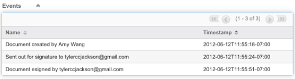

# [!DNL SugarCRM] Guide d’installation {#sugarcrm-install-guide}

[Contacter l’assistance clientèle](https://adobe.com/go/adobesign-support-center_fr)

Adobe [!DNL EchoSign] pour [!DNL SugarCRM] est une solution de signature électronique et de contractualisation web de pointe qui automatise les signatures électroniques dans [!DNL SugarCRM] pour les signatures électroniques et les télécopies. Les utilisateurs peuvent directement envoyer des contrats depuis SugarCRM, consulter l’historique des contrats et enregistrer des contrats signés électroniquement avec les comptes, contacts, devis associés et plus encore.
Adobe [!DNL EchoSign] pour [!DNL SugarCRM] est disponible pour toutes les versions prises en charge de SugarCRM, y compris 6.3 - 6.7 pour les solutions à la demande ou sur site.

Ce document est un guide pour [!DNL SugarCRM] administrateurs pour savoir comment installer et configurer l’Adobe [!DNL EchoSign] pour [!DNL SugarCRM] plugin.

## Installer ce module externe {#install-plugin}

1. Obtenir l&#39;Adobe [!DNL EchoSign] pour [!DNL SugarCRM]  archive à partir du fichier [Liste de SugarExchange](http://www.sugarexchange.com/product_details.php?product=1123).
1. Se connecter [!DNL SugarCRM] avec votre compte administrateur.
1. Accéder à **[!UICONTROL Administration]** > **[!UICONTROL Chargeur de modules]**.

   

1. Pour télécharger le fichier d’archive de l’Adobe [!DNL EchoSign] pour [!DNL SugarCRM] , sélectionnez **[!UICONTROL Parcourir]**, sélectionnez le fichier d’archive, puis sélectionnez **[!UICONTROL Télécharger]**.
1. Une fois le fichier d’archive chargé, sélectionnez **[!UICONTROL Installer]** pour commencer l’installation.
1. Vérifiez les conditions générales, puis sélectionnez **[!UICONTROL Accepter]** > **[!UICONTROL Valider]**.
1. Si le plug-in s’installe correctement, la barre de progression indique que l’installation a été effectuée à 100 %.  Si la barre de progression n’atteint pas 100 %, sélectionnez **[!UICONTROL Afficher le journal]** pour voir l&#39;erreur rencontrée par SugarCRM.

   

1. Après l’installation, accédez à **[!UICONTROL Administration > Réparation]** et sélectionnez **[!UICONTROL Réparation et reconstruction rapides]**.

>[!NOTE]
>
>Si vous installez le plug-in sous [!DNL SugarCRM] À la demande, créez un ticket de support avec [!DNL SugarCRM] pour supprimer temporairement les restrictions de l’inspecteur de package pour OnDemand afin que le package puisse être installé. Cela fait partie du processus standard.

## Mettre à niveau le plug-in {#upgrade-plugin}

Si vous mettez à jour l’Adobe [!DNL EchoSign] pour [!DNL SugarCRM] plugin à une version plus récente, vous devriez installer le plugin sans désinstaller la version précédente.
Après la mise à niveau du plug-in, accédez à **[!UICONTROL Administration]** > **[!UICONTROL Réparation]** et sélectionnez **[!UICONTROL Réparation et reconstruction rapides]**.

**Remarque :** Si vous désinstallez un module externe précédent, ne supprimez pas les tables pendant la désinstallation. Sinon, vous risquez de perdre la [!DNL EchoSign] données des accords.

## Configuration du plug-in {#configure-plugin}

1. Si vous êtes déjà un Adobe [!DNL EchoSign] client, passez à l’étape 2.

   Si vous n’avez pas de [!DNL EchoSign] compte, [inscrivez-vous à un essai GRATUIT de 14 jours](https://sugarcrmintegration.echosign.com/public/login) et suivez les étapes d’inscription en ligne pour activer votre Adobe [!DNL EchoSign] compte.
1. Se connecter à [Compte Echo Sign](http://www.echosign.com) et procédez comme suit :
   1. Sélectionner **[!UICONTROL Compte]** .
   1. Sélectionner **[!UICONTROL API EchoSign]** en bas à gauche.
   1. Sélectionner **[!UICONTROL Activer l’accès API]** et récupérez votre clé API depuis la page.

   

1. Dans SugarCRM, allez à **[!UICONTROL Administration]** > **[!UICONTROL Paramètres Adobe EchoSign]** et entrez la clé API dans le champ intitulé **[!UICONTROL Clé API EchoSign]**.
1. Si vous le souhaitez, configurez le plug-in avec les paramètres suivants :

   1. Joindre automatiquement le PDF lors de la création d’un accord à partir d’un devis : Indiquez si vous souhaitez joindre automatiquement un PDF du devis si un [!DNL SugarCRM] L’utilisateur crée un accord EchoSign à partir du module Devis.
   1. Gérer la liste des destinataires : Sélectionnez les modules à afficher dans le sous-panneau Destinataire du [!DNL EchoSign] Module Accords. Cela ajoute également l’attribut [!DNL EchoSign] Sous-panneau Accords pour ces modules.
   1. Ajoutez les boutons Envoyer à ces modules : Sélectionnez cette option si vous souhaitez que le [!DNL EchoSign] Bouton/action d’accord à inclure avec les actions principales du module Devis.
   1. Sélectionner **[!UICONTROL Enregistrer]** pour stocker vos paramètres.

**Remarque :** L&#39;Adobe [!DNL EchoSign] pour [!DNL SugarCRM] nécessite le module externe [Extension PHP SOAP](http://www.php.net/manual/en/book.soap.php). Pour activer le support SOAP, configurez PHP avec enable-soap.

## Obtenir les mises à jour des accords (pour [!DNL SugarCRM] versions 6.3 ou ultérieures) {#get-agreement-updates}

Pour les versions 6.3 et ultérieures, vous pouvez utiliser les deux options suivantes pour obtenir les mises à jour de l’accord. Dans les versions précédentes de SugarCRM, le module externe par défaut offre uniquement la méthode de rappel (Option 1).

### Option 1 : Configuration de la méthode de rappel pour l’envoi des mises à jour vers EchoSign

Si votre site web est public, vous pouvez faire en sorte qu’Adobe EchoSign envoie un ping à votre [!DNL SugarCRM] chaque fois qu&#39;un nouvel événement se produit. [!DNL SugarCRM] met ensuite à jour le statut de l’accord, les événements et télécharge le document signé (s’il est signé) automatiquement et en temps réel. (Si vous êtes derrière un pare-feu, vous devez mettre en liste blanche la [!DNL EchoSign] adresses IP du serveur ou utiliser la méthode de travail planifié pour mettre à jour les accords EchoSign (décrite dans la section suivante de ce guide).

1. Accéder à **[!UICONTROL Administration]** > **[!UICONTROL Paramètres Adobe EchoSign]**.
1. Cochez la case **[!UICONTROL Utiliser la méthode de rappel EchoSign]** pour mettre à jour les événements et les statuts des accords.
1. Sélectionner **[!UICONTROL Enregistrer]**.

### Option 2 : Configurer un travail planifié pour [!DNL SugarCRM] Instances derrière un pare-feu

La [!DNL EchoSign] pour [!DNL SugarCRM] peut également utiliser un travail planifié pour interroger [!DNL EchoSign] pour les mises à jour des accords envoyés pour signature. La méthode de requête de tâche planifiée peut être utilisée si vous disposez d’un [!DNL SugarCRM] l’installation se fait derrière un pare-feu.

Pour configurer :

1. Accéder à **[!UICONTROL Administration]** > **[!UICONTROL Planificateur]**.
1. Dans le menu déroulant de l’onglet, sélectionnez **[!UICONTROL Créer un planificateur]**.
1. Saisissez un nom de tâche.
1. Pour le champ Tâche, sélectionnez **[!UICONTROL Adobe EchoSign Status Updater]**.
1. Configurez la tâche pour qu&#39;elle s&#39;exécute aussi fréquemment que nécessaire. Nous vous suggérons de le configurer pour qu’il s’exécute toutes les 10 minutes, ce qui signifie qu’après l’ouverture, la lecture ou la signature d’un accord, jusqu’à 10 minutes peuvent être nécessaires pour [!DNL SugarCRM] à mettre à jour avec ces informations.

   **Remarque :** Si un grand nombre d’accords sont envoyés pour signature, le fait d’exécuter cette opération trop fréquemment peut ralentir votre système.

   

1. Accéder à **[!UICONTROL Administration]** > **[!UICONTROL Paramètres Adobe EchoSign]**.
1. Décochez la case **[!UICONTROL Utiliser la méthode de rappel EchoSign]** pour mettre à jour les événements et les statuts des accords.
1. Sélectionner **[!UICONTROL Enregistrer]**.
Remarque : Activer les planificateurs dans [!DNL SugarCRM] pour que cela fonctionne.

Pour ajouter des accords EchoSign à d’autres [!DNL SugarCRM] modules :

1. Accéder à **[!UICONTROL Administration]** > **[!UICONTROL Studio]**.
1. Dans l’arborescence de dossiers de la colonne de gauche, sélectionnez le module à ajouter [!DNL EchoSign] Accords.
1. Sélectionner **[!UICONTROL Relations]**> **[!UICONTROL Ajouter des relations]**.
1. Dans le menu déroulant, sélectionnez Type en tant que **[!UICONTROL Un à plusieurs]** et Module en tant que **[!UICONTROL Accords EchoSign]**.
1. Sélectionner **[!UICONTROL Enregistrement et déploiement]**.

   

   [!DNL EchoSign] Les accords apparaissent désormais dans le module et peuvent être créés et suivis.

   

**Autres étapes de configuration**

* **Masquage [!DNL EchoSign] Modules**: Vous pouvez masquer la [!DNL EchoSign] Destinataires et [!DNL EchoSign] Événements en accédant à Administration&quot; Afficher les onglets et sous-panneaux du module et les déplacer vers la colonne masquée.
* **Désactivation de packageScan**: Si vous avez activé packageScan sur votre propre système, vous devez le désactiver pendant l’installation. Si vous utilisez la commande [!DNL SugarCRM] À la demande, contact [!DNL SugarCRM] pour désactiver packageScan pour vous.

## Désinstallation du module externe {#uninstall-plugin}

1. Se connecter [!DNL SugarCRM] avec votre compte administrateur.
1. Accéder à **[!UICONTROL Administration]** > **[!UICONTROL Chargeur de modules]**.
1. Sélectionner **[!UICONTROL Désinstaller]** en regard du [!UICONTROL Module externe EchoSign pour SugarCRM].
1. Sélectionner **[!UICONTROL Valider]** pour commencer la désinstallation. Vous pouvez également choisir de supprimer les tables de base de données créées pour le plug-in.

   

   Si le plug-in se désinstalle correctement, la barre de progression indique un succès à 100 %. Si la barre de progression n’atteint pas 100 %, sélectionnez [!UICONTROL Afficher le journal] pour voir l&#39;erreur rencontrée par SugarCRM.

   

## Utiliser l’Adobe [!DNL EchoSign] pour [!DNL SugarCRM] {#use-echosign-for-sugarcrm}

Vous pouvez créer un Adobe [!DNL EchoSign] accord associé à un compte, un contact, un devis ou autre [!DNL SugarCRM] modules. Vous pouvez joindre des fichiers, spécifier des destinataires et les envoyer pour signature. Adobe [!DNL EchoSign] mises [!DNL SugarCRM] avec le statut actuel de l’accord et stocke le contrat signé dans [!DNL SugarCRM] une fois qu’il est entièrement exécuté.

### Création et modification d’un Adobe [!DNL EchoSign] accord {#create-edit-agreements}

Vous pouvez créer des accords via le menu [!DNL EchoSign] Module Accords ou via des modules configurés par un [!DNL SugarCRM] administrateur.

1. Dans le [!UICONTROL Actions] de la boîte de dialogue [!UICONTROL Accords EchoSign] , sélectionnez **[!UICONTROL Créer un accord EchoSign]**.
1. Dans la section principale du [!DNL EchoSign] Accord, entrez les informations suivantes ou sélectionnez parmi diverses options d’accord :

   1. **[!UICONTROL Nom :]** Saisissez un nom pour l’accord.
   1. **[!UICONTROL Type de signature :]** Sélectionnez le type de signature accepté pour le document. Les options disponibles sont Signature électronique et Signature par fax.
   1. **[!UICONTROL Je dois également signer cet accord :]** Indiquez si l’expéditeur doit également signer l’accord.
   1. **[!UICONTROL Ordre des signatures :]** Si l’option Je dois également signer cet accord est cochée, sélectionnez également l’ordre dans lequel l’expéditeur et les destinataires doivent signer.
   1. **[!UICONTROL Rappeler aux destinataires de signer :]** Sélectionnez la fréquence à laquelle rappeler à un destinataire de signer un document. Les options sont Quotidien ou Hebdomadaire.
   1. **[!UICONTROL Jours avant l’échéance de signature :]** Spécifiez le nombre de jours avant la signature de l’accord.
   1. **[!UICONTROL Prévisualiser, positionner la signature ou ajouter des champs de formulaire :]**  Sélectionnez cette option pour prévisualiser l’accord avant son envoi ou faites glisser les champs de signature, les champs initiaux ou d’autres champs de formulaire sur l’accord avant son envoi aux destinataires. Après avoir prévisualisé le document ou fait glisser les champs souhaités vers le document, n’oubliez pas de sélectionner le bouton Envoyer pour envoyer l’accord au destinataire.
   1. **[!UICONTROL Héberger signature pour 1er signataire :]** Indiquez si l’expéditeur souhaite héberger la signature de l’accord en personne.
      * **[!UICONTROL Message :]** Incluez un message pour le destinataire.
      * **[!UICONTROL Compte, Opportunité, Devis :]** Sélectionnez ou modifiez le compte, l’opportunité ou le devis associé à cet accord.
      * **[!UICONTROL Langue :]** Spécifiez la langue dans laquelle la page de signature et les notifications électroniques s’affichent pour les destinataires.

      

1. Dans le [!UICONTROL Options de sécurité] de la boîte de dialogue [!UICONTROL Accord EchoSign], entrez les informations suivantes :

   a) **[!UICONTROL Mot de passe requis pour la signature :]** Indiquez si un mot de passe doit être saisi pour qu’un destinataire puisse signer un document.
b) **[!UICONTROL Mot de passe requis pour l&#39;ouverture :]** Indiquez si un mot de passe doit être saisi pour qu’un destinataire puisse ouvrir un mot de PDF de l’accord ou de l’accord signé. c) **[!UICONTROL Mot de passe :]** Spécifiez le mot de passe à utiliser pour signer ou ouvrir un document.
d) **[!UICONTROL Confirmer le mot de passe :]** Confirmez le mot de passe à utiliser pour signer ou ouvrir un document.

1. Dans la section Autre du [!DNL EchoSign] Accord, saisissez les informations suivantes :

   a) **[!UICONTROL Utilisateur :]** Spécifiez un [!DNL SugarCRM] utilisateur. La valeur par défaut est l’utilisateur actuellement connecté au système.
b) **[!UICONTROL Équipes :]** Pour modifier l&#39;affectation d&#39;équipe principale, entrez le nom de la nouvelle équipe principale. Pour affecter des équipes supplémentaires à l’enregistrement, cliquez sur **[!UICONTROL Sélectionner]** et sélectionnez une équipe dans la liste des équipes, ou sélectionnez **[!UICONTROL Ajouter à]** pour ajouter des champs d’équipe et entrez les noms des équipes. Pour plus d’informations, voir Affectation d’enregistrements aux utilisateurs et aux équipes dans la [!DNL SugarCRM] Guide de candidature.

1. Sélectionner **[!UICONTROL Enregistrer]**.

### [!DNL EchoSign] vue détail des accords {#agreement-detail-view}

Après un [!DNL EchoSign] L’accord est enregistré, la vue Détails de l’accord comprend les sous-panneaux suivants :

* **[!UICONTROL Destinataires :]** Tous les contacts répertoriés dans ce sous-panneau reçoivent les documents spécifiés dans le sous-panneau Documents. Vous devez ajouter un ou plusieurs destinataires avant d’envoyer l’accord.
* **[!UICONTROL Documents :]** Charger un nouveau document ou sélectionner un document déjà chargé dans [!DNL SugarCRM] pour envoyer pour signature.
* **[!UICONTROL Événements :]** Toute action concernant l’accord, telle que l’heure à laquelle l’accord a été envoyé pour signature, affiché ou signé, est répertoriée dans ce sous-panneau.
Pour modifier un élément [!DNL EchoSign] Accord, sélectionnez l’option [!UICONTROL Modifier] dans la [!UICONTROL Vue Détail] de l’accord.

**Remarque :** Une fois qu’un accord est envoyé pour signature, la boîte de dialogue [!UICONTROL Modifier] est supprimé de la vue Détail pour conserver l’enregistrement des événements. Vous pouvez toutefois activer le bouton Modifier. Pour ce faire, accédez à [!UICONTROL Administrateur] > [!UICONTROL Paramètres Adobe EchoSign] et désélectionnez l’option *[!UICONTROL Une fois qu’un accord est envoyé pour signature, désactivez la possibilité de modifier ou de supprimer]*.

### Ajout d’un document à un [!DNL EchoSign] accord {#add-document}

[!DNL SugarCRM] les utilisateurs peuvent télécharger un nouveau document ou sélectionner un document déjà chargé dans [!DNL SugarCRM] en utilisant le sous-panneau Documents d’un enregistrement d’accord EchoSign.
Pour télécharger un document, sélectionnez **[!UICONTROL Télécharger le document]** dans le [!UICONTROL Documents] sous-panneau.

Consultez la section &quot;Module Documents&quot; du [!DNL SugarCRM] Guide de demande pour obtenir plus de renseignements sur les différents champs de ce formulaire.

Pour sélectionner un document, cliquez sur **[!UICONTROL Sélectionner]** dans le sous-panneau Documents. Voir &quot;Affichage et gestion des informations d’enregistrement&quot; dans la [!DNL SugarCRM] Guide d’application pour plus d’informations sur la gestion des informations associées dans les sous-panneaux.

### Spécifiez un destinataire pour un fichier [!DNL EchoSign] accord {#specify-recipient}

1. Dans le [!UICONTROL Destinataire] sous-panneau d’un [!DNL EchoSign] Accord, sélectionnez **[!UICONTROL Ajouter un destinataire]**.
1. Entrez les informations suivantes : a) [!UICONTROL Destinataire :] Sélectionnez le type de destinataire dans le menu déroulant. Saisissez le nom ou l’adresse électronique du destinataire dans le champ de texte. [!DNL SugarCRM] recherche le nom à mesure que vous tapez et propose une liste de sélections. Sélectionnez un nom si une correspondance est trouvée. Vous pouvez également sélectionner l’icône en forme de flèche pour sélectionner un nom dans une fenêtre contextuelle. Pour effacer le nom du champ, sélectionnez l’option **[!UICONTROL X]** s’affiche.
b) [!UICONTROL Rôle :] Sélectionnez un rôle dans le menu déroulant. Les options sont Signataire et CC et Approbateur. Un approbateur n’a pas besoin de signer le document.
1. Sélectionnez Enregistrer.

### Envoi d’accords pour signature {#send-for-signature}

Lorsque les accords sont prêts à être envoyés pour signature, sélectionnez **[!UICONTROL Send for Signature]** dans le menu déroulant en haut à gauche de la page. Les destinataires reçoivent ensuite un e-mail les informant des documents en attente de leur signature. Une fois que les destinataires ont signé le document, l’expéditeur reçoit une notification par e-mail.
Si la [!UICONTROL Héberger signature pour 1er signataire] est cochée, vous pouvez sélectionner **[!UICONTROL Send for Signature]** pour permettre au signataire de signer le document avec l’expéditeur présent.

Un lien **[!UICONTROL Héberger signature pour le signataire actuel]** pour le signataire actuel s’affiche également en regard du champ [!UICONTROL Héberger signature pour 1er signataire], accessible jusqu’à ce que le document soit signé. Vous pouvez utiliser ce lien pour héberger la signature de l’accord pour plusieurs signataires ou pour rouvrir la fenêtre contextuelle si elle a été fermée par erreur.
Si [!UICONTROL Prévisualisation, positionnement de la signature ou ajout de champs de formulaire] est cochée, sélectionnez **[!UICONTROL Send for Signature]** pour permettre à l’expéditeur de prévisualiser le document ou de faire glisser des champs sur le document avant son envoi. Vous devez sélectionner **[!UICONTROL Envoyer]** dans cette fenêtre pour envoyer l’accord au destinataire.

Figure 5 : Sélectionnez Send for Signature pour envoyer un document à un destinataire pour signature.

### Envoyer à partir d’un enregistrement de devis {#send-from-quote-record}

Adobe [!DNL EchoSign] a une intégration directe avec Devis dans [!DNL SugarCRM] afin que le PDF du devis soit automatiquement généré et joint à l’enregistrement de l’accord.
Lorsque vous consultez un devis, sélectionnez **[!UICONTROL Créer un accord EchoSign]** pour générer le devis et le joindre automatiquement à l’accord. Le nouvel accord associe également automatiquement toute opportunité, tout compte ou tout devis associé.

Pour désactiver la pièce jointe automatique du devis PDF à l’accord, accédez à **[!UICONTROL Administration]** > **[!UICONTROL Paramètres Adobe EchoSign]**, puis décochez la case *[!UICONTROL Joindre automatiquement le PDF lors de la création d’un accord à partir d’un devis]*.

### Annulation d’un accord {#cancel-agreement}

Vous pouvez annuler un [!DNL EchoSign] Accord après son envoi pour signature si tous les destinataires n’ont pas encore signé le document. A [!UICONTROL Annuler l’accord] apparaît dans la vue Détail d’un accord après l’envoi d’un document pour signature. Sélectionner **[!UICONTROL Annuler l’accord]** pour annuler l’accord.

Remarque : Si un [!DNL EchoSign] L’accord est envoyé pour signature et l’enregistrement est supprimé. Vous devez annuler l’accord avant de le supprimer.

### Suivi des signatures {#track-signatures}

La [!UICONTROL Événements] sous-panneau d’un [!DNL EchoSign] L’accord suit le statut des accords envoyés pour signature. Pour afficher les dernières mises à jour sur un [!DNL EchoSign] Accord, sélectionnez **[!UICONTROL Mettre à jour]**. La [!UICONTROL Mettre à jour] n’est disponible qu’après l’envoi d’un accord pour signature.

Une fois qu’un accord est envoyé pour signature, sélectionnez **[!UICONTROL Mettre à jour]** pour récupérer le dernier état.

### Envoyer des rappels {#send-reminders}

Pour envoyer un rappel au signataire actuel après l’envoi de l’accord, sélectionnez **[!UICONTROL Envoyer le rappel]**. Il envoie immédiatement un e-mail de rappel au signataire actuel pour l’accord en attente de signature.

