# [!DNL SugarCRM]  Guide d’installation {#sugarcrm-install-guide}

[Contacter le service clientèle](https://adobe.com/go/adobesign-support-center_fr)

L’Adobe [!DNL EchoSign] pour [!DNL SugarCRM] est une solution de pointe en matière de signature électronique et de contrats Web qui permet l’automatisation des signatures électroniques dans [!DNL SugarCRM] pour les signatures électroniques et les signatures par fax. Les utilisateurs peuvent envoyer directement des contrats à partir de SugarCRM, afficher l’historique des contrats et enregistrer des contrats signés électroniquement avec des comptes, contacts, devis associés, etc. associés.
L&#39;Adobe [!DNL EchoSign] pour [!DNL SugarCRM] est disponible pour toutes les versions prises en charge de SugarCRM, y compris les versions 6.3 à 6.7 pour les solutions à la demande ou sur site.

Ce document est un guide destiné aux administrateurs [!DNL SugarCRM] pour savoir comment installer et configurer Adobe [!DNL EchoSign] pour [!DNL SugarCRM] plug-in.

## Installer ce plug-in {#install-plugin}

1. Obtenez l&#39;Adobe [!DNL EchoSign] pour [!DNL SugarCRM] fichier d&#39;archive à partir de la liste [SugarExchange](http://www.sugarexchange.com/product_details.php?product=1123).
1. Connectez-vous à [!DNL SugarCRM] avec votre compte d&#39;administrateur.
1. Accédez à **[!UICONTROL Administration]** > **[!UICONTROL Module Loader]**.

   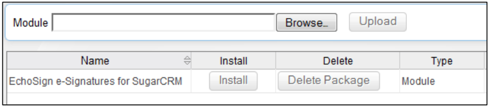

1. Pour télécharger le fichier d&#39;archive de l&#39;Adobe [!DNL EchoSign] pour [!DNL SugarCRM] plug-in, sélectionnez **[!UICONTROL Parcourir]**, sélectionnez le fichier d&#39;archive, puis sélectionnez **[!UICONTROL Télécharger]**.
1. Une fois le fichier d&#39;archive chargé, sélectionnez **[!UICONTROL Installer]** pour commencer l&#39;installation.
1. Passez en revue les conditions générales, puis sélectionnez **[!UICONTROL Accepter]** > **[!UICONTROL Commit]**.
1. Si le module externe s’installe correctement, la barre de progression indique une réussite de 100 %.  Si la barre de progression n&#39;atteint pas 100 %, sélectionnez **[!UICONTROL Afficher le journal]** pour voir l&#39;erreur rencontrée par SugarCRM.

   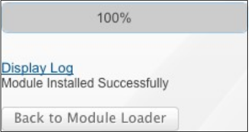

1. Après l&#39;installation, accédez à **[!UICONTROL Administration > Réparer]** et sélectionnez **[!UICONTROL Réparation rapide et reconstruction]**.

>[!NOTE]
>
>Si vous installez le module externe sur [!DNL SugarCRM] OnDemand, envoyez un ticket de support avec [!DNL SugarCRM] pour supprimer temporairement les restrictions de l’inspecteur de packages pour OnDemand afin que le package puisse être installé. Cela fait partie du processus standard.

## Mettre à niveau le module externe {#upgrade-plugin}

Si vous mettez à jour l’Adobe [!DNL EchoSign] pour [!DNL SugarCRM] plug-in vers une version plus récente, vous devez installer le plug-in sans désinstaller la version précédente.
Après avoir mis à niveau le module externe, accédez à **[!UICONTROL Administration]** > **[!UICONTROL Réparer]** et sélectionnez **[!UICONTROL Réparation rapide et reconstruction]**.

**Remarque :** si vous désinstallez un module externe précédent, ne supprimez pas les tables pendant la désinstallation. Sinon, vous risquez de perdre les données de l’accord [!DNL EchoSign].

## Configuration du module externe {#configure-plugin}

1. Si vous êtes déjà un client [!DNL EchoSign] Adobe, passez à l&#39;étape 2.

   Si vous n’avez pas de compte [!DNL EchoSign], [inscrivez-vous pour une évaluation GRATUITE de 14 jours](https://sugarcrmintegration.echosign.com/public/login) et suivez les étapes d’enregistrement en ligne pour activer votre compte d’Adobe [!DNL EchoSign].
1. Connectez-vous à [compte Echo Sign](http://www.echosign.com) et procédez comme suit :
   1. Sélectionnez l&#39;onglet **[!UICONTROL Compte]**.
   1. Sélectionnez **[!UICONTROL API EchoSign]** en bas à gauche.
   1. Sélectionnez **[!UICONTROL Activer l’accès à l’API]** et récupérez votre clé d’API à partir de la page.

   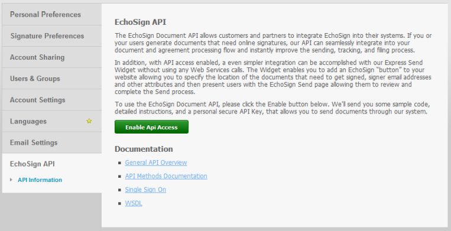

1. Dans SugarCRM, accédez à **[!UICONTROL Administration]** > **[!UICONTROL Paramètres Adobe EchoSign]** et entrez la clé d’API dans le champ intitulé **[!UICONTROL Clé d’API EchoSign]**.
1. Si vous le souhaitez, configurez le module externe avec les paramètres suivants :

   1. Joindre automatiquement un PDF lors de la création d’un accord à partir d’un devis : Sélectionnez si vous souhaitez joindre automatiquement un PDF du devis si un utilisateur [!DNL SugarCRM] crée un accord EchoSign à partir du module Guillemets.
   1. Gérer la liste des destinataires : Sélectionnez les modules qui apparaissent dans le sous-panneau Destinataire du module Accords [!DNL EchoSign]. Cela ajoute également le sous-panneau Accords [!DNL EchoSign] à ces modules.
   1. Ajoutez les boutons d’envoi aux modules suivants : Sélectionnez cette option si vous souhaitez que le bouton/l’action Créer un [!DNL EchoSign] accord soit inclus dans les actions principales du module Devis.
   1. Sélectionnez **[!UICONTROL Enregistrer]** pour stocker vos paramètres.

**Note :** L&#39;Adobe  [!DNL EchoSign] du  [!DNL SugarCRM] plug-in nécessite l&#39;extension [ SOAP ](http://www.php.net/manual/en/book.soap.php)PHP. Pour activer la prise en charge SOAP, configurez PHP avec enable-soap.

## Obtenir les mises à jour de l’accord (pour [!DNL SugarCRM] les versions 6.3 ou ultérieures) {#get-agreement-updates}

Pour la version 6.3 et les versions ultérieures, vous pouvez utiliser les deux options suivantes pour obtenir les mises à jour d’accord. Dans les versions précédentes de SugarCRM, le module externe propose par défaut uniquement la méthode de rappel (Option 1).

### Option 1 : Configuration de la méthode de rappel pour transmettre les mises à jour à EchoSign

Si votre site Web est public, vous pouvez demander à Adobe EchoSign de ping votre instance [!DNL SugarCRM] chaque fois qu&#39;un nouvel événement se produit. [!DNL SugarCRM] met ensuite à jour l’état de l’accord, les événements et téléchargez le document signé (s’il est signé) automatiquement et en temps réel. (Si vous êtes derrière un pare-feu, vous devez approuver les adresses IP du serveur [!DNL EchoSign] ou utiliser la méthode Travail planifié pour mettre à jour les accords EchoSign décrite dans la section suivante de ce guide).

1. Accédez à **[!UICONTROL Administration]** > **[!UICONTROL Paramètres Adobe EchoSign]**.
1. Cochez la case **[!UICONTROL Utiliser la méthode de rappel EchoSign]** pour mettre à jour les événements et les états des accords.
1. Sélectionnez **[!UICONTROL Enregistrer]**.

### Option 2 : Configuration d&#39;une tâche planifiée pour [!DNL SugarCRM] instances derrière un pare-feu

Le module externe [!DNL EchoSign] pour [!DNL SugarCRM] peut également utiliser une tâche planifiée pour interroger [!DNL EchoSign] les mises à jour des accords envoyés pour signature. La méthode de requête de tâche planifiée peut être utilisée si vous disposez d&#39;une installation sur site [!DNL SugarCRM] située derrière un pare-feu.

Pour configurer :

1. Accédez à **[!UICONTROL Administration]** > **[!UICONTROL Planificateur]**.
1. Dans le menu déroulant de l&#39;onglet, sélectionnez **[!UICONTROL Créer un planificateur]**.
1. Saisissez un nom de tâche.
1. Pour le champ Tâche, sélectionnez **[!UICONTROL Adobe EchoSign Status Updater]**.
1. Définissez la tâche à exécuter aussi souvent que nécessaire. Nous suggérons de le configurer pour qu’il s’exécute toutes les 10 minutes, ce qui signifie qu’après l’ouverture, la lecture ou la signature d’un accord, il peut prendre jusqu’à 10 minutes pour que [!DNL SugarCRM] soit mis à jour avec ces informations.

   **Remarque :** si de nombreux accords sont en attente de signature, une exécution trop fréquente peut ralentir votre système.

   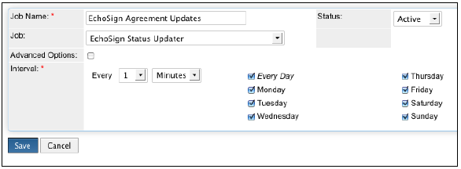

1. Accédez à **[!UICONTROL Administration]** > **[!UICONTROL Paramètres Adobe EchoSign]**.
1. Décochez la case **[!UICONTROL Utiliser la méthode de rappel EchoSign]** pour mettre à jour les événements et les états des accords.
1. Sélectionnez **[!UICONTROL Enregistrer]**.
Remarque : Activez les planificateurs dans [!DNL SugarCRM] pour que cela fonctionne.

Pour ajouter des accords EchoSign à d’autres modules [!DNL SugarCRM] :

1. Accédez à **[!UICONTROL Administration]** > **[!UICONTROL Studio]**.
1. Dans l’arborescence du dossier de la colonne de gauche, sélectionnez le module pour ajouter [!DNL EchoSign] des accords.
1. Sélectionnez **[!UICONTROL Relations]** **[!UICONTROL Ajouter des relations]**.
1. Dans le menu déroulant, sélectionnez Tapez **[!UICONTROL Un à plusieurs]** et Module comme **[!UICONTROL Accords EchoSign]**.
1. Sélectionnez **[!UICONTROL Enregistrer et déployer]**.

   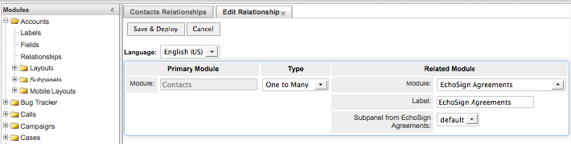

   [!DNL EchoSign] Les accords s’affichent désormais dans le module et ils peuvent être créés et suivis dans ce module.

   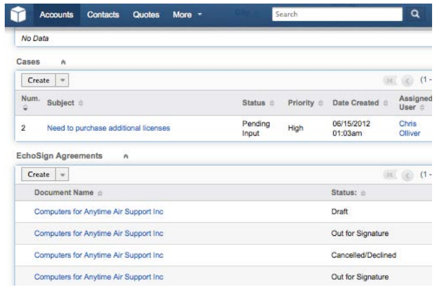

**Autres étapes de configuration**

* **Masquage  [!DNL EchoSign] des modules** : Vous pouvez masquer les modules  [!DNL EchoSign] Destinataires et  [!DNL EchoSign] Evénements en accédant à Administration > Onglets et sous-panneaux du module d’affichage et en les déplaçant dans la colonne masquée.
* **Désactivation de packageScan** : Si vous avez activé PackageScan sur votre propre système, vous devez le désactiver pendant l&#39;installation. Si vous utilisez [!DNL SugarCRM] On-Demand, contactez le support [!DNL SugarCRM] pour désactiver PackageScan pour vous.

## Désinstallation du module externe {#uninstall-plugin}

1. Connectez-vous à [!DNL SugarCRM] avec votre compte d&#39;administrateur.
1. Accédez à **[!UICONTROL Administration]** > **[!UICONTROL Module Loader]**.
1. Sélectionnez **[!UICONTROL Désinstaller]** en regard du [!UICONTROL module externe EchoSign pour SugarCRM].
1. Sélectionnez **[!UICONTROL Valider]** pour commencer la désinstallation. Vous pouvez également choisir de supprimer les tables de base de données créées pour le module externe.

   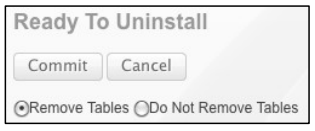

   Si le module externe se désinstalle correctement, la barre de progression indique une réussite de 100 %. Si la barre de progression n&#39;atteint pas 100 %, sélectionnez [!UICONTROL Afficher le journal] pour voir l&#39;erreur rencontrée par SugarCRM.

   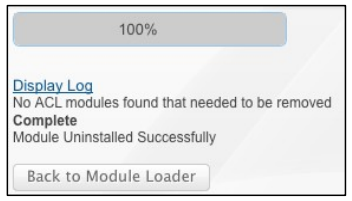

## Utiliser l&#39;Adobe [!DNL EchoSign] pour [!DNL SugarCRM] {#use-echosign-for-sugarcrm}

Vous pouvez créer un accord d&#39;Adobe [!DNL EchoSign] associé à un compte, à un contact, à un devis ou à d&#39;autres modules [!DNL SugarCRM]. Vous pouvez joindre des fichiers, spécifier des destinataires et les envoyer pour signature. L&#39;Adobe [!DNL EchoSign] met à jour [!DNL SugarCRM] avec l&#39;état actuel de l&#39;accord et stocke le contrat signé dans [!DNL SugarCRM] une fois qu&#39;il a été entièrement exécuté.

### Création et modification d’un accord d’Adobe [!DNL EchoSign] {#create-edit-agreements}

Vous pouvez créer des accords via le module Accords [!DNL EchoSign] ou via des modules configurés par un administrateur [!DNL SugarCRM].

1. Dans la liste [!UICONTROL Actions] de l’onglet [!UICONTROL Accords EchoSign], sélectionnez **[!UICONTROL Créer l’accord EchoSign]**.
1. Dans la section principale de l’accord [!DNL EchoSign], entrez les informations suivantes ou sélectionnez l’une des différentes options d’accord :

   1. **[!UICONTROL Nom :]** saisissez un nom pour l’accord.
   1. **[!UICONTROL Type de signature :]** sélectionnez le type de signature accepté pour le document. Les options disponibles sont la signature électronique et la signature par fax.
   1. **[!UICONTROL Je dois également signer cet accord :]** indiquez si l’expéditeur doit également signer l’accord.
   1. **[!UICONTROL Ordre de signature :]** si l’option précédente Je dois également signer cet accord est cochée, sélectionnez également l’ordre dans lequel l’expéditeur et les destinataires doivent signer.
   1. **[!UICONTROL Rappeler aux destinataires de signer :]** sélectionnez la fréquence à laquelle rappeler à un destinataire de signer un document. Les options disponibles sont Quotidien ou Hebdomadaire.
   1. **[!UICONTROL Jours avant l’échéance de signature :]** spécifiez le nombre de jours avant la signature de l’accord.
   1. **[!UICONTROL Aperçu, placer la signature ou ajouter des champs de formulaire :]**  sélectionnez cette option pour prévisualiser l’accord avant qu’il ne soit envoyé ou faites glisser et déposez les champs de signature, les champs initiaux ou d’autres champs de formulaire sur l’accord avant qu’il ne soit envoyé aux destinataires. Après avoir prévisualisé le document ou fait glisser les champs que vous souhaitez placer sur le document, n’oubliez pas de sélectionner le bouton Envoyer pour envoyer l’accord au destinataire.
   1. **[!UICONTROL Héberger la signature pour le premier signataire :]** indiquez si l’expéditeur souhaite héberger la signature de l’accord en personne.
      * **[!UICONTROL Message :]** incluez un message pour le destinataire.
      * **[!UICONTROL Compte, Opportunité, Devis :]** sélectionnez ou modifiez le compte, l’opportunité ou le devis associé à cet accord.
      * **[!UICONTROL Langue :]** spécifiez la langue dans laquelle la page de signature et les notifications par courrier électronique sont affichées aux destinataires.

      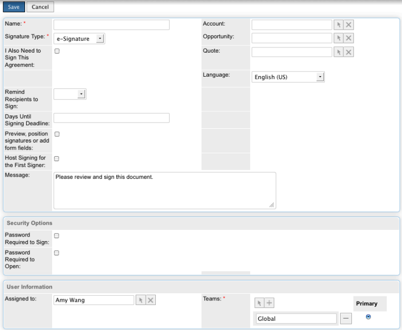

1. Dans la section [!UICONTROL Options de sécurité] de l’[!UICONTROL accord EchoSign], entrez les informations suivantes :

   a) **[!UICONTROL Mot de passe requis pour signer :]** Indiquez si un mot de passe doit être saisi avant qu’un destinataire puisse signer un document.
b) **[!UICONTROL Mot de passe requis pour l’ouverture :]** Indiquez si un mot de passe doit être saisi avant qu’un destinataire puisse ouvrir un PDF de l’accord ou de l’accord signé.
c) **[!UICONTROL Mot de passe :]** Spécifiez le mot de passe à utiliser pour signer ou ouvrir un document.
d) **[!UICONTROL Confirmer le mot de passe :]** Confirmez le mot de passe à utiliser pour signer ou ouvrir un document.

1. Dans la section Autre de l&#39;accord [!DNL EchoSign], entrez les informations suivantes :

   a) **[!UICONTROL Utilisateur :]** Spécifiez un utilisateur [!DNL SugarCRM]. La valeur par défaut est l’utilisateur actuellement connecté au système.
b) **[!UICONTROL Équipes :]** Pour modifier l&#39;affectation de l&#39;équipe principale, entrez le nom de la nouvelle équipe principale. Pour affecter des équipes supplémentaires à l’enregistrement, cliquez sur **[!UICONTROL Sélectionner]** et sélectionnez une équipe dans la liste d’équipes, ou sélectionnez **[!UICONTROL Ajouter à]** pour ajouter des champs d’équipe et entrer les noms d’équipe. Pour plus d’informations, voir &quot;Affectation d’enregistrements à des utilisateurs et des équipes&quot; dans le [!DNL SugarCRM] Guide de l’application.

1. Sélectionnez **[!UICONTROL Enregistrer]**.

### [!DNL EchoSign] vue détaillée des accords {#agreement-detail-view}

Une fois un accord [!DNL EchoSign] enregistré, la vue Détail de l’accord inclut les sous-panneaux suivants :

* **[!UICONTROL Destinataires :]** tous les contacts répertoriés dans ce sous-panneau reçoivent les documents spécifiés dans le sous-panneau Documents. Vous devez ajouter un ou plusieurs destinataires avant d’envoyer l’accord.
* **[!UICONTROL Documents :]** Chargez un nouveau document ou sélectionnez un document déjà chargé  [!DNL SugarCRM] pour signature.
* **[!UICONTROL Événements :]** Toute action concernant l’accord, telle que lorsque l’accord a été envoyé pour signature, affiché ou signé, est répertoriée dans ce sous-panneau.
Pour modifier un [!DNL EchoSign] accord, sélectionnez le bouton [!UICONTROL Modifier] dans la [!UICONTROL vue Détail] de l’accord.

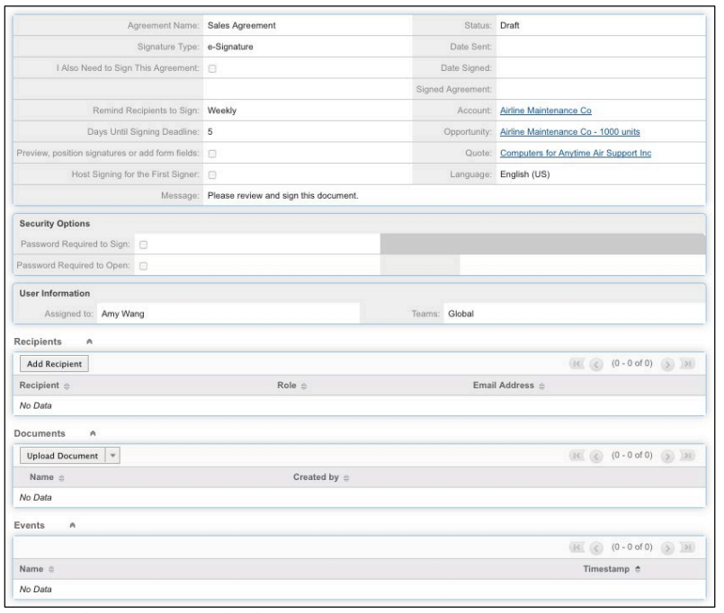

**Remarque :** Après l’envoi d’un accord pour signature, le bouton   Modifier est supprimé de la vue Détail pour conserver l’enregistrement des événements. Cependant, vous pouvez activer le bouton Modifier. Pour ce faire, accédez à [!UICONTROL Admin] > [!UICONTROL Paramètres Adobe EchoSign] et désélectionnez l’option *[!UICONTROL Une fois qu’un accord est envoyé pour signature, désactivez la possibilité de modifier ou de supprimer]*.

### Ajout d’un document à un accord [!DNL EchoSign] {#add-document}

[!DNL SugarCRM] les utilisateurs peuvent télécharger un nouveau document ou sélectionner un document déjà chargé dans  [!DNL SugarCRM] en utilisant le sous-panneau Documents d’un enregistrement d’accord EchoSign.
Pour télécharger un document, sélectionnez **[!UICONTROL Télécharger le document]** dans le sous-panneau [!UICONTROL Documents].

Pour plus d&#39;informations sur les champs individuels de ce formulaire, consultez la section &quot;Module Documents&quot; du [!DNL SugarCRM] Guide de l&#39;application.

Pour sélectionner un document, cliquez sur **[!UICONTROL Sélectionner]** dans le sous-panneau Documents. Pour plus d&#39;informations sur la gestion des informations associées dans les sous-panneaux, consultez la rubrique &quot;Affichage et gestion des informations d&#39;enregistrement&quot; dans le [!DNL SugarCRM] Guide de l&#39;application.

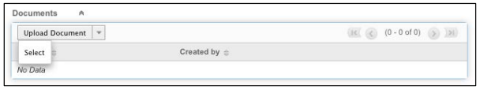

### Spécifier un destinataire pour un accord [!DNL EchoSign] {#specify-recipient}

1. Dans le sous-panneau [!UICONTROL Destinataire] d’un [!DNL EchoSign] accord, sélectionnez **[!UICONTROL Ajouter un destinataire]**.
1. Entrez les informations suivantes :
a) [!UICONTROL Destinataire :] Sélectionnez le type de destinataire dans le menu déroulant. Saisissez le nom ou l’adresse électronique du destinataire dans le champ de texte. [!DNL SugarCRM] recherche le nom à mesure que vous tapez et propose une liste de sélections. Sélectionnez un nom si une correspondance est trouvée. Vous pouvez également sélectionner l’icône en forme de flèche pour sélectionner un nom dans une fenêtre contextuelle. Pour effacer le nom du champ, sélectionnez l’icône **[!UICONTROL X]**.
b) [!UICONTROL Rôle :] Sélectionnez un rôle dans le menu déroulant. Les options disponibles sont Signataire, CC et Approbateur. Un approbateur n’a pas à signer le document.
1. Sélectionnez Enregistrer.

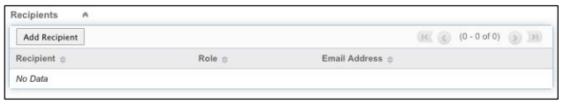

### Envoi d’accords pour signature {#send-for-signature}

Lorsque les accords sont prêts à être envoyés pour signature, sélectionnez **[!UICONTROL Send for Signature]** dans le menu déroulant en haut à gauche de la page. Les destinataires reçoivent ensuite un courrier électronique les informant des documents en attente de leur signature. Une fois que les destinataires ont signé le document, l’expéditeur reçoit une notification par e-mail.
Si l’option [!UICONTROL Héberger la signature pour le premier signataire] est cochée, vous pouvez sélectionner **[!UICONTROL Send for Signature]** pour permettre au signataire de signer le document avec l’expéditeur présent.

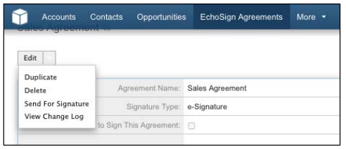

Un lien **[!UICONTROL Héberger signature pour le signataire actuel]** pour le signataire actuel s’affiche également en regard du champ [!UICONTROL Héberger signature pour 1er signataire], accessible jusqu’à ce que le document soit signé. Vous pouvez utiliser ce lien pour héberger la signature de l’accord pour plusieurs signataires, ou pour rouvrir la fenêtre contextuelle si elle a été fermée accidentellement.
Si l’option [!UICONTROL Aperçu, placer la signature ou ajouter des champs de formulaire] est cochée, sélectionnez **[!UICONTROL Send for Signature]** pour permettre à l’expéditeur de prévisualiser le document ou de faire glisser les champs vers le document avant de l’envoyer. Vous devez sélectionner **[!UICONTROL Envoyer]** dans cette fenêtre pour envoyer l’accord au destinataire.

Figure 5 : Sélectionnez Send for Signature pour envoyer un document à un destinataire pour signature.

### Envoi depuis un enregistrement de devis {#send-from-quote-record}

L&#39;Adobe [!DNL EchoSign] est directement intégré aux devis dans [!DNL SugarCRM] de sorte que le PDF du devis soit automatiquement généré et joint à l&#39;enregistrement de l&#39;accord.
Lors de l’affichage d’un devis, sélectionnez **[!UICONTROL Créer un accord EchoSign]** pour générer le devis et le joindre automatiquement à l’accord. Le nouvel accord associe également automatiquement toute opportunité, compte ou devis associés.

Pour désactiver la pièce jointe automatique du PDF de devis de l’accord, accédez à **[!UICONTROL Administration]** > **[!UICONTROL Paramètres Adobe EchoSign]**, puis décochez la case *[!UICONTROL Joindre automatiquement le PDF lors de la création d’un accord à partir d’un devis]*.

### Annulation d’un accord {#cancel-agreement}

Si tous les destinataires n’ont pas encore signé le document, vous pouvez annuler un [!DNL EchoSign] accord après l’avoir envoyé pour signature. Un bouton [!UICONTROL Annuler l’accord] apparaît dans la vue Détail d’un accord après l’envoi d’un document pour signature. Sélectionnez **[!UICONTROL Annuler l’accord]** pour annuler l’accord.

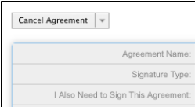

Remarque : Si un accord [!DNL EchoSign] est envoyé pour signature et que l’enregistrement est supprimé, vous devez annuler l’accord avant de le supprimer.

### Suivi des signatures {#track-signatures}

Le sous-panneau [!UICONTROL Événements] d’un [!DNL EchoSign] accord suit l’état des accords envoyés pour signature. Pour afficher les dernières mises à jour d’un [!DNL EchoSign] accord, sélectionnez **[!UICONTROL Mettre à jour l’état]**. Le bouton [!UICONTROL Mettre à jour l’état] n’est disponible qu’après l’envoi d’un accord pour signature.

### Envoi de rappels {#send-reminders}

Pour envoyer un rappel au signataire actuel après l’envoi de l’accord, sélectionnez **[!UICONTROL Envoyer un rappel]**. Il envoie immédiatement un rappel par courrier électronique au signataire actuel concernant l’accord en attente de signature.

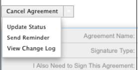
