# [!DNL Veeva Vault] Guide d’installation{#veeva-installation-guide}

[**Contacter le support technique Adobe Sign**](https://adobe.com/go/adobesign-support-center_fr)

## Présentation {#overview}

Ce document explique comment établir l’intégration d’Adobe Sign avec [!DNL Veeva Vault] plateforme. [!DNL Veeva Vault] est une plateforme de gestion de contenu d&#39;entreprise (ECM) conçue pour les sciences de la vie. Un &quot;coffre-fort&quot; est un dépôt de contenu et de données dont l&#39;utilisation est typique pour les dépôts réglementaires, les rapports de recherche, les demandes de subventions, les marchés généraux, etc. Une seule entreprise peut avoir plusieurs &quot;coffres&quot; qui doivent être gérés séparément.

Les étapes générales pour terminer l’intégration sont les suivantes :

* Activez votre compte d’administrateur dans Adobe Sign (nouveaux clients uniquement).
* Créez des objets pour suivre l’historique du cycle de vie d’un accord dans Vault.
* Créez un profil de sécurité.
* Configurez un groupe dans Adobe Sign pour qu’il contienne le [!DNL Veeva Vault] utilisateur d’intégration.
* Créez des champs et des rendus de document.
* Configurez les actions web et mettez à jour le cycle de vie du document.
* Créer un utilisateur de type de document et la configuration du rôle utilisateur.
* Connectez Veeva Vault à Adobe Sign à l’aide d’un middleware.

>[!NOTE]
>
>L’administrateur Adobe Sign doit effectuer les étapes de configuration d’Adobe Sign dans Adobe Sign.

## Configurer [!DNL Veeva Vault] {#configure-veeva}

Pour configurer [!DNL Veeva Vault] pour l’intégration avec Adobe Sign, vous devez implémenter les étapes ci-dessous.

### Étape 1. Créer un groupe {#create-group}

Pour configurer Adobe Sign pour [!DNL Vault], un nouveau groupe appelé *Groupe d’administration Adobe Sign* est créée. Ce groupe est utilisé pour définir la sécurité au niveau du champ de document pour les champs associés à Adobe Sign et doit inclure *Profil d’intégration Adobe Sign* par défaut.

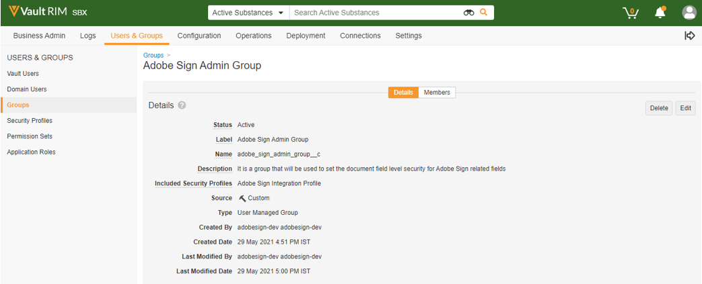

### Étape 2. Déploiement du pack {#deploy-package}

[Déploiement du pack](https://helpx.adobe.com/content/dam/help/en/PKG-AdobeSign-Integration.zip) et suivez les étapes. Une fois déployé, le pack crée :

* Objets personnalisés : Objet Signature, objet Signatory, objet Signature Event, objet Process Locker
* Mise en page Objet Signature
* Mise en page de l’objet Signature Event
* Mise en page des objets signataires
* Mise en page d&#39;objet Process Locker
* Type de rendu Adobe Sign
* Signature de champ partagé __c , allow_adobe_sign_user_actions__c
* Action web Adobe Sign
* Annuler l’action web Adobe Sign
* Jeu d’autorisations Actions d’administrateur Adobe Sign
* Profil de sécurité du profil d’intégration Adobe Sign
* Rôle d’application Rôle d’administrateur Adobe Sign
* Groupe de types de document &quot;Document Adobe Sign&quot;

#### Objet Signature {#signature-object}

L’objet Signature est créé pour stocker les informations relatives à l’accord. Un objet Signature est une base de données qui contient des informations dans les champs spécifiques suivants :

**Champs d’objet Signature**

| Champ | Libellé | Type | Description |
| --- | --- | ---| --- | 
| id_externe__c | ID de l’accord | Chaîne (100) | Contient l’ID d’accord unique Adobe Sign. |
| file_hash__c | Hachage de fichier | Chaîne (50) | Contient la somme de contrôle md5 du fichier envoyé à Adobe Sign |
| name__v | Nom | Chaîne (128) | Contient le nom de l’accord |
| sender__c | Expéditeur | Objet (Utilisateur) | Contient la référence à l’utilisateur Vault qui a créé l’accord. |
| signature_status__c | État de signature | Chaîne (75) | Contient le statut de l’accord dans Adobe Sign. |
| signature_type__c | Type de signature | Chaîne (20) | Contient le type de signature de l’accord dans Adobe Sign (PAR ÉCRIT ou ESIGN). |
| start_date__c | Date de début | DateHeure | Date d’envoi de l’accord pour signature |
| cancelation_date__c | Date de résiliation | DateHeure | Contient la date à laquelle l’accord a été annulé. |
| completed_date__c | Date de fin | DateHeure | Contient la date à laquelle l’accord a été complété. |
| viewable_rendition_used__c | Format associé visible utilisé | Booléen | Indicateur qui indique si le rendu visible a été envoyé pour signature. (par défaut, elle est vraie) |

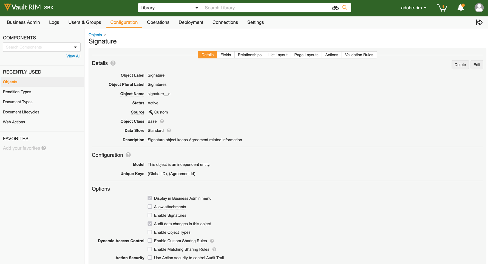

#### Objet signataire {#signatory-object}

L’objet signataire est créé pour stocker des informations liées aux participants dans un accord. Il contient des informations dans les champs spécifiques suivants :

**Champs d’objet signataire**

| Champ | Libellé | Type | Description |
| --- | --- | ---| --- | 
| email__c | E-mail | Chaîne (120) | Contient l’ID d’accord unique Adobe Sign. |
| id_externe__c | ID du participant | Chaîne (80) | Contient l’identifiant unique du participant Adobe Sign |
| name__v | Nom | Chaîne (128) | Contient le nom du participant Adobe Sign |
| order__c | Ordre | Numéro | Contient le numéro de commande du participant à l’accord Adobe Sign |
| role__c | Rôle | Chaîne (30) | Contient le rôle du participant à l’accord Adobe Sign |
| signature__c | Signature | Objet (signature) | Contient la référence à l’enregistrement parent de la signature |
| signature_status__c | État de signature | Chaîne (100) | Contient le statut du participant à l’accord Adobe Sign |
| user__c | Utilisateur | Objet (Utilisateur) | Contient la référence à l’enregistrement d’utilisateur du signataire si le participant est un utilisateur Vault |

#### Objet Événement de signature {#signature-event}

L’objet Événement de signature est créé pour stocker les informations relatives aux événements d’un accord. Il contient des informations dans les champs spécifiques suivants :

| Champ | Libellé | Type | Description |
| --- | --- | ---| --- | 
| acting_user_email__c | Adresse él. du responsable de l’action | Chaîne | Contient l’adresse e-mail de l’utilisateur Adobe Sign qui a exécuté l’action à l’origine de la génération de l’événement |
| acting_user_name__c | Nom d&#39;utilisateur intérimaire | Chaîne | Contient le nom de l’utilisateur Adobe Sign qui a exécuté l’action à l’origine de la génération de l’événement |
| description__c | Description | Chaîne | Contient la description de l’événement Adobe Sign |
| event_date__c | Date de l’événement | DateHeure | Contient la date et l’heure de l’événement Adobe Sign |
| event_type__c | Type d&#39;événement | Chaîne | Contient le type de l’événement Adobe Sign |
| name__v | Nom | Chaîne | Nom d&#39;événement généré automatiquement |
| participant_comment__c | Commentaire du participant | Chaîne | Contient le commentaire du participant Adobe Sign, le cas échéant |
| participant_email__c | Adresse él. du participant | Chaîne | Contient l’adresse e-mail du participant Adobe Sign |
| participant_role__c | Rôle de participant | Chaîne | Holds the Adobe Sign participant’s role |
| signature__c | Signature | Objet (signature) | Contient la référence à l’enregistrement parent de la signature |

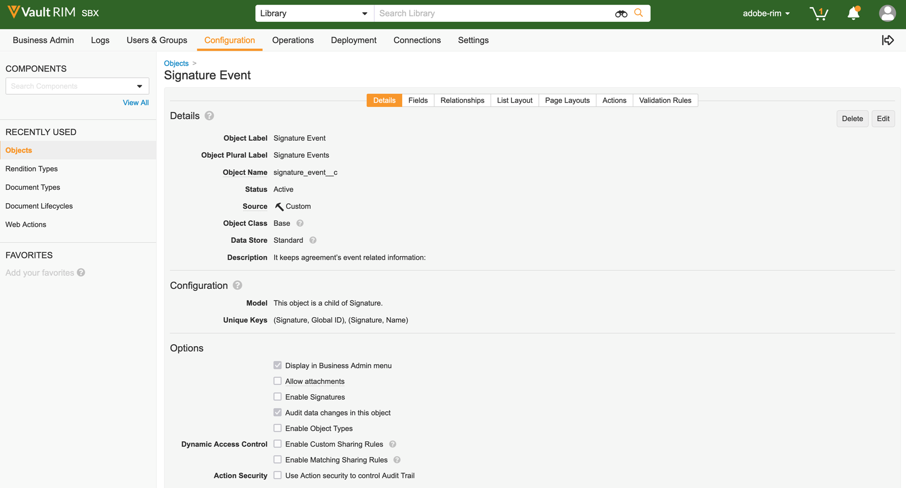

#### Objet Process Locker {#process-locker}

Un objet Process Locker est créé pour verrouiller le processus d’intégration d’Adobe Sign. Aucun champ personnalisé n’est requis.

### Étape 3. Configuration des profils de sécurité {#security-profiles}

Le déploiement réussi du pack à l’étape 2 crée un profil d’intégration Adobe Sign. Le profil d’intégration Adobe Sign est attribué au compte système et est utilisé par l’intégration lors de l’appel des API Vault. Ce profil autorise les autorisations pour :

* API Vault
* Lecture, création, modification et suppression : Objets Signature, Signataire, Evénements de signature et Verrouillage de processus

Vous devez mettre à jour le groupe d’administrateurs Adobe Sign (créé à l’étape 1) en définissant le profil de sécurité inclus sur Profil d’intégration Adobe Sign, comme indiqué dans l’image ci-dessous.

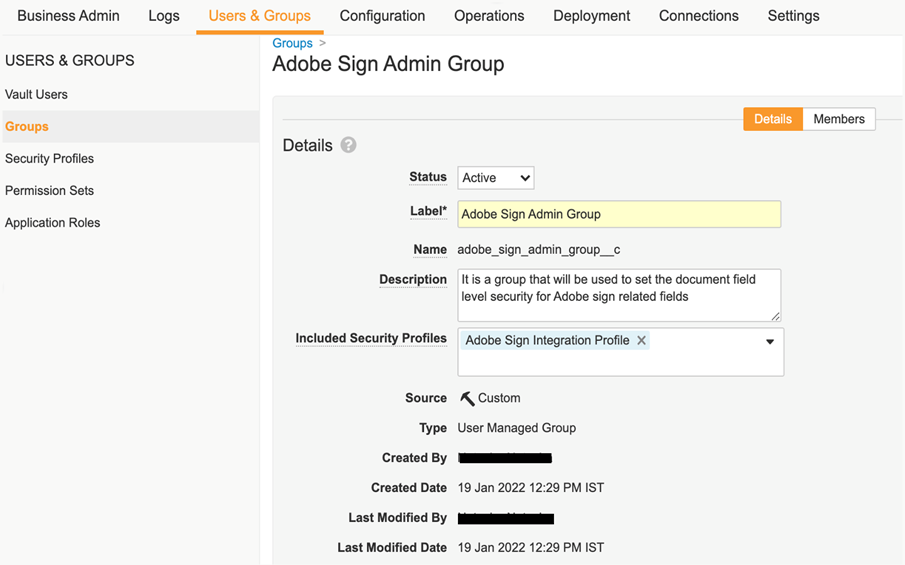

### Étape 4. Créer un utilisateur {#create-user}

L’utilisateur du compte système Vault de l’intégration Adobe Sign doit :

* Avoir un profil d’intégration Adobe Sign
* Avoir un profil de sécurité
* Avoir une stratégie de sécurité spécifique qui désactive l&#39;expiration du mot de passe
* Soyez membre du groupe d’administration Adobe Sign.

Pour ce faire, procédez comme suit :

1. Créer un compte système Vault utilisateur de l’intégration Adobe Sign.

   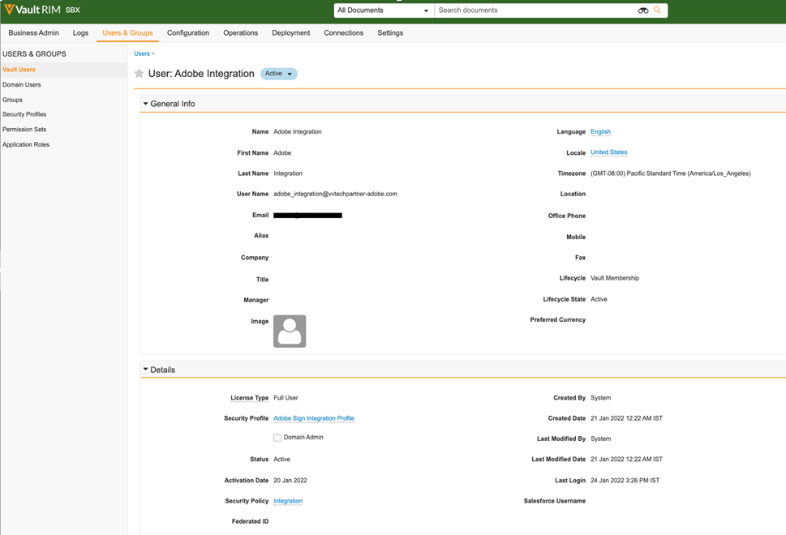

2. Ajoutez l’utilisateur au groupe d’administrateurs Adobe Sign.

   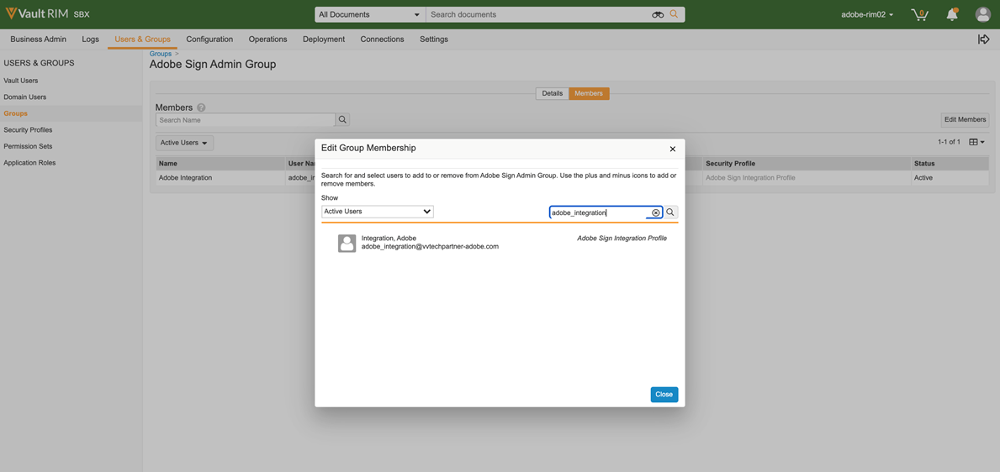

### Étape 5. Configurer le groupe de types de document {#create-document-type-group}

Lorsque vous déployez le package Adobe Sign, il crée un enregistrement de groupe de types de document appelé &quot;Document Adobe Sign&quot;.

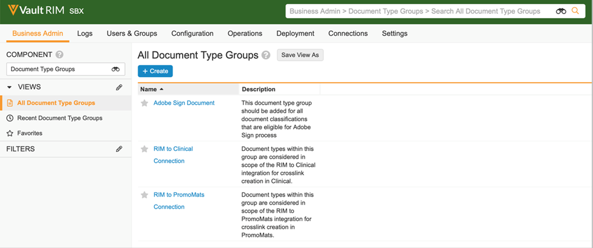

Vous devez ajouter ce groupe de types de document pour toutes les classifications de documents éligibles au processus Adobe Sign. Dans la mesure où la propriété de groupe de types de documents n’est héritée ni d’un type à un sous-type ni d’un sous-type à un niveau de classification, elle doit être définie pour chaque classification de document éligible pour Adobe Sign.

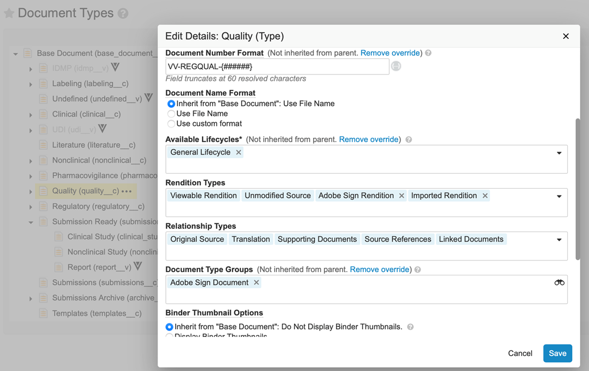

**Remarque :** Si l&#39;objet Configuration du rôle d&#39;utilisateur ne contient pas le champ faisant référence à l&#39;objet Groupe de types de document, vous devez ajouter le champ. Pour ce faire, accédez à **[!UICONTROL Objet]** > **[!UICONTROL Configuration du rôle utilisateur]** > **[!UICONTROL Champs]** et effectuez les étapes requises, comme indiqué dans l’image ci-dessous.

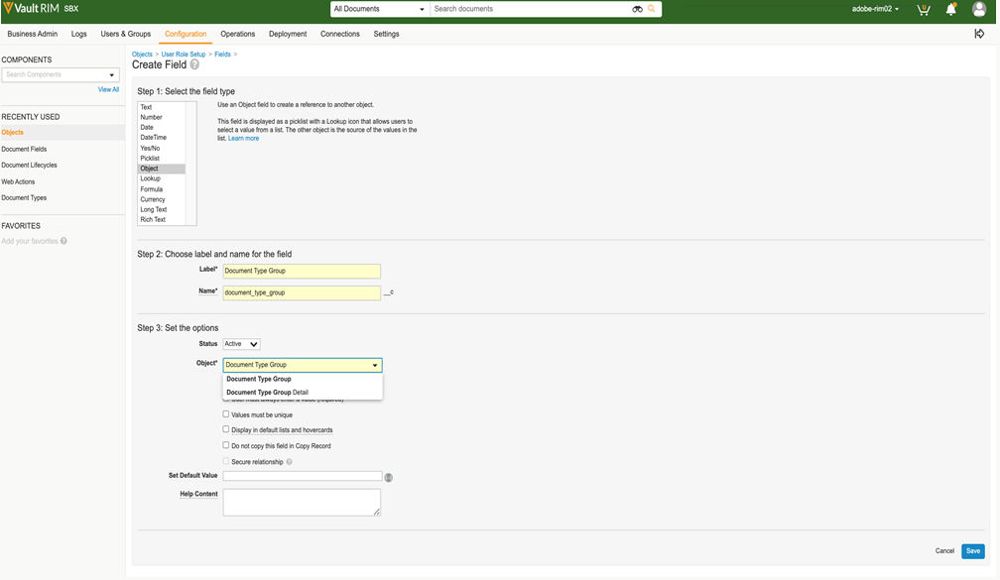

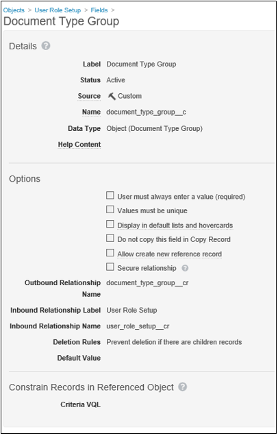

### Étape 6. Créer une configuration de rôle utilisateur {#create-user-role-setup}

Une fois les cycles de vie correctement configurés, le système doit s’assurer que l’utilisateur Adobe Sign Admin est ajouté par DAC pour tous les documents éligibles au processus Adobe Sign. Pour ce faire, créez l&#39;enregistrement de configuration de rôle d&#39;utilisateur approprié qui spécifie :

* Groupe de types de document en tant que document Adobe Sign
* Rôle d’application en tant que rôle d’administrateur Adobe Sign
* Utilisateur d&#39;intégration

### Étape 7. Configurer les champs de document {#create-fields}

Le déploiement de packs crée les deux nouveaux champs de document partagé suivants, qui sont requis pour établir l’intégration :

* Signature (signature__c)
* Autoriser les actions utilisateur Adobe Sign (allow_adobe_sign_user_actions__c)

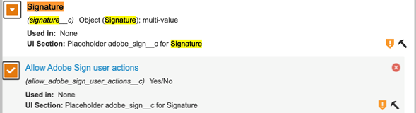

Pour configurer les champs de document :

1. Accédez à l’onglet Configuration et sélectionnez **[!UICONTROL Champs de document]** > **[!UICONTROL Champs partagés]**.
1. Dans le champ Afficher la section , sélectionnez **[!UICONTROL Créer une section d&#39;affichage]** et affectez **[!UICONTROL Signature Adobe]** comme étiquette de section.

   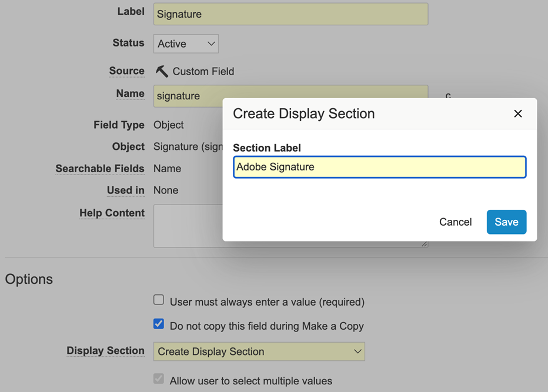

1. Pour les deux champs de document partagés (signature__c et allow_adobe_sign_user_actions__c), mettez à jour la section de l’interface utilisateur avec **[!UICONTROL Signature Adobe]** comme libellé de section.
1. Ajoutez les trois champs partagés à tous les types de documents éligibles à la signature Adobe. Pour ce faire, dans la page Document de base, sélectionnez **[!UICONTROL Ajouter]** > **[!UICONTROL Champ partagé existant]** dans le coin supérieur droit.

   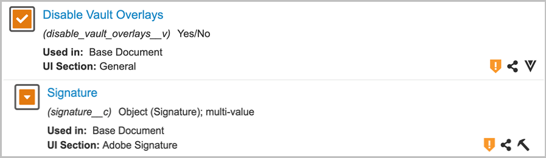

   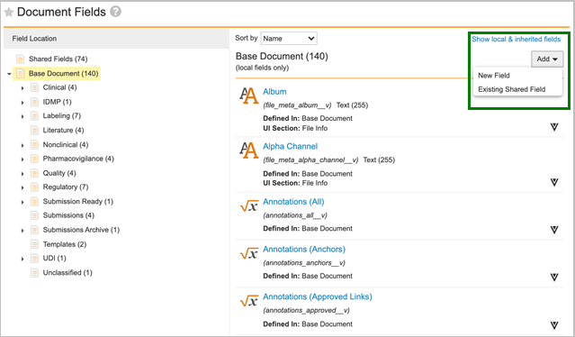

   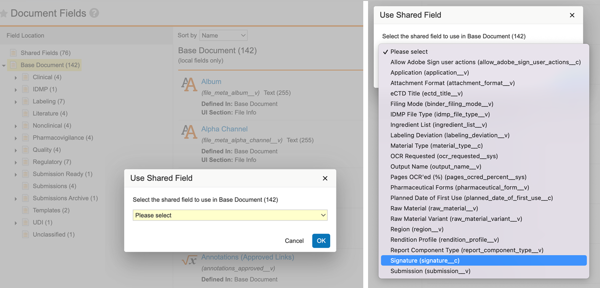

1. Notez que les deux champs doivent avoir une sécurité spécifique qui permet uniquement aux membres du groupe d’administration Adobe Sign de mettre à jour leurs valeurs.

   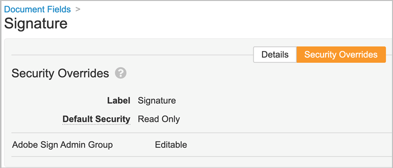

Disable Vault Overlays (disable_vault_overlays__v) est un champ partagé existant. Si vous le souhaitez, le champ peut avoir une sécurité spécifique qui permet uniquement aux membres du groupe d’administration Adobe Sign de mettre à jour sa valeur.

### Étape 8. Déclarer des formats associés de document {#declare-renditions}

The new rendition type called *Adobe Sign Rendition (adobe_sign_rendition__c)* is used by Vault integration to upload signed PDF documents to Adobe Sign. You must declare the Adobe Sign rendition for each document type that is eligible for Adobe Signature.

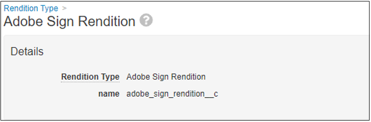

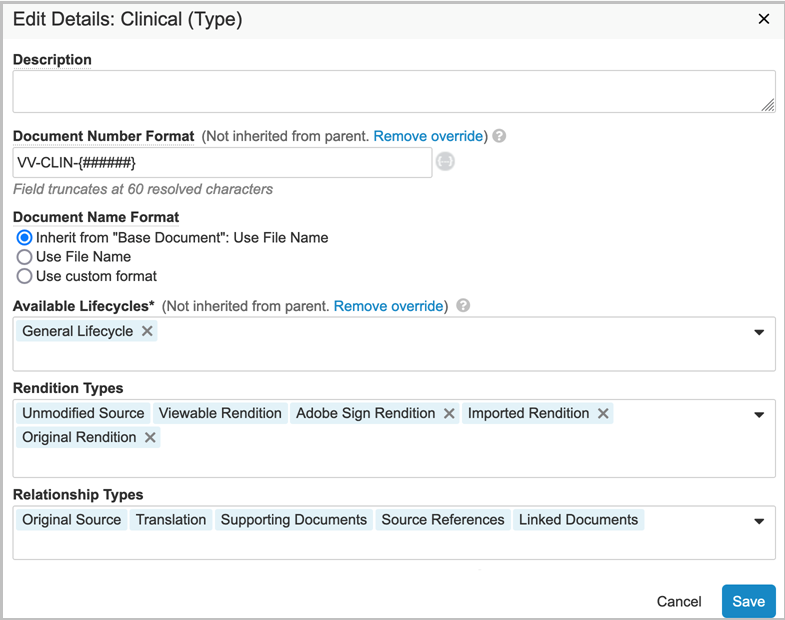

### Étape 9. Actions Web Update {#web-actions}

L&#39;intégration d&#39;Adobe Sign et de Vault nécessite la création et la configuration des deux actions Web suivantes :

* **Création d’Adobe Sign**: L’accord Adobe Sign est créé ou affiché.

   Type : Cible du document : Afficher dans les informations d&#39;identification Vault : Activer les identifiants de post-session via l&#39;URL de post-message : <https://api.na1.adobesign.com/api/gateway/veevavaultintsvc/partner/agreement?docId=${Document.id}&majVer=${Document.major_version_number__v}&minVer=${Document.minor_version_number__v}&vaultid=${Vault.id}&useWaitPage=true>

   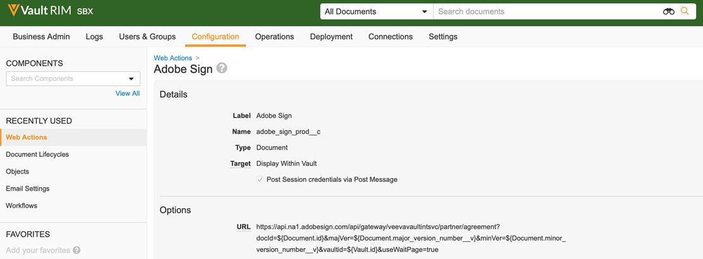

* **Annuler Adobe Sign**: Cela annule un accord existant dans Adobe Sign et rétablit l’état initial d’un document.

   Type : Cible du document : Afficher dans les informations d&#39;identification Vault : Activer les identifiants de post-session via l&#39;URL de post-message : : <https://api.na1.adobesign.com/api/gateway/veevavaultintsvc/partner/agreement/cancel?docId=${Document.id}&majVer=${Document.major_version_number__v}&minVer=${Document.minor_version_number__v}&vaultid=${Vault.id}&useWaitPage=true>

   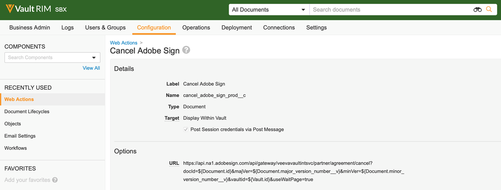

### Étape 10. Mettre à jour le cycle {#document-lifecycle}

Pour chaque type de document éligible à la signature Adobe, vous devez mettre à jour le cycle de vie du document correspondant en ajoutant de nouveaux rôles et états de cycle de vie.

Le cycle de vie des accords Adobe Sign présente les états suivants :

* BROUILLON
* CRÉATION ou DOCUMENTS_NOT_YET_PROCESSED
* OUT_FOR_SIGNATURE ou OUT_FOR_APPROVAL
* SIGNÉ ou APPROUVÉ
* ANNULÉE
* EXPIRÉ

Pour mettre à jour le cycle de vie du document, procédez comme suit :

1. Ajouter un rôle Lifecycle. Le rôle d’application Administrateur Adobe Sign doit être ajouté dans tous les cycles de vie utilisés par les documents éligibles à la signature d’Adobe, comme indiqué ci-dessous.

   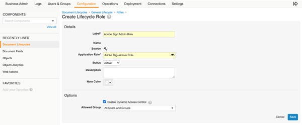

   Le rôle d’administrateur doit être créé avec les options suivantes :

   * Contrôle d&#39;accès dynamique activé.
   * Document sharing rules that include only Document Type Group, as shown in the image below.

   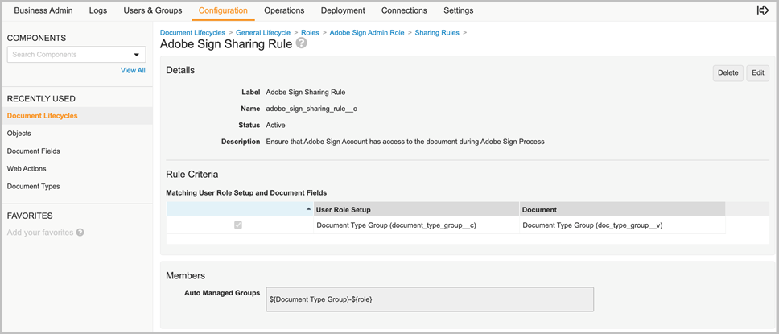

2. Créer des états du cycle de vie Pour ce faire, accédez à **[!UICONTROL Paramètres]** > **[!UICONTROL Configuration]** > **[!UICONTROL Cycle de vie du document]** > **[!UICONTROL Cycle de vie général]** > **[!UICONTROL États]** > **[!UICONTROL Créer]**. Créez ensuite les états suivants :

   * Dans Adobe Sign Draft

   

   * Dans la création Adobe Sign

   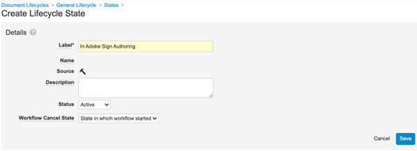

   * En Adobe Signature

   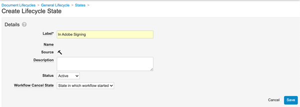

3. Ajoutez des actions utilisateur aux états répertoriés ci-dessous.

   Lorsqu’un document Vault est envoyé à Adobe Sign, son état doit correspondre à celui de l’accord. Pour ce faire, ajoutez les états suivants dans chaque cycle de vie utilisé par les documents pouvant être signés par un Adobe :

   * **Avant signature Adobe** (Révisé) : Il s’agit d’un nom d’espace réservé pour l’état à partir duquel le document peut être envoyé à Adobe Sign. En fonction du type de document, il peut s’agir de l’état Brouillon ou Révisé. Le libellé de l’état du document peut être personnalisé selon les exigences du client. Avant que l’Adobe Signature ne définisse les deux actions utilisateur suivantes :

      * Action qui modifie l’état du document en *Dans Adobe Sign Draft* état. Le nom de cette action utilisateur doit être le même pour tous les types de documents, quel que soit leur cycle de vie. Si nécessaire, les critères pour cette action peuvent être définis sur &quot;Autoriser les actions utilisateur Adobe Sign est égal à Oui&quot;.
      * Action qui appelle l’action Web &quot;Adobe Sign&quot;. Cet état doit disposer d’une sécurité qui permet au rôle d’administrateur Adobe Sign de : afficher le document, afficher le contenu, modifier les champs, modifier les relations, télécharger la source, gérer le rendu visible et modifier l’état.

      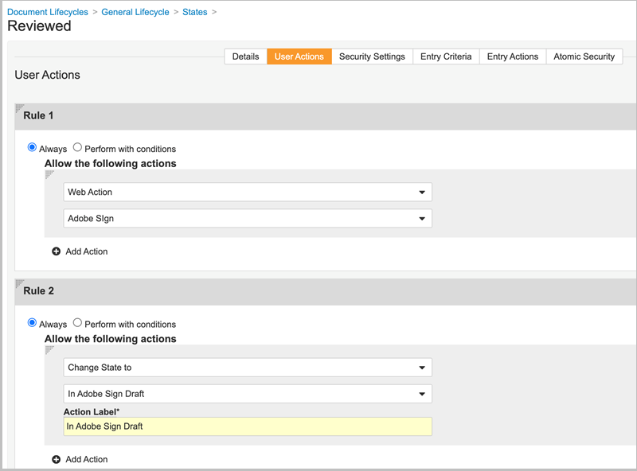

   * **Dans Adobe Sign Draft**: Il s’agit d’un nom d’espace réservé pour l’état qui indique que le document est déjà téléchargé vers Adobe Sign et que son accord est à l’état BROUILLON . C&#39;est un état requis. Cet état doit définir les cinq actions utilisateur suivantes :

      * Action qui modifie l’état du document en *Dans la création Adobe Sign* état. Le nom de cette action utilisateur doit être le même pour tous les types de documents, quel que soit leur cycle de vie. Si nécessaire, les critères pour cette action peuvent être définis sur &quot;Autoriser les actions utilisateur Adobe Sign est égal à Oui&quot;.
      * Action qui modifie l’état du document en *En Adobe Signature état*. Le nom de cette action utilisateur doit être le même pour tous les types de documents, quel que soit leur cycle de vie. Si nécessaire, les critères pour cette action peuvent être définis sur &quot;Autoriser les actions utilisateur Adobe Sign est égal à Oui&quot;.
      * Action qui modifie l’état du document en *Adobe Sign annulé* état. The name of this user action must be the same for all document types for any lifecycle. Si nécessaire, les critères pour cette action peuvent être définis sur &quot;Autoriser les actions utilisateur Adobe Sign est égal à Oui&quot;.
      * Action qui appelle l’action web &quot;Adobe Sign&quot; .
      * Action that calls the Web Action ‘Cancel Adobe Sign’. This state must have security that allowsAdobe Sign Admin role to: view document, view content, edit fields, edit relationships, download source, manage viewable rendition, and change state.

      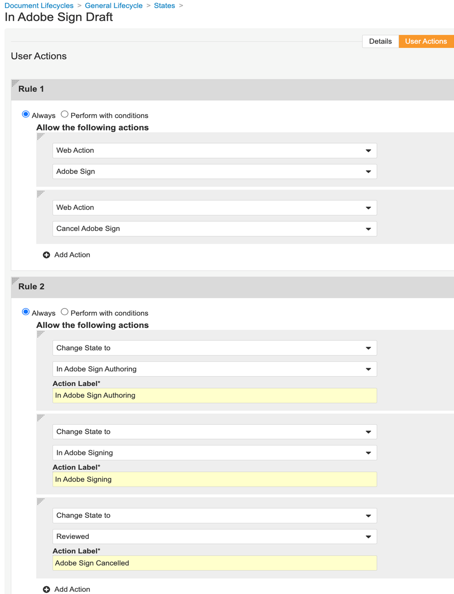

   * **Dans la création Adobe Sign**: Il s’agit d’un nom d’espace réservé pour l’état qui indique que le document est déjà téléchargé vers Adobe Sign et que son accord est à l’état CRÉATION ou DOCUMENTS_NOT_YET_PROCESSED. C&#39;est un état requis. Cet état doit comporter les quatre actions utilisateur suivantes :

      * Action qui remplace l’état du document par l’état Adobe Sign Annulé . Le nom de cette action utilisateur doit être le même pour tous les types de documents, quel que soit leur cycle de vie. Si nécessaire, les critères pour cette action peuvent être définis sur &quot;Autoriser les actions utilisateur Adobe Sign est égal à Oui&quot;.
      * Action qui modifie l’état du document en Adobe Signature. Le nom de cette action utilisateur doit être le même pour tous les types de documents, quel que soit leur cycle de vie. Si nécessaire, les critères pour cette action peuvent être définis sur &quot;Autoriser les actions utilisateur Adobe Sign est égal à Oui&quot;.
      * Action qui appelle l’action web &quot;Adobe Sign&quot;
      * Action qui appelle l’action web &quot;Annuler Adobe Sign&quot;. Cet état doit disposer d’une sécurité qui permet au rôle d’administrateur Adobe Sign de : afficher le document, afficher le contenu, modifier les champs, modifier les relations, télécharger la source, gérer le rendu visible et modifier l’état.

      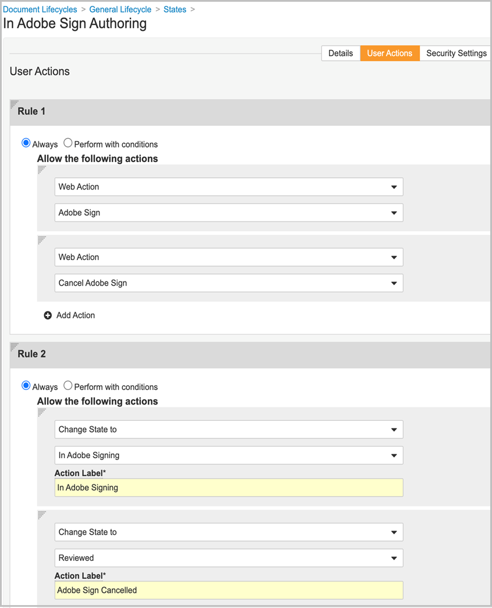

   * **En Adobe Signature**: Il s’agit d’un nom d’espace réservé pour l’état qui indique que le document est chargé dans Adobe Sign et que son accord est déjà envoyé aux participants (état OUT_FOR_SIGNATURE ou OUT_FOR_APPROVAL). C&#39;est un état requis. Cet état doit comporter les cinq actions utilisateur suivantes :

      * Action qui remplace l’état du document par l’état Adobe Sign Annulé . L’état cible de cette action peut être n’importe quelle exigence du client et il peut être différent pour différents types. Le nom de cette action utilisateur doit être le même pour tous les types de documents, quel que soit leur cycle de vie. Si nécessaire, les critères pour cette action peuvent être définis sur &quot;Autoriser les actions utilisateur Adobe Sign est égal à Oui&quot;.
      * Action qui remplace l’état du document par l’état Adobe Sign rejeté. L’état cible de cette action peut être n’importe quelle exigence du client et il peut être différent pour différents types. Le nom de cette action utilisateur doit être le même pour tous les types de documents, quel que soit leur cycle de vie. Si nécessaire, les critères pour cette action peuvent être définis sur &quot;Autoriser les actions utilisateur Adobe Sign est égal à Oui&quot;.
      * Action qui remplace l’état du document par l’état Signé par l’Adobe. L’état cible de cette action peut être n’importe quelle exigence du client et il peut être différent pour différents types. Toutefois, le nom de cette action utilisateur doit être le même pour tous les types de documents, quel que soit leur cycle de vie. Si nécessaire, les critères pour cette action peuvent être définis sur &quot;Autoriser les actions utilisateur Adobe Sign est égal à Oui&quot;.
      * Action qui appelle l&#39;action Web *Adobe Sign*.
      * Action qui appelle Action Web *Annuler Adobe Sign*. Cet état doit disposer d’une sécurité qui permet au rôle d’administrateur Adobe Sign de : afficher le document, afficher le contenu, modifier les champs, modifier les relations, télécharger la source, gérer le rendu visible et modifier l’état.

      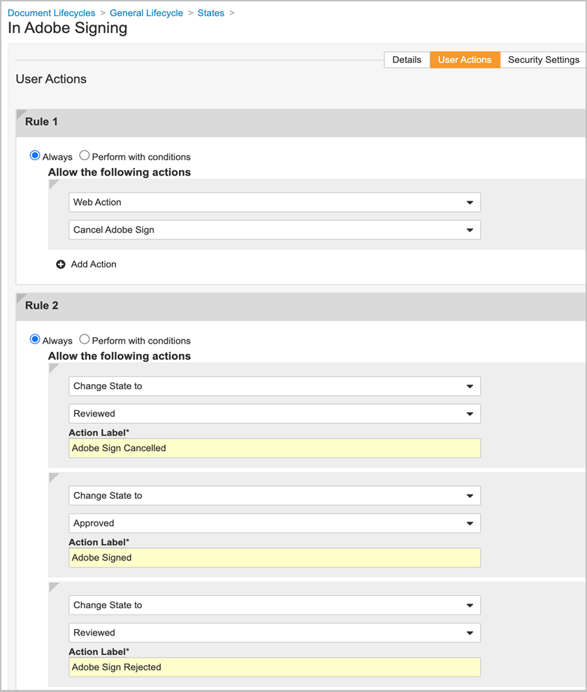

      * **Adobe signé (approuvé)**: Il s’agit d’un nom d’espace réservé pour l’état qui indique que le document est chargé dans Adobe Sign et que son accord est terminé (état SIGNÉ ou APPROUVÉ). Il s&#39;agit d&#39;un état obligatoire qui peut être un état de cycle de vie existant, comme Approuvé.
Cet état ne nécessite aucune action de l’utilisateur. Il doit disposer d’une sécurité qui permet au rôle d’administrateur Adobe Sign de : afficher des documents, afficher du contenu et modifier des champs.

   Le diagramme suivant illustre les mappages entre les états d’accord Adobe Sign et de document Vault, où l’état &quot;Avant signature de l’Adobe&quot; est Brouillon.

   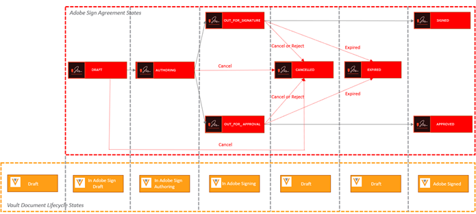

### Étape 11. Ajout de la scène Adobe Sign au cycle de vie général dans les groupes de scène de cycle de vie

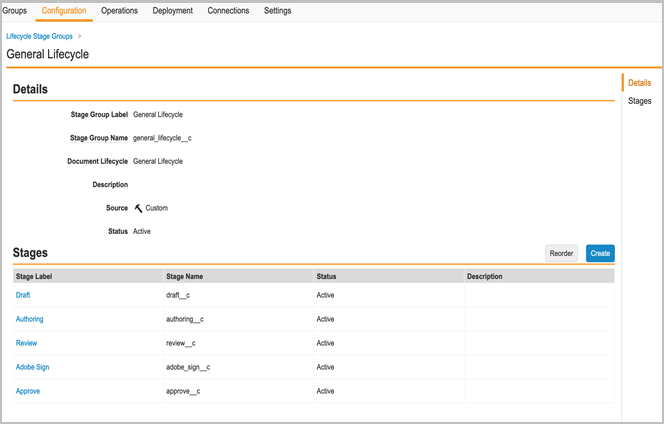

### Étape 12. Définir des autorisations pour le rôle d&#39;utilisateur dans l&#39;état du cycle de vie

Vous devez définir les autorisations appropriées pour chaque rôle d&#39;utilisateur dans l&#39;état du cycle de vie, comme indiqué dans l&#39;image ci-dessous.

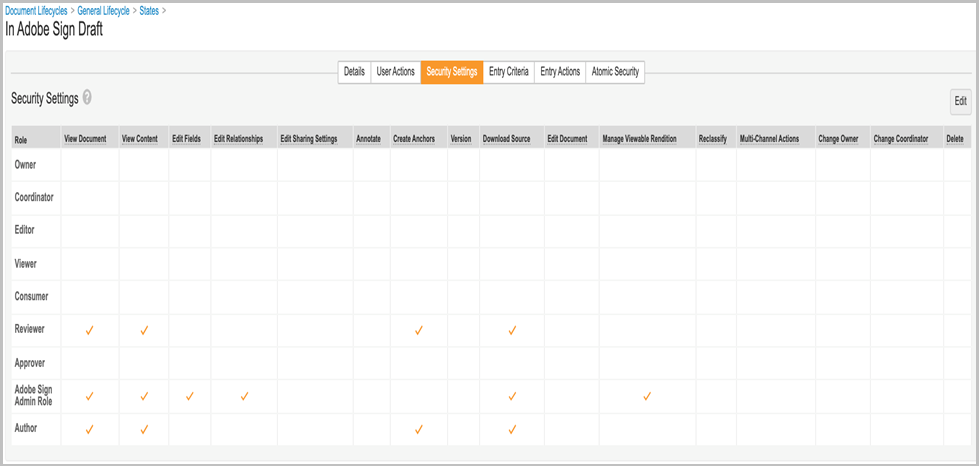

### Étape 13. Configuration de la sécurité atomique en fonction de l’état du document et du rôle de l’utilisateur

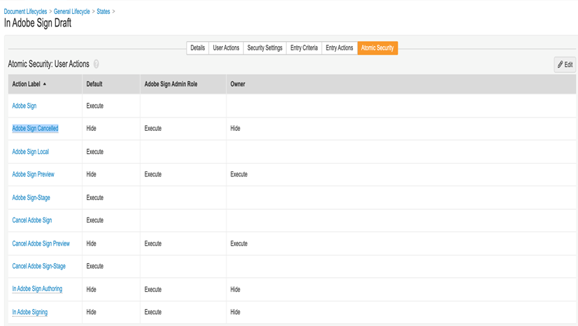

### Étape 14. Créer des messages de document pour Adobe Sign Annuler

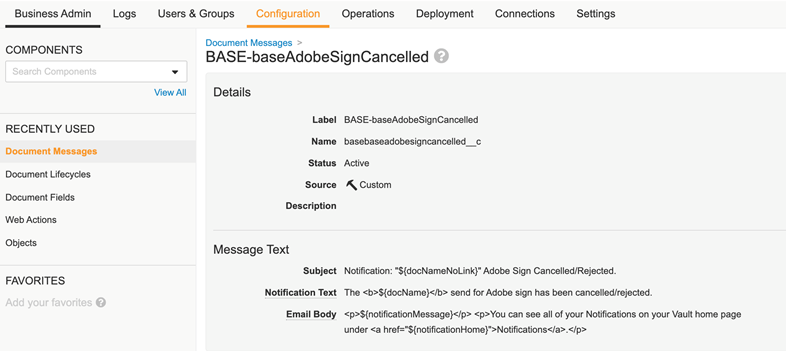

## Connect [!DNL Veeva Vault] vers Adobe Sign à l’aide de middleware {#connect-middleware}

Après avoir terminé la configuration de [!DNL Veeva Vault] et le compte Administrateur Adobe Sign, l’administrateur doit créer une connexion entre les deux comptes à l’aide du middleware. La [!DNL Veeva Vault] et la connexion au compte Adobe Sign est initiée par l’identité Adobe Sign, puis elle est utilisée pour stocker le fichier[!DNL Veeva Vault]identité.
Pour la sécurité et la stabilité du système, l’administrateur doit utiliser un [!DNL Veeva Vault] compte système/service/utilitaire, tel que `adobe.for.veeva@xyz.com`, au lieu d’un compte d’utilisateur personnel, tel que `bob.smith@xyz.com`.

Un administrateur de compte Adobe Sign doit suivre les étapes ci-dessous pour se connecter [!DNL Veeva Vault] vers Adobe Sign à l’aide de middleware :

1. Accédez à l’onglet [Adobe Sign pour [!DNL Veeva Vault] Page Accueil](https://static.adobesigncdn.com/veevavaultintsvc/index.html).
1. Sélectionner **[!UICONTROL Connexion]** dans le coin supérieur droit.

   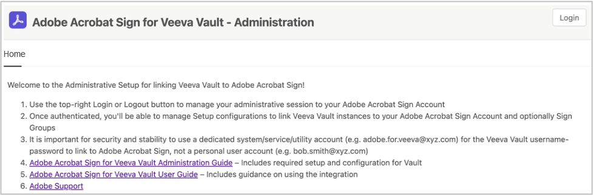

1. Dans la page de connexion Adobe Sign qui s’ouvre, indiquez l’adresse e-mail et le mot de passe de l’administrateur du compte, puis sélectionnez **[!UICONTROL Se connecter]**.

   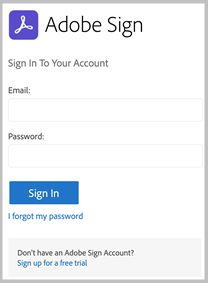

   Une fois que vous êtes connecté, la page affiche l’ID de messagerie associé et un onglet Paramètres, comme indiqué ci-dessous.

   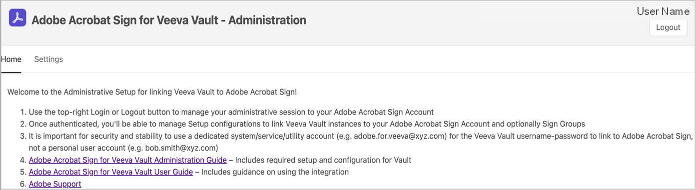

1. Sélectionnez le fichier **[!UICONTROL Paramètres]** .

   La page Paramètres affiche les connexions disponibles, ainsi que *Aucune connexion disponible* en cas de première configuration de connexion, comme indiqué ci-dessous.

   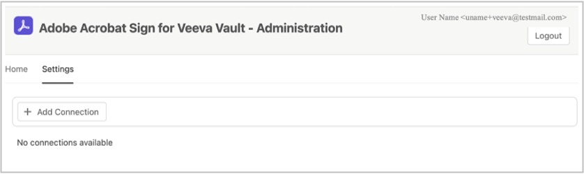

1. Sélectionner **[!UICONTROL Ajouter une connexion]** pour ajouter une nouvelle connexion.

1. Dans la boîte de dialogue Ajouter une connexion qui s’ouvre, fournissez les détails requis, y compris le [!DNL Veeva Vault] identifiants.

   Les informations d’identification Adobe Sign sont renseignées automatiquement à partir de la connexion Adobe Sign initiale.

   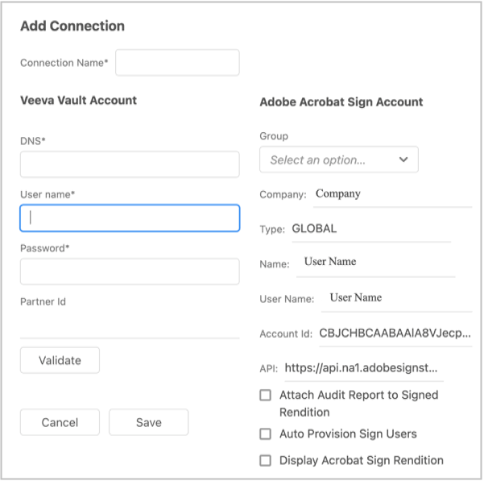

1. Sélectionner **[!UICONTROL Valider]** pour valider les détails du compte.

   Une fois la validation réussie, une notification &quot;Validation de l’utilisateur réussie&quot; s’affiche, comme indiqué ci-dessous.

   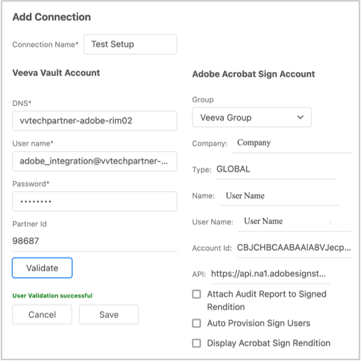

1. Pour restreindre l’utilisation à un groupe Adobe Sign particulier, développez la boîte de dialogue **[!UICONTROL Groupe]** et sélectionnez l’un des groupes disponibles.

   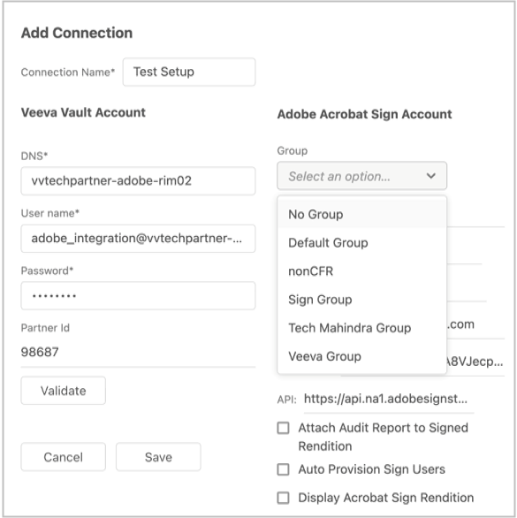

1. Cochez la case pour joindre le rapport d’audit au rendu signé **[!UICONTROL Joindre le rapport d’audit au rendu signé]**.

   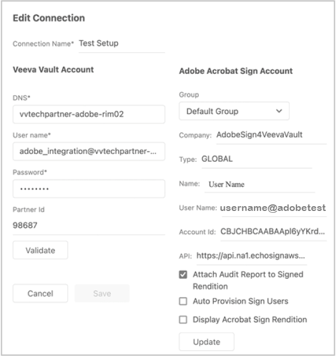

1. Pour autoriser la configuration automatique des utilisateurs dans Adobe Sign, cochez la case **[!UICONTROL Configurer automatiquement les utilisateurs Sign]**.

   **Remarque :** La configuration automatique des nouveaux utilisateurs Adobe Sign ne fonctionne que si elle a été activée au niveau du compte Adobe Sign dans Adobe Sign en plus de l’activation **[!UICONTROL Configurer automatiquement les utilisateurs Sign]** pour le[!DNL Veeva Vault]Intégration d’Adobe Sign comme indiqué ci-dessous par l’administrateur du compte Adobe Sign.

   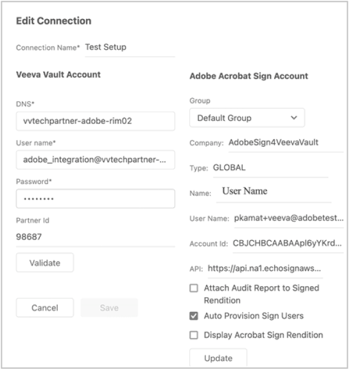

1. Sélectionner **[!UICONTROL Enregistrer]** pour enregistrer votre nouvelle connexion.

   La nouvelle connexion apparaît sous l’onglet Paramètres pour indiquer que l’intégration entre [!DNL Veeva Vault] et Adobe Sign.

   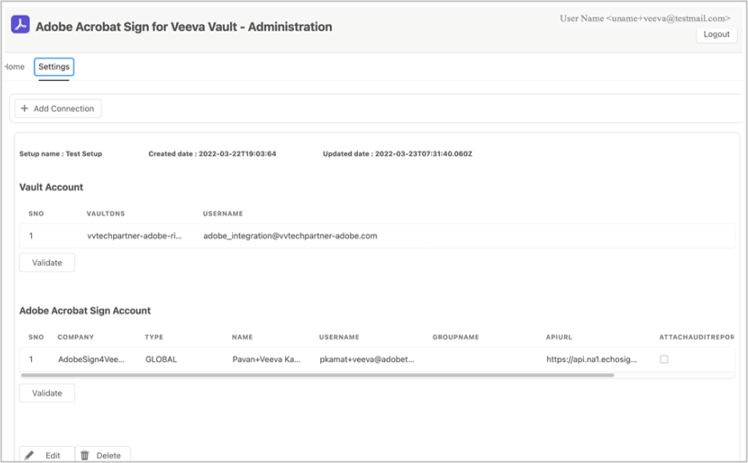

