# [!DNL Veeva Vault] Guide d’installation{#veeva-installation-guide}

[**Contacter le support Adobe Acrobat Sign**](https://adobe.com/go/adobesign-support-center_fr)

## Présentation {#overview}

Ce document explique comment établir l’intégration de Adobe Acrobat Sign avec [!DNL Veeva Vault] plateforme. [!DNL Veeva Vault] est une plateforme de gestion de contenu d&#39;entreprise (ECM) conçue pour les sciences de la vie. Un &quot;coffre-fort&quot; est un dépôt de contenu et de données dont l&#39;utilisation est typique pour les dépôts réglementaires, les rapports de recherche, les demandes de subventions, les marchés généraux, etc. Une seule entreprise peut avoir plusieurs &quot;coffres&quot; qui doivent être gérés séparément.

Les étapes générales pour terminer l’intégration sont les suivantes :

* Activez votre compte d’administrateur dans Adobe Acrobat Sign (nouveaux clients uniquement).
* Créez des objets pour suivre l’historique du cycle de vie d’un accord dans Vault.
* Créez un profil de sécurité.
* Configurez un groupe dans Adobe Acrobat Sign pour qu’il contienne le [!DNL Veeva Vault] utilisateur d’intégration.
* Créez des champs et des rendus de document.
* Configurez les actions web et mettez à jour le cycle de vie du document.
* Créer un utilisateur de type de document et la configuration du rôle utilisateur.
* Connectez Veeva Vault à Adobe Acrobat Sign à l&#39;aide d&#39;un middleware.

>[!NOTE]
>
>L’administrateur Adobe Sign doit effectuer les étapes de configuration de Adobe Acrobat Sign dans Adobe Acrobat Sign.

## Configurer [!DNL Veeva Vault] {#configure-veeva}

Pour configurer [!DNL Veeva Vault] pour l’intégration à Adobe Acrobat Sign, vous devez implémenter les étapes ci-dessous.

### Étape 1. Créer un groupe {#create-group}

Pour configurer Adobe Acrobat Sign pour [!DNL Vault], un nouveau groupe appelé *Groupe d’administration Adobe Sign* est créée. Ce groupe est utilisé pour définir la sécurité au niveau du champ de document pour les champs associés à Adobe Acrobat Sign et doit inclure *Profil d’intégration Adobe Sign* par défaut.

### Étape 2. Déploiement du pack {#deploy-package}

[Déploiement du pack](https://helpx.adobe.com/content/dam/help/en/PKG-AdobeSign-Integration-veeva.zip) et suivez les étapes. Une fois déployé, le pack crée :

* Objets personnalisés : Objet Signature, objet Signatory, objet Signature Event, objet Process Locker
* Mise en page Objet Signature
* Mise en page de l’objet Signature Event
* Mise en page des objets signataires
* Mise en page d&#39;objet Process Locker
* Mise en page d&#39;objet Journal des tâches d&#39;intégration Adobe Sign
* Type de rendu Adobe Sign
* Type de rendu original
* Signature de champ partagée__c
* Action web Adobe Sign
* Annuler l’action web Adobe Sign
* Jeu d’autorisations Actions d’administrateur Adobe Sign
* Profil de sécurité du profil d’intégration Adobe Sign
* Rôle d’application Rôle d’administrateur Adobe Sign
* Groupe de types de document &quot;Document Adobe Sign&quot;
* Objet journal des tâches d’intégration Adobe Sign

#### Objet Signature {#signature-object}

L’objet Signature est créé pour stocker les informations relatives à l’accord. Un objet Signature est une base de données qui contient des informations dans les champs spécifiques suivants :

**Champs d’objet Signature**

| Champ | Libellé | Type | Description |
|:---|:---|:---|:------- | 
| id_externe__c | ID de l’accord | Chaîne (100) | Contient l’ID d’accord unique de Adobe Acrobat Sign |
| file_hash__c | Hachage de fichier | Chaîne (50) | Contient la somme de contrôle md5 du fichier envoyé à Adobe Acrobat Sign |
| name__v | Nom | Chaîne (128) | Contient le nom de l’accord |
| sender__c | Expéditeur | Objet (Utilisateur) | Contient la référence à l’utilisateur Vault qui a créé l’accord. |
| signature_status__c | État de signature | Chaîne (75) | Contient le statut de l’accord dans Adobe Acrobat Sign. |
| signature_type__c | Type de signature | Chaîne (20) | Contient le type de signature de l’accord dans Adobe Acrobat Sign (PAR ÉCRIT ou ESIGN). |
| start_date__c | Date de début | DateHeure | Date d’envoi de l’accord pour signature |
| cancelation_date__c | Date de résiliation | DateHeure | Contient la date à laquelle l’accord a été annulé. |
| completed_date__c | Date de fin | DateHeure | Contient la date à laquelle l’accord a été complété. |
| viewable_rendition_used__c | Format associé visible utilisé | Booléen | Indicateur qui indique si le rendu visible a été envoyé pour signature. (par défaut, elle est vraie) |
| plugin_version__c | Version du module externe | Texte (10) | Il est utilisé pour permettre le traitement approprié de tous les accords créés avant le déploiement d’une nouvelle version 4.0. Remarque : Une fois la version 4.0 de l’application web personnalisée déployée, ce champ est défini sur 4.0 à chaque création d’un enregistrement de signature. |
| external_environment__c | Environnement externe | Texte (20) | Contient le nom de l’environnement Adobe Sign dans lequel l’accord a été créé. |

#### Objet signataire {#signatory-object}

L’objet signataire est créé pour stocker des informations liées aux participants dans un accord. Il contient des informations dans les champs spécifiques suivants :

**Champs d’objet signataire**

| Champ | Libellé | Type | Description |
|:---|:---|:---|:------- | 
| email__c | E-mail | Chaîne (120) | Contient l’ID d’accord unique de Adobe Acrobat Sign |
| id_externe__c | ID du participant | Chaîne (80) | Contient l’identifiant unique du participant Adobe Acrobat Sign |
| name__v | Nom | Chaîne (128) | Contient le nom du participant Adobe Acrobat Sign |
| order__c | Ordre | Numéro | Contient le numéro de commande du participant à l’accord Adobe Acrobat Sign |
| role__c | Rôle | Chaîne (30) | Contient le rôle du participant à l’accord Adobe Acrobat Sign |
| signature__c | Signature | Objet (signature) | Contient la référence à l’enregistrement parent de la signature |
| signature_status__c | État de signature | Chaîne (100) | Contient le statut du participant à l’accord Adobe Acrobat Sign |
| user__c | Utilisateur | Objet (Utilisateur) | Contient la référence à l’enregistrement d’utilisateur du signataire si le participant est un utilisateur Vault |

#### Objet Événement de signature {#signature-event}

L’objet Événement de signature est créé pour stocker les informations relatives aux événements d’un accord. Il contient des informations dans les champs spécifiques suivants :

Champs d’objet Signature Event

| Champ | Libellé | Type | Description |
|:---|:---|:---|:-------- | 
| acting_user_email__c | Adresse él. du responsable de l’action | Chaîne | Contient l’adresse e-mail de l’utilisateur Adobe Acrobat Sign qui a exécuté l’action à l’origine de la génération de l’événement |
| acting_user_name__c | Nom d&#39;utilisateur intérimaire | Chaîne | Contient le nom de l’utilisateur Adobe Acrobat Sign qui a exécuté l’action à l’origine de la génération de l’événement |
| description__c | Description | Chaîne | Contient la description de l’événement Adobe Acrobat Sign |
| event_date__c | Date de l’événement | DateHeure | Contient la date et l’heure de l’événement Adobe Acrobat Sign |
| event_type__c | Type d&#39;événement | Chaîne | Contient le type de l’événement Adobe Acrobat Sign |
| name__v | Nom | Chaîne | Nom d&#39;événement généré automatiquement |
| participant_comment__c | Commentaire du participant | Chaîne | Contient le commentaire du participant Adobe Acrobat Sign, le cas échéant |
| participant_email__c | Adresse él. du participant | Chaîne | Contient l’adresse e-mail du participant Adobe Acrobat Sign |
| participant_role__c | Rôle de participant | Chaîne | Contient le rôle du participant Adobe Acrobat Sign |
| signature__c | Signature | Objet (signature) | Contient la référence à l’enregistrement parent de la signature |
| id_externe__c | ID externe | Texte (200) | Contient l’identificateur d’événement d’accord généré par Adobe Sign. |

#### Objet Process Locker {#process-locker}

Un objet Process Locker est créé pour verrouiller le processus d’intégration de Adobe Acrobat Sign. Aucun champ personnalisé n’est requis.

#### Objet journal des tâches d’intégration Adobe Sign {#task-log}

Création du journal des tâches d’intégration Adobe Sign (as_int_task_log__c). Il s’agit d’un objet de volume élevé utilisé pour suivre l’exécution de AgreementsEventsSynchronizerJob et AgreementsEventsProcessingJob.
AgreementsEventsSynchronizerJob : Cette tâche permet de s’assurer que tous les événements d’accord manquants dans Adobe Sign sont créés en tant qu’événements de signature actifs dans Vault pour toutes les signatures créées dans Vault au cours des N derniers jours.
AgreementsEventsProcessingJob : Cette tâche garantit que tous les documents comportant des enregistrements d’événement de signature actifs sont traités en fonction du type d’événement.

Champs d’objet du journal des tâches d’intégration Adobe Sign

| Champ | Libellé | Type | Description |
|:--|:--|:--|:---------| 
| start_date__c | Date de début | DateHeure | Date de début de tâche |
| end_date__c | Date de fin | DateHeure | Date de fin de tâche |
| task_status__c | État de tâche | Liste déroulante | Contient le statut de la tâche :   Terminé (task_completed__c) Terminé avec des erreurs (task_completed_with_errors__c) Échec (task_failed__c) |
| task_type__c | Type de tâche | Liste déroulante | Contient le type de tâche :    Synchronisation des événements d’accord (agreements_events_sync__c) Traitement des événements d’accord (agreements_events_processing__c) |
| messages__c | Message | Long (32000) | Contient le message de tâche |

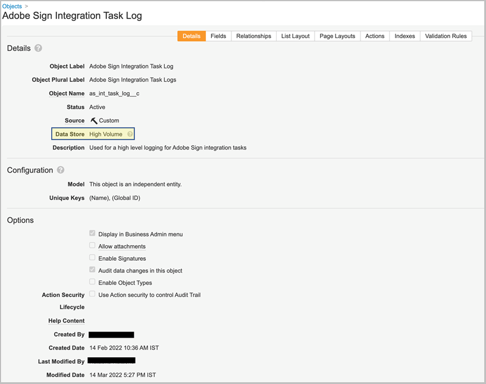

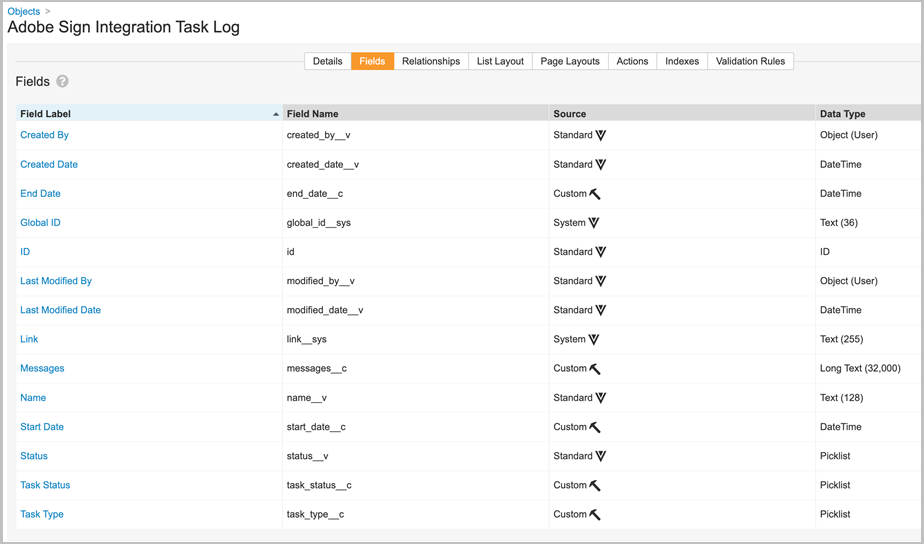

Les objets Signature, Signataire, Événement de signature, Outil de verrouillage de processus et Journal des tâches qui font partie du pack de déploiement ont la propriété &quot;Auditer les modifications des données pour cet objet&quot; activée par défaut.

**Remarque :** Vous pouvez configurer l&#39;objet de capture Vault pour enregistrer les modifications de données dans les journaux d&#39;audit en activant le paramètre Auditer les modifications de données. Ce paramètre est désactivé par défaut. Une fois que vous activez ce paramètre et créez des enregistrements, vous ne pouvez plus le désactiver. Si ce paramètre est désactivé et qu&#39;il existe des enregistrements, seul un propriétaire de coffre peut mettre à jour le paramètre.

#### **Afficher les participants et l’historique de l’objet Signature** {#display-participants-history}

L’objet Signature qui fait partie du pack de déploiement est fourni avec le fichier [Mise en page Détails de la signature](https://vvtechpartner-adobe-rim.veevavault.com/ui/#admin/content_setup/object_schema/pagelayout?t=signature__c&amp;d=signature_detail_page_layout__c). La mise en page comporte des sections pour les participants et l’historique.

* La *Participants* contient la section Objets associés configurée comme indiqué dans l’image ci-dessous.

   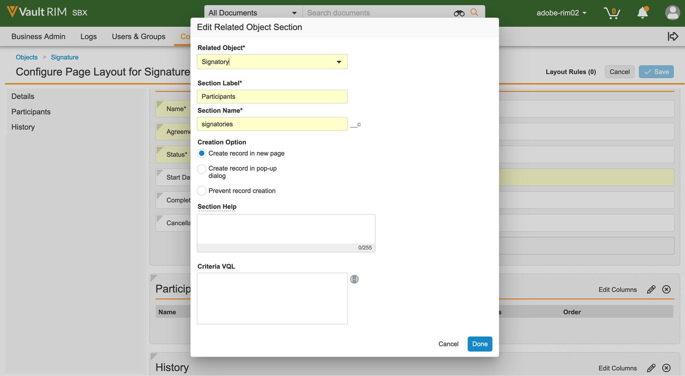

* Vous pouvez modifier les colonnes à afficher pour les participants, comme indiqué ci-dessous.

   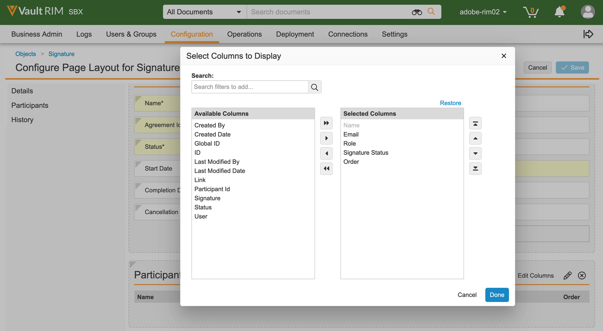

* La *Historique* contient la section Objets associés configurée comme indiqué dans l’image ci-dessous.

   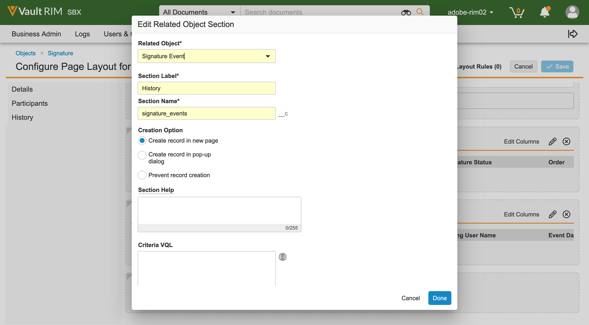

* Vous pouvez modifier les colonnes à afficher pour l’historique, comme indiqué ci-dessous.

   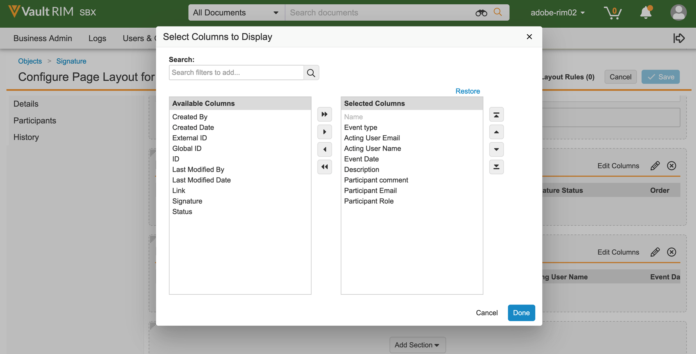

#### **Afficher les participants et l’historique d’audit pour le document Adobe Acrobat Sign** {#view-participants-audit-history}

* Pour afficher les participants et l’historique d’audit du document Adobe Acrobat Sign, sélectionnez le lien dans la section &quot;Signature Adobe&quot; du document.

   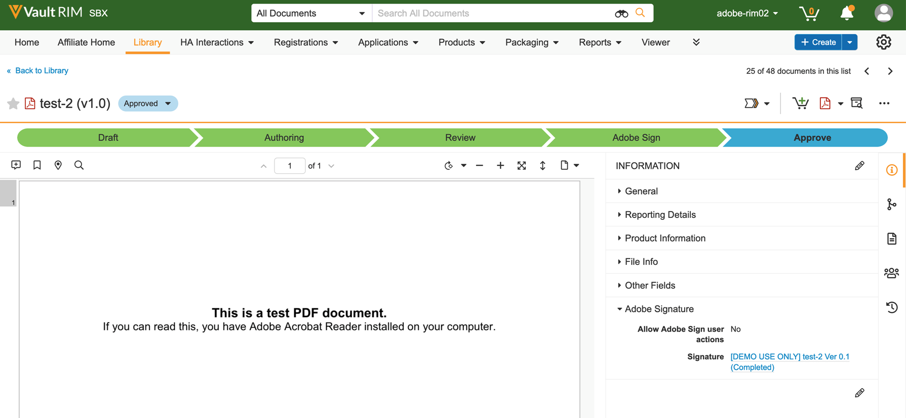

* La page qui s’ouvre affiche les participants et l’historique du document Adobe Acrobat Sign, comme indiqué ci-dessous.

   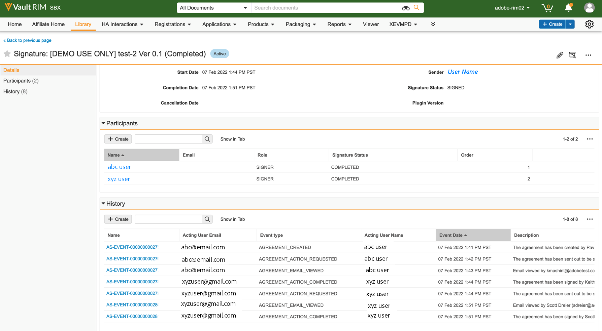

* Affichez la piste d’audit pour Signature comme indiqué ci-dessous.

   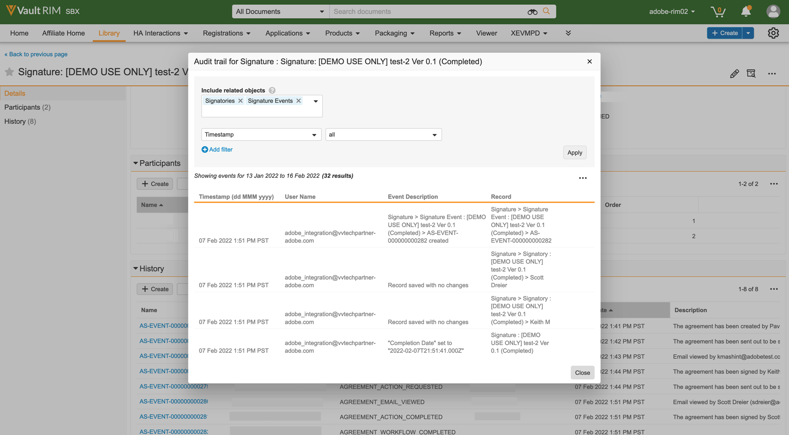

### Étape 3. Configuration des profils de sécurité {#security-profiles}

Le déploiement réussi du pack à l’étape 2 crée un profil d’intégration Adobe Sign. Le profil d’intégration Adobe Sign est attribué au compte système et est utilisé par l’intégration lors de l’appel des API Vault. Ce profil autorise les autorisations pour :

* API Vault
* Lecture, création, modification et suppression : Objets Signature, Signataire, Evénements de signature et Verrouillage de processus

Vous devez mettre à jour le groupe d’administrateurs Adobe Sign (créé à l’étape 1) en définissant le profil de sécurité inclus sur Profil d’intégration Adobe Sign, comme indiqué dans l’image ci-dessous.

### Étape 4. Créer un utilisateur {#create-user}

L&#39;utilisateur du compte système Vault de l&#39;intégration Adobe Acrobat Sign doit :

* Avoir un profil d’intégration Adobe Sign
* Avoir un profil de sécurité
* Avoir une stratégie de sécurité spécifique qui désactive l&#39;expiration du mot de passe
* Soyez membre du groupe d’administration Adobe Sign.

Pour ce faire, procédez comme suit :

1. Créer un compte système Vault utilisateur de l&#39;intégration Adobe Acrobat Sign.

   

2. Ajoutez l’utilisateur au groupe d’administrateurs Adobe Sign.

   

### Étape 5. Configurer le groupe de types de document {#create-document-type-group}

Lorsque vous déployez le package Adobe Acrobat Sign, il crée un enregistrement de groupe de types de document appelé &quot;Document Adobe Sign&quot;.

Vous devez ajouter ce groupe de types de document pour toutes les classifications de documents éligibles au traitement Adobe Acrobat Sign. Etant donné que la propriété de groupe de types de documents n’est héritée ni d’un type à un sous-type ni d’un sous-type à un niveau de classification, elle doit être définie pour chaque classification de document éligible à Adobe Acrobat Sign.

**Remarque :** Si l&#39;objet Configuration du rôle d&#39;utilisateur ne contient pas le champ faisant référence à l&#39;objet Groupe de types de document, vous devez ajouter le champ. Pour ce faire, accédez à **[!UICONTROL Objet]** > **[!UICONTROL Configuration du rôle utilisateur]** > **[!UICONTROL Champs]** et effectuez les étapes requises, comme indiqué dans l’image ci-dessous.

### Étape 6. Créer une configuration de rôle utilisateur {#create-user-role-setup}

Une fois les cycles de vie correctement configurés, le système doit s’assurer que l’utilisateur administrateur Adobe Sign est ajouté par DAC pour tous les documents éligibles au processus Adobe Acrobat Sign. Pour ce faire, créez l&#39;enregistrement de configuration de rôle d&#39;utilisateur approprié qui spécifie :

* Groupe de types de document en tant que document Adobe Sign
* Rôle d’application en tant que rôle d’administrateur Adobe Sign
* Utilisateur d&#39;intégration

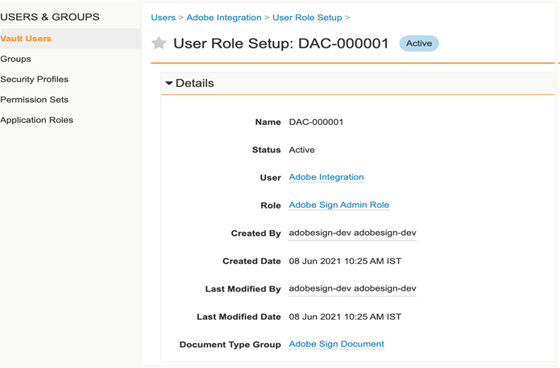

### Étape 7. Configurer les champs de document {#create-fields}

Le déploiement du pack crée les nouveaux champs de document partagé suivants, qui sont requis pour établir l’intégration :

* Signature (signature__c)

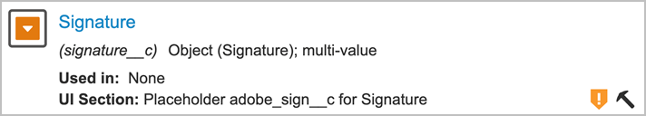

Pour configurer des champs de document :

1. Accédez à l’onglet Configuration et sélectionnez **[!UICONTROL Champs de document]** > **[!UICONTROL Champs partagés]**.
1. Dans le champ Afficher la section , sélectionnez **[!UICONTROL Créer une section d&#39;affichage]** et affectez **[!UICONTROL Signature Adobe]** comme étiquette de section.

   

1. Pour les champs de document partagés (signature__c), mettez à jour la section de l’interface utilisateur avec **[!UICONTROL Signature Adobe]** comme libellé de section.
1. Ajoutez les deux champs partagés à tous les types de documents éligibles pour la signature Adobe Acrobat. Pour ce faire, dans la page Document de base, sélectionnez **[!UICONTROL Ajouter]** > **[!UICONTROL Champ partagé existant]** dans le coin supérieur droit.

   

   

   

1. Les deux champs doivent avoir une sécurité spécifique qui permet uniquement aux membres du groupe d’administration Adobe Sign de mettre à jour leurs valeurs.

   

Disable Vault Overlays (disable_vault_overlays__v) est un champ partagé existant. Si vous le souhaitez, le champ peut avoir une sécurité spécifique qui permet uniquement aux membres du groupe d’administration Adobe Sign de mettre à jour sa valeur.

### Étape 8. Déclarer des formats associés de document {#declare-renditions}

Le nouveau type de rendu appelé *Adobe Sign Rendition (adobe_sign_rendition__c)* est utilisé par l’intégration Vault pour télécharger des documents signés par PDF vers Adobe Acrobat Sign. Vous devez déclarer le rendu Adobe Sign pour chaque type de document éligible à la signature Adobe Acrobat.

Le nouveau type de rendu appelé *Rendu d’origine (original_rendition__c)* est utilisé par l’intégration Vault comme nom du rendu qui doit être utilisé pour stocker le rendu visible d’origine si le document signé est importé en tant que rendu visible.

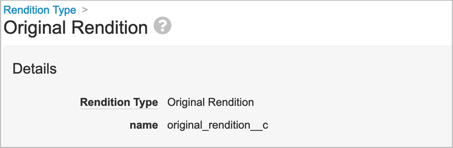

### Étape 9. Actions Web Update {#web-actions}

L&#39;intégration de Adobe Acrobat Sign et Vault nécessite la création et la configuration des deux actions Web suivantes :

* **Création d’Adobe Sign**: L’accord Adobe Acrobat Sign est créé ou affiché.

   Type : Cible du document : Afficher dans les informations d&#39;identification Vault : Activer les identifiants de post-session via l&#39;URL de post-message : <https://api.na1.adobesign.com/api/gateway/veevavaultintsvc/partner/agreement?docId=${Document.id}&majVer=${Document.major_version_number__v}&minVer=${Document.minor_version_number__v}&vaultid=${Vault.id}&useWaitPage=true>

   

* **Annuler Adobe Sign**: Cela annule un accord existant dans Adobe Acrobat Sign et rétablit l’état initial d’un document.

   Type : Cible du document : Afficher dans les informations d&#39;identification Vault : Activer les identifiants de post-session via l&#39;URL de post-message : : <https://api.na1.adobesign.com/api/gateway/veevavaultintsvc/partner/agreement/cancel?docId=${Document.id}&majVer=${Document.major_version_number__v}&minVer=${Document.minor_version_number__v}&vaultid=${Vault.id}&useWaitPage=true>

   

### Étape 10. Mettre à jour le cycle {#document-lifecycle}

Pour chaque type de document éligible à la signature Adobe, vous devez mettre à jour le cycle de vie du document correspondant en ajoutant de nouveaux rôles et états de cycle de vie.

Le cycle de vie des accords Adobe Acrobat Sign présente les états suivants :

* BROUILLON
* CRÉATION ou DOCUMENTS_NOT_YET_PROCESSED
* OUT_FOR_SIGNATURE ou OUT_FOR_APPROVAL
* SIGNÉ ou APPROUVÉ
* ANNULÉE
* EXPIRÉ

Pour mettre à jour le cycle de vie du document, procédez comme suit :

1. Ajouter un rôle Lifecycle. Le rôle d’application Administrateur Adobe Sign doit être ajouté dans tous les cycles de vie utilisés par les documents éligibles à la signature Adobe Acrobat, comme indiqué ci-dessous.

   

   Le rôle d’administrateur doit être créé avec les options suivantes :

   * Contrôle d&#39;accès dynamique activé.
   * Règles de partage de document qui incluent uniquement le groupe de types de document, comme illustré dans l’image ci-dessous.

   

2. Créer des états du cycle de vie Pour ce faire, accédez à **[!UICONTROL Paramètres]** > **[!UICONTROL Configuration]** > **[!UICONTROL Cycle de vie du document]** > **[!UICONTROL Cycle de vie général]** > **[!UICONTROL États]** > **[!UICONTROL Créer]**. Créez ensuite les états suivants :

   * Dans Adobe Sign Draft

   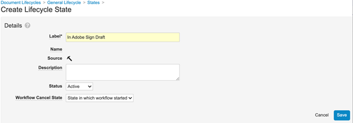

   * Dans la création Adobe Sign

   

   * En Adobe Signature

   

3. Ajoutez des actions utilisateur aux états répertoriés ci-dessous.

   Lorsqu’un document Vault est envoyé à Adobe Acrobat Sign, son état doit correspondre à celui de l’accord. Pour ce faire, ajoutez les états suivants dans chaque cycle de vie utilisé par les documents pouvant être signés par un Adobe :

   * **Avant signature Adobe** (Révisé) : Il s’agit d’un nom d’espace réservé pour l’état à partir duquel le document peut être envoyé à Adobe Acrobat Sign. En fonction du type de document, il peut s’agir de l’état Brouillon ou Révisé. Le libellé de l’état du document peut être personnalisé selon les exigences du client. Avant que l’Adobe Signature ne définisse les deux actions utilisateur suivantes :

      * Action qui modifie l’état du document en *Dans Adobe Sign Draft* état. Le nom de cette action utilisateur doit être le même pour tous les types de documents, quel que soit leur cycle de vie.
      * Action qui appelle l’action Web &quot;Adobe Sign&quot;. Cet état doit disposer d’une sécurité qui permet au rôle d’administrateur Adobe Sign de : afficher le document, afficher le contenu, modifier les champs, modifier les relations, télécharger la source, gérer le rendu visible et modifier l’état.

      

      * Modifier *Révisé* Sécurité atomique par paramètre *Dans Adobe Sign Draft* par défaut sur Masqué et Exécuter uniquement pour *Rôle d’administrateur Adobe Sign*.
      **Remarque :** Si *Rôle d’administrateur Adobe Sign* rôle ne fait pas partie de *Sécurité atomique : Actions utilisateur*, Ajouter **[!UICONTROL Rôle d’administrateur Adobe Sign]** en sélectionnant **[!UICONTROL Modifier]**> **[!UICONTROL Rôle personnalisé]**. Ensuite, ajoutez **Rôle d’administrateur Adobe Sign** pour *Révisé* Etat.

      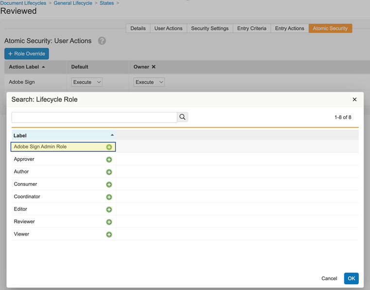
      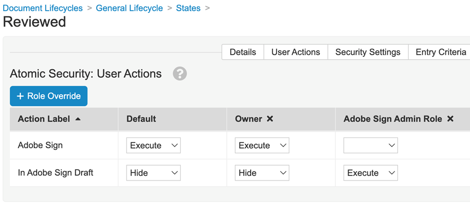
      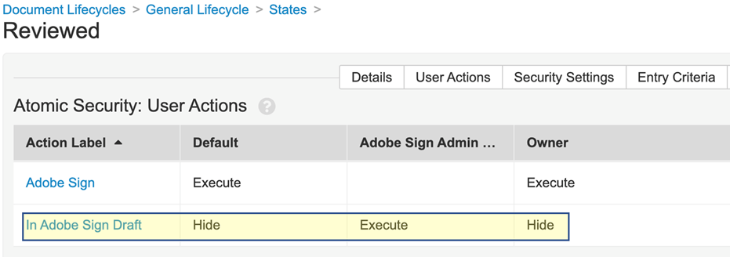

   * **Dans Adobe Sign Draft**: Il s’agit d’un nom d’espace réservé pour l’état qui indique que le document est déjà chargé dans Adobe Acrobat Sign et que son accord est à l’état BROUILLON . C&#39;est un état requis. Cet état doit définir les cinq actions utilisateur suivantes :

      * Action qui modifie l’état du document en *Dans la création Adobe Sign* état. Le nom de cette action utilisateur doit être le même pour tous les types de documents, quel que soit leur cycle de vie.
      * Action qui modifie l’état du document en *En Adobe Signature état*. Le nom de cette action utilisateur doit être le même pour tous les types de documents, quel que soit leur cycle de vie.
      * Action qui modifie l’état du document en *Adobe Sign annulé* état. Le nom de cette action utilisateur doit être le même pour tous les types de documents, quel que soit leur cycle de vie.
      * Action qui appelle l&#39;action Web *Adobe Sign*.
      * Action qui appelle l&#39;action Web *Annuler Adobe Sign*. Cet état doit disposer d’une sécurité qui permet au rôle d’administrateur Adobe Sign de : afficher le document, afficher le contenu, modifier les champs, modifier les relations, télécharger la source, gérer le rendu visible et modifier l’état.

      

      * Modifier *Dans Adobe Sign Draft* sécurité atomique d&#39;état : actions *Adobe Sign annulé*, *Dans la création Adobe Sign*, *En Adobe Signature* doit être masqué pour tout le monde, à l’exception du rôle d’administrateur Adobe Sign.
      **Remarque :** Si *Rôle d’administrateur Adobe Sign* ne fait pas partie de *Sécurité atomique : Actions utilisateur*, ajoutez **[!UICONTROL Rôle d’administrateur Adobe Sign]** en sélectionnant **[!UICONTROL Modifier]** > **[!UICONTROL Rôle personnalisé]**. Ensuite, ajoutez **[!UICONTROL Rôle d’administrateur Adobe Sign]** rôle pour *Dans Adobe Sign Draft* Etat.

      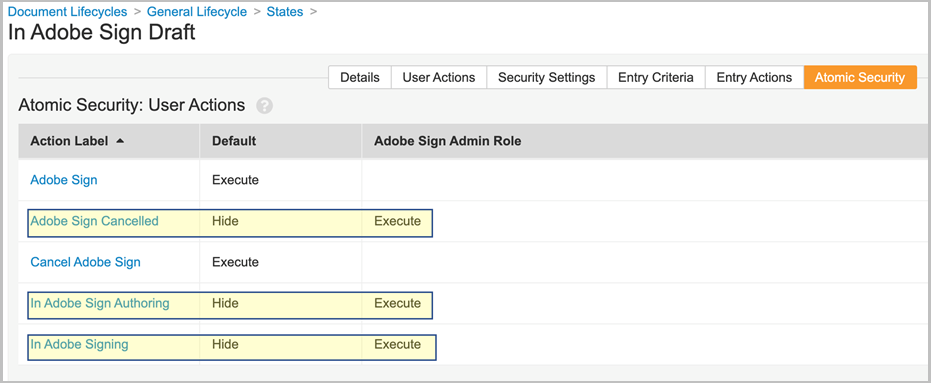

   * **Dans la création Adobe Sign**: Il s’agit d’un nom d’espace réservé pour l’état qui indique que le document est déjà chargé dans Adobe Acrobat Sign et que son accord est à l’état CRÉATION ou DOCUMENTS_NOT_YET_PROCESSED. C&#39;est un état requis. Cet état doit comporter les quatre actions utilisateur suivantes :

      * Action qui remplace l’état du document par l’état Adobe Sign Annulé . Le nom de cette action utilisateur doit être le même pour tous les types de documents, quel que soit leur cycle de vie.
      * Action qui modifie l’état du document en Adobe Signature. Le nom de cette action utilisateur doit être le même pour tous les types de documents, quel que soit leur cycle de vie.
      * Action qui appelle l’action web &quot;Adobe Sign&quot;
      * Action qui appelle l’action web &quot;Annuler Adobe Sign&quot;. Cet état doit disposer d’une sécurité qui permet au rôle d’administrateur Adobe Sign de : afficher le document, afficher le contenu, modifier les champs, modifier les relations, télécharger la source, gérer le rendu visible et modifier l’état.

      

      * Modifier *Dans la création Adobe Sign* sécurité atomique d&#39;état : actions *Adobe Sign annulé* et *En Adobe Signature* doit être masqué pour tout le monde, à l’exception du rôle d’administrateur Adobe Sign.
      **Remarque :** Si *Rôle d’administrateur Adobe Sign* ne fait pas partie de *Sécurité atomique : Actions utilisateur*, ajoutez **[!UICONTROL Rôle d’administrateur Adobe Sign]** en sélectionnant **[!UICONTROL Modifier]** > **[!UICONTROL Rôle personnalisé]**. Ensuite, ajoutez **[!UICONTROL Rôle d’administrateur Adobe Sign]** rôle pour *Dans la création Adobe Sign* Etat.

      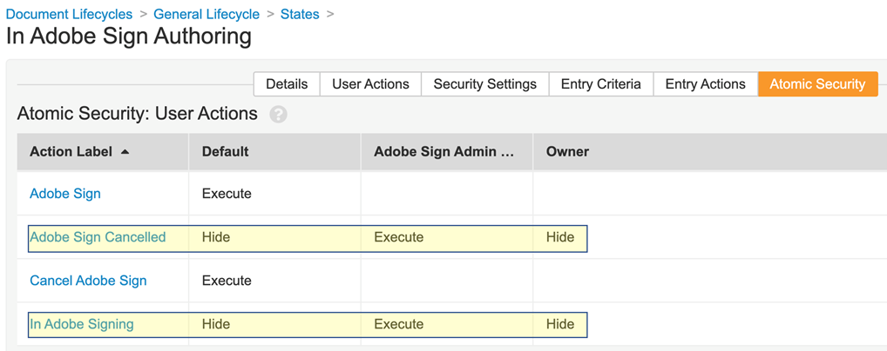

   * **En Adobe Signature**: Il s’agit d’un nom d’espace réservé pour l’état qui indique que le document est chargé dans Adobe Acrobat Sign et que son accord est déjà envoyé aux participants (état OUT_FOR_SIGNATURE ou OUT_FOR_APPROVAL). C&#39;est un état requis. Cet état doit comporter les cinq actions utilisateur suivantes :

      * Action qui remplace l’état du document par l’état Adobe Sign Annulé . L’état cible de cette action peut être n’importe quelle exigence du client et il peut être différent pour différents types. Le nom de cette action utilisateur doit être le même pour tous les types de documents, quel que soit leur cycle de vie.
      * Action qui remplace l’état du document par l’état Adobe Sign rejeté. L’état cible de cette action peut être n’importe quelle exigence du client et il peut être différent pour différents types. Le nom de cette action utilisateur doit être le même pour tous les types de documents, quel que soit leur cycle de vie.
      * Action qui remplace l’état du document par l’état Signé par l’Adobe. L’état cible de cette action peut être n’importe quelle exigence du client et il peut être différent pour différents types. Toutefois, le nom de cette action utilisateur doit être le même pour tous les types de documents, quel que soit leur cycle de vie.
      * Action qui appelle l&#39;action Web *Adobe Sign*.
      * Action qui appelle Action Web *Annuler Adobe Sign*. Cet état doit disposer d’une sécurité qui permet au rôle d’administrateur Adobe Sign de : afficher le document, afficher le contenu, modifier les champs, modifier les relations, télécharger la source, gérer le rendu visible et modifier l’état.

      

      * Modifier *En Adobe Signature* sécurité atomique d&#39;état : actions *Adobe Sign annulé*, *Adobe Sign rejeté*, et *Adobe signé* doit être masqué pour tout le monde, à l’exception du rôle d’administrateur Adobe Sign.
      **Remarque :** Si *Rôle d’administrateur Adobe Sign* ne fait pas partie de *Sécurité atomique : Actions utilisateur*, ajoutez **[!UICONTROL Rôle d’administrateur Adobe Sign]** en sélectionnant **[!UICONTROL Modifier]** > **[!UICONTROL Rôle personnalisé]**. Ensuite, ajoutez **[!UICONTROL Rôle d’administrateur Adobe Sign]** rôle pour *En Adobe Signature* Etat.

      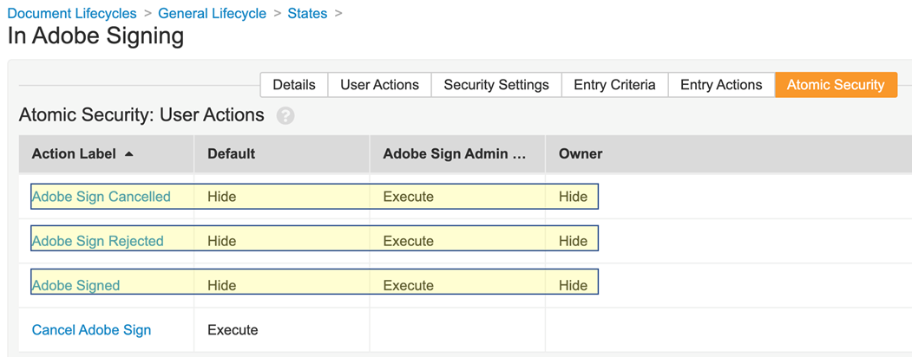

      * **Adobe signé (approuvé)**: Il s’agit d’un nom d’espace réservé pour l’état qui indique que le document est chargé dans Adobe Acrobat Sign et que son accord est terminé (état SIGNÉ ou APPROUVÉ). Il s&#39;agit d&#39;un état obligatoire qui peut être un état de cycle de vie existant, comme Approuvé.
Cet état ne nécessite aucune action de l’utilisateur. Il doit disposer d’une sécurité qui permet au rôle d’administrateur Adobe Sign de : afficher des documents, afficher du contenu et modifier des champs.

   Le diagramme suivant illustre les mappages entre les états d’accord Adobe Acrobat Sign et de document en chambre forte, où l’état &quot;Avant signature de l’Adobe&quot; est Brouillon.

   

### Étape 11. Ajout de la scène Adobe Sign au cycle de vie général dans les groupes de scène de cycle de vie

### Étape 12. Définir des autorisations pour le rôle d&#39;utilisateur dans l&#39;état du cycle de vie

Vous devez définir les autorisations appropriées pour chaque rôle d&#39;utilisateur dans l&#39;état du cycle de vie, comme indiqué dans l&#39;image ci-dessous.

### Étape 13. Configuration de la sécurité atomique en fonction de l’état du document et du rôle de l’utilisateur

### Étape 14. Créer des messages de document pour Adobe Sign Annuler

## Connect [!DNL Veeva Vault] vers Adobe Acrobat Sign avec middleware {#connect-middleware}

Après avoir terminé la configuration de [!DNL Veeva Vault] et le compte Administrateur Adobe Acrobat Sign, l’administrateur doit créer une connexion entre les deux comptes à l’aide du middleware. La [!DNL Veeva Vault] et la connexion au compte Adobe Acrobat Sign est initiée par l’identité Adobe Acrobat Sign, puis elle est utilisée pour stocker le fichier[!DNL Veeva Vault] identité.
Pour la sécurité et la stabilité du système, l’administrateur doit utiliser un [!DNL Veeva Vault] compte système/service/utilitaire, tel que `adobe.for.veeva@xyz.com`, au lieu d’un compte d’utilisateur personnel, tel que `bob.smith@xyz.com`.

Un administrateur de compte Adobe Acrobat Sign doit suivre les étapes ci-dessous pour se connecter [!DNL Veeva Vault] vers Adobe Acrobat Sign à l’aide de middleware :

1. Accédez à l’onglet [Adobe Acrobat Sign pour [!DNL Veeva Vault] Page Accueil](https://static.adobesigncdn.com/veevavaultintsvc/index.html).
1. Sélectionner **[!UICONTROL Connexion]** dans le coin supérieur droit.

   

1. Pour autoriser le niveau d’accès à l’application, sélectionnez la portée OAuth d’Acrobat Sign comme **[!UICONTROL COMPTE]** ou **[!UICONTROL GROUPE]**. Ensuite, sélectionnez **[!UICONTROL Autoriser]**.

   

1. Dans la page de connexion Adobe Acrobat Sign qui s’ouvre, indiquez l’adresse e-mail et le mot de passe de l’administrateur du compte, puis sélectionnez **[!UICONTROL Se connecter]**.

   

   Une fois que vous êtes connecté, la page affiche l’ID de messagerie associé et un onglet Paramètres, comme indiqué ci-dessous.

   

1. Sélectionnez le fichier **[!UICONTROL Paramètres]** .

   La page Paramètres affiche les connexions disponibles, ainsi que *Aucune connexion disponible* en cas de première configuration de connexion, comme indiqué ci-dessous.

   

1. Sélectionner **[!UICONTROL Ajouter une connexion]** pour ajouter une nouvelle connexion.

1. Dans la boîte de dialogue Ajouter une connexion qui s’ouvre, fournissez les détails requis, y compris le [!DNL Veeva Vault] identifiants.

   Les informations d’identification Adobe Acrobat Sign sont renseignées automatiquement à partir de la connexion Adobe Sign initiale.

   

1. Sélectionner **[!UICONTROL Valider]** pour valider les détails du compte.

   Une fois la validation réussie, une notification &quot;Validation de l’utilisateur réussie&quot; s’affiche, comme indiqué ci-dessous.

   

1. Pour restreindre l’utilisation à un groupe Adobe Acrobat Sign particulier, développez la boîte de dialogue **[!UICONTROL Groupe]** et sélectionnez l’un des groupes disponibles.

   

1. Cochez la case pour joindre le rapport d’audit au rendu signé **[!UICONTROL Joindre le rapport d’audit au rendu signé]**.

   

1. Pour permettre la configuration automatique des utilisateurs dans Adobe Acrobat Sign, cochez la case **[!UICONTROL Configurer automatiquement les utilisateurs Sign]**.

   **Remarque :** La configuration automatique des nouveaux utilisateurs Adobe Acrobat Sign ne fonctionne que si elle a été activée au niveau du compte Adobe Acrobat Sign dans Adobe Acrobat Sign en plus de l’activation **[!UICONTROL Configurer automatiquement les utilisateurs Sign]** pour le[!DNL Veeva Vault] Intégration de Adobe Acrobat Sign comme indiqué ci-dessous par l’administrateur du compte Adobe Acrobat Sign.

   

1. Pour configurer Adobe Sign Rendition pour qu’il s’affiche dans Veeva au lieu du rendu d’origine, cochez la case **[!UICONTROL Affichage du rendu Acrobat Sign]**.

   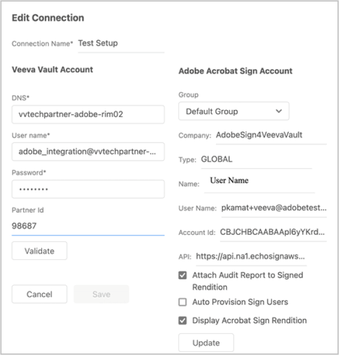

1. Sélectionner **[!UICONTROL Enregistrer]** pour enregistrer votre nouvelle connexion.

   La nouvelle connexion apparaît sous l’onglet Paramètres pour indiquer que l’intégration entre [!DNL Veeva Vault] et Adobe Acrobat Sign.

   

