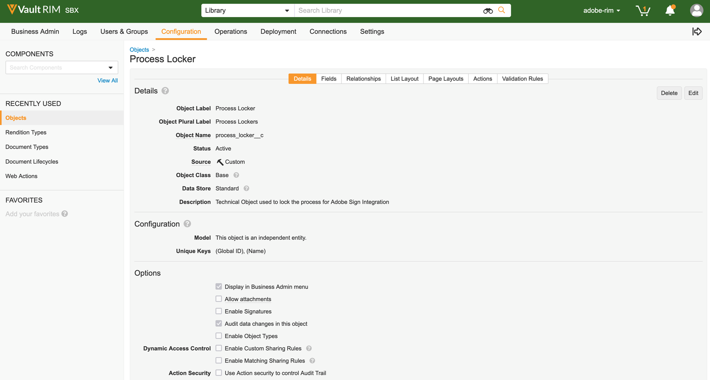

# [!DNL Veeva Vault] Guide d’installation{#veeva-installation-guide}

[**Contacter le support technique Adobe Sign**](https://adobe.com/go/adobesign-support-center_fr)

## Présentation {#overview}

Ce document explique comment établir l’intégration de Adobe Sign avec [!DNL Veeva Vault] plate-forme. [!DNL Veeva Vault] est une plate-forme de gestion de contenu d’entreprise (ECM) conçue pour les sciences de la vie. Un &quot;coffre-fort&quot; est un référentiel de contenu et de données qui sert habituellement aux dépôts réglementaires, aux rapports de recherche, aux demandes de subventions, aux contrats généraux, et bien plus encore. Une seule entreprise peut avoir plusieurs &quot;coffres-forts&quot; qui doivent être entretenus séparément.

Les étapes de haut niveau permettant de terminer l’intégration sont les suivantes :

* Activer votre compte d’administration dans Adobe Sign (nouveaux clients uniquement)
* Créez des objets pour suivre l’historique du cycle de vie d’un accord dans Vault.
* Créez un profil de sécurité.
* Configuration d’un groupe dans Adobe Sign pour qu’il contienne le noeud [!DNL Veeva Vault] utilisateur d’intégration.
* Créez des champs et des rendus de document.
* Configurez les actions Web et mettez à jour le cycle de vie du document.
* Créez la configuration des rôles utilisateur et utilisateur de type de document.

>[!NOTE]
>
>L’administrateur Adobe Sign doit effectuer les étapes de configuration Adobe Sign dans Adobe Sign.

## Configurer [!DNL Veeva Vault] {#configure-veeva}

Pour configurer [!DNL Veeva Vault] pour l’intégration avec Adobe Sign, créez certains objets qui permettent de suivre l’historique du cycle de vie d’un accord dans Vault. Les administrateurs doivent créer les objets suivants :

* Signature
* Signataire
* Événement de signature
* Verrouillage de processus

### Créer un objet Signature  {#create-signature-object}

L’objet de signature est créé pour stocker les informations relatives aux accords. Un objet Signature est une base de données qui contient des informations sous les champs spécifiques suivants :

**Champs d’objet de signature**

| Champ | Libellé | Type | Description |
| --- | --- | ---| --- | 
| external_id__c | ID de l’accord | Chaîne (100) | Contient l’ID d’accord unique de l’Adobe Sign |
| file_hash__c | Hachage de fichier | Chaîne (50) | Contient la somme de contrôle md5 du fichier qui a été envoyé à Adobe Sign |
| name__v | Nom | Chaîne (128) | Contient le nom de l’accord |
| sender__c | Expéditeur | Objet (Utilisateur) | Contient la référence à l’utilisateur Vault qui a créé l’accord. |
| signature_status__c | État de signature | Chaîne (75) | Contient le statut de l’accord dans Adobe Sign |
| signature_type__c | Type de signature | Chaîne (20) | Contient le type de signature de l’accord dans Adobe Sign (ÉCRITE ou ESIGN) |
| start_date__c | Date de début | DateHeure | Date à laquelle l’accord a été envoyé pour signature |
| annulation_date__c | Date d&#39;annulation | DateHeure | Contient la date à laquelle l’accord a été annulé. |
| complete_date__c | Date de fin | DateHeure | Contient la date à laquelle l’accord a été complété. |
| viewable_rendition_used__c | Rendu visible utilisé | Booléen | Indicateur indiquant si le rendu visible a été envoyé pour signature. (par défaut, il est vrai) |

### Créer un objet Signataire {#create-signatory-object}

L’objet de signature est créé pour stocker les informations relatives aux participants à un accord. Il contient des informations sous les champs spécifiques suivants :

**Champs d’objet signé**

| Champ | Libellé | Type | Description |
| --- | --- | ---| --- | 
| email__c | E-mail | Chaîne (120) | Contient l’ID d’accord unique de l’Adobe Sign |
| external_id__c | ID de participant | Chaîne (80) | Contient l’identifiant du participant unique Adobe Sign |
| name__v | Nom | Chaîne (128) | Contient le nom du participant Adobe Sign |
| order__c | Ordre | Numéro | Contient le numéro de commande du participant à l’accord Adobe Sign |
| role__c | Rôle | Chaîne (30) | Contient le rôle du participant à l’accord Adobe Sign |
| signature__c | Signature | Objet (signature) | Contient la référence à l’enregistrement parent de la signature. |
| signature_status__c | État de signature | Chaîne (100) | Contient l’état du participant à l’accord Adobe Sign |
| user__c | Utilisateur | Objet (Utilisateur) | Contient la référence à l’enregistrement d’utilisateur du signataire si le participant est un utilisateur Vault. |

### Créer un objet Événement de signature  {#create-signature-event}

L’objet Événement de signature est créé pour stocker les informations relatives aux événements d’un accord. Il contient des informations sous les champs spécifiques suivants :

| Champ | Libellé | Type | Description |
| --- | --- | ---| --- | 
| acteur_utilisateur_email__c | Adresse él. du responsable de l’action | Chaîne | Contient l’adresse électronique de l’utilisateur Adobe Sign qui a exécuté l’action qui a provoqué la génération de l’événement. |
| acteur_nom_utilisateur__c | Nom d&#39;utilisateur intérimaire | Chaîne | Contient le nom de l’utilisateur Adobe Sign qui a exécuté l’action qui a provoqué la génération de l’événement. |
| description_c | Description | Chaîne | Contient la description de l’événement Adobe Sign |
| event_date__c | Date de l’événement | DateHeure | Contient la date et l’heure de l’événement Adobe Sign |
| event_type__c | Type d’événement | Chaîne | Contient le type de l’événement Adobe Sign |
| name__v | Nom | Chaîne | Nom d’événement généré automatiquement |
| participant_comment__c | Commentaire du participant | Chaîne | Contient le commentaire du participant Adobe Sign, le cas échéant |
| participant_email__c | Adresse él. du participant | Chaîne | Contient l’adresse électronique du participant Adobe Sign |
| participant_role__c | Rôle de participant | Chaîne | Contient le rôle du participant Adobe Sign |
| signature__c | Signature | Objet (signature) | Contient la référence à l’enregistrement parent de la signature. |

### Créer un objet Process Locker  {#create-process-locker}

Un objet Process Locker est créé pour verrouiller le processus d&#39;intégration Adobe Sign. Il ne nécessite aucun champ personnalisé.

## Création de profils de sécurité{#security-profiles}

Pour une intégration réussie du coffre, un nouveau profil de sécurité appelé *Profil d’intégration Adobe Sign* est créé et son autorisation est définie pour *Actions d’administration Adobe Sign*. Le profil d&#39;intégration Adobe Sign est affecté au compte système et est utilisé par l&#39;intégration lors de l&#39;appel des API Vault. Ce profil autorise les autorisations pour :

* API Vault
* Lecture, création, modification et suppression : Objets de signature, de signature, d’événements de signature et de verrouillage de processus

Les profils de sécurité des utilisateurs qui ont besoin d’accéder à l’historique Adobe Sign dans Vault doivent disposer d’autorisations en lecture pour les objets Signature, Signatory et Signature Event.

## Créer un groupe {#create-group}

Pour configurer Adobe Sign pour [!DNL Vault], un nouveau groupe appelé *Groupe d’administrateurs Adobe Sign* est créé. Ce groupe est utilisé pour définir la sécurité au niveau des champs de document pour les champs liés à Adobe Sign et doit inclure *Profil d’intégration Adobe Sign* par défaut.

## Créer un utilisateur {#create-user}

L&#39;utilisateur du compte système Vault de l&#39;intégration Adobe Sign doit :

* Posséder un profil d&#39;intégration Adobe Sign
* Posséder un profil de sécurité
* Dispose d&#39;une stratégie de sécurité spécifique qui désactive l&#39;expiration du mot de passe
* Soyez membre du groupe d’administrateurs Adobe Sign.

Pour vous assurer que l’utilisateur du compte système appartient au groupe d’administrateurs Adobe Sign pour le cycle de vie du document spécifique, vous devez créer des enregistrements de configuration de rôle utilisateur.

## Créer des rôles d’application {#create-application-roles}

Vous devez créer un rôle d’application appelé *Rôle d’administrateur Adobe Sign*. Ce rôle doit être défini dans le cycle de vie de chaque type de document pouvant être signé par Adobe. Pour chacun des états de cycle de vie spécifiques à Adobe Sign, le rôle d&#39;administrateur Adobe Sign est ajouté et configuré avec les autorisations appropriées.

## Créer des champs de document {#create-fields}

Pour établir l’intégration avec Adobe Sign, les administrateurs doivent créer les deux nouveaux champs de document partagés suivants :

* Signature (signature__c)
* Autoriser les actions utilisateur Adobe Sign (allow_adobe_sign_user_actions__c)

Ces champs partagés doivent être ajoutés à tous les types de document pouvant être signés par Adobe. Les deux champs doivent avoir une sécurité spécifique qui permet uniquement aux membres du groupe d’administrateurs Adobe Sign de mettre à jour leurs valeurs.

Les administrateurs doivent ajouter un champ partagé existant. *Désactiver les incrustations de coffre (disable_vault_Overlay__v)* et définissez-la sur Actif pour tous les types de documents pouvant être signés par Adobe. Si vous le souhaitez, le champ peut avoir une sécurité spécifique qui permet uniquement aux membres du groupe d’administrateurs Adobe Sign de mettre à jour sa valeur.

## Créer des rendus de document {#create-renditions}

Les administrateurs doivent créer un nouveau type de rendu appelé *Adobe Sign Rendition (adobe_sign_rendition__c)*, qui est utilisé par l’intégration de Vault pour télécharger des documents PDF signés vers Adobe Sign. Le rendu Adobe Sign doit être déclaré pour chaque type de document éligible pour la signature par Adobe.

## Configuration des actions Web {#web-actions}

L’intégration d’Adobe Sign et Vault nécessite que vous créiez et configuriez les deux actions Web suivantes :

* **Créer Adobe Sign**: Il crée ou affiche l’accord Adobe Sign.

   Type : Cible du document : Afficher dans l&#39;URL de coffre-fort : <https://api.na1.adobesign.com/api/gateway/veevavaultintsvc/partner/agreement?docId=${Document.id}&majVer=${Document.major_version_number__v}&minVer=${Document.minor_version_number__v}&vaultid=${Vault.id}&useWaitPage=true>

   

* **Annuler Adobe Sign**: Il annule un accord existant dans Adobe Sign et rétablit l’état initial d’un document.

   Type : Cible du document : Afficher dans l&#39;URL de coffre-fort : : <https://api.na1.adobesign.com/api/gateway/veevavaultintsvc/partner/agreement/cancel?docId=${Document.id}&majVer=${Document.major_version_number__v}&minVer=${Document.minor_version_number__v}&vaultid=${Vault.id}&useWaitPage=true>

   

## Mettre à jour le cycle de vie du document {#document-lifecycle}

Pour chaque type de document éligible pour la signature d’Adobe, le cycle de vie du document correspondant doit être mis à jour en ajoutant un nouveau rôle et des états de cycle de vie.

### Rôle du cycle de vie {#lifecycle-role}

Le rôle d’application Administrateur Adobe Sign doit être ajouté à tous les cycles de vie utilisés par les documents éligibles à la signature d’Adobe, comme indiqué ci-dessous.

Le rôle d’administrateur doit être créé avec les options suivantes :

* Activation du contrôle d&#39;accès dynamique.
* Règles de partage de documents qui incluent uniquement le groupe de types de documents, comme illustré dans l’image ci-dessous.

### États du cycle de vie {#lifecycle-states}

Le cycle de vie des accords Adobe Sign contient les états suivants :

* PROJET
* CRÉATION ou DOCUMENTS_NOT_YET_PROCESSED
* OUT_FOR_SIGNATURE ou OUT_FOR_APPROVAL
* SIGNÉ ou approuvé
* ANNULÉE
* EXPIRÉ

Lorsqu’un document Vault est envoyé à Adobe Sign, son état doit correspondre à celui dans lequel l’accord est. Pour ce faire, ajoutez les états suivants dans chaque cycle de vie utilisé par les documents éligibles à la signature d’Adobe :

* **Avant signature de l’Adobe** (Révisé) : Il s’agit d’un nom d’espace réservé pour l’état à partir duquel le document peut être envoyé à Adobe Sign. En fonction du type de document, il peut s’agir de l’état Brouillon ou Révisé. Le libellé d’état du document peut être personnalisé en fonction des besoins du client. Avant l’état de signature de l’Adobe, vous devez définir les deux actions suivantes de l’utilisateur :

   * Action qui transforme l’état du document en *In Adobe Sign Draft* état. Le nom de cette action utilisateur doit être le même pour tous les types de document pour tout cycle de vie. Si nécessaire, les critères de cette action peuvent être définis sur &quot;Autoriser les actions utilisateur Adobe Sign égales à Oui&quot;.
   * Action qui appelle l’action Web &quot;Adobe Sign&quot;. Cet état doit avoir une sécurité qui permet au rôle d&#39;administrateur Adobe Sign de : afficher le document, afficher le contenu, modifier les champs, modifier les relations, télécharger la source, gérer le rendu affichable et modifier l’état.

      

* **In Adobe Sign Draft**: Il s’agit d’un nom d’espace réservé pour l’état qui indique que le document est déjà téléchargé vers Adobe Sign et que son accord est dans un état BROUILLON. C&#39;est un état obligatoire. Cet état doit définir les cinq actions utilisateur suivantes :

   * Action qui transforme l’état du document en *In Adobe Sign Authoring* état. Le nom de cette action utilisateur doit être le même pour tous les types de document pour tout cycle de vie. Si nécessaire, les critères de cette action peuvent être définis sur &quot;Autoriser les actions utilisateur Adobe Sign égales à Oui&quot;.
   * Action qui transforme l’état du document en *État de signature en Adobe*. Le nom de cette action utilisateur doit être le même pour tous les types de document pour tout cycle de vie. Si nécessaire, les critères de cette action peuvent être définis sur &quot;Autoriser les actions utilisateur Adobe Sign égales à Oui&quot;.
   * Action qui transforme l’état du document en *Adobe Sign annulé* état. Le nom de cette action utilisateur doit être le même pour tous les types de document pour tout cycle de vie. Si nécessaire, les critères de cette action peuvent être définis sur &quot;Autoriser les actions utilisateur Adobe Sign égales à Oui&quot;.
   * Action qui appelle l’action Web &quot;Adobe Sign&quot; .
   * Action qui appelle l’action Web &quot;Annuler Adobe Sign&quot;. Cet état doit avoir une sécurité qui permet au rôle d’administrateur Adobe Sign de : afficher le document, afficher le contenu, modifier les champs, modifier les relations, télécharger la source, gérer le rendu affichable et modifier l’état.

      

* **In Adobe Sign Authoring**: Il s’agit d’un nom d’espace réservé pour l’état qui indique que le document est déjà téléchargé vers Adobe Sign et que son accord est à l’état AUTHORING ou DOCUMENTS_NOT_YET_PROCESSED. C&#39;est un état obligatoire. Cet état doit avoir quatre actions utilisateur suivantes définies :

   * Action qui modifie l’état du document en état d’Adobe Sign Annulé. Le nom de cette action utilisateur doit être le même pour tous les types de documents, quel que soit le cycle de vie. Si nécessaire, les critères de cette action peuvent être définis sur &quot;Autoriser les actions utilisateur Adobe Sign égales à Oui&quot;.
   * Action qui modifie l’état du document en état de signature en Adobe. Le nom de cette action utilisateur doit être le même pour tous les types de documents, quel que soit le cycle de vie. Si nécessaire, les critères de cette action peuvent être définis sur &quot;Autoriser les actions utilisateur Adobe Sign égales à Oui&quot;.
   * Action qui appelle l’action Web &quot;Adobe Sign&quot;
   * Action qui appelle l’action Web &quot;Annuler Adobe Sign&quot;. Cet état doit avoir une sécurité qui permet au rôle d’administrateur Adobe Sign de : afficher le document, afficher le contenu, modifier les champs, modifier les relations, télécharger la source, gérer le rendu affichable et modifier l’état.

      

* **Signature en Adobe**: Il s’agit d’un nom d’espace réservé pour l’état qui indique que le document est téléchargé vers Adobe Sign et que son accord est déjà envoyé aux participants (état OUT_FOR_SIGNATURE ou OUT_FOR_APPROVAL). C&#39;est un état obligatoire. Cet état doit comporter les cinq actions utilisateur suivantes définies :

   * Action qui modifie l’état du document en état d’Adobe Sign Annulé. L’état cible de cette action peut être n’importe quelle exigence du client et peut être différent pour différents types. Le nom de cette action utilisateur doit être le même pour tous les types de documents, quel que soit le cycle de vie. Si nécessaire, les critères de cette action peuvent être définis sur &quot;Autoriser les actions utilisateur Adobe Sign égales à Oui&quot;.
   * Action qui modifie l’état du document en état d’éjection Adobe Sign. L’état cible de cette action peut être n’importe quelle exigence du client et peut être différent pour différents types. Le nom de cette action utilisateur doit être le même pour tous les types de documents, quel que soit le cycle de vie. Si nécessaire, les critères de cette action peuvent être définis sur &quot;Autoriser les actions utilisateur Adobe Sign égales à Oui&quot;.
   * Action qui transforme l’état du document en état de signature d’Adobe. L’état cible de cette action peut être n’importe quelle exigence du client et peut être différent pour différents types. Toutefois, le nom de cette action utilisateur doit être le même pour tous les types de document, quel que soit le cycle de vie. Si nécessaire, les critères de cette action peuvent être définis sur &quot;Autoriser les actions utilisateur Adobe Sign égales à Oui&quot;.
   * Action qui appelle l’action Web *Adobe Sign*.
   * Action appelant une action Web *Annuler Adobe Sign*. Cet état doit avoir une sécurité qui permet au rôle d’administrateur Adobe Sign de : afficher le document, afficher le contenu, modifier les champs, modifier les relations, télécharger la source, gérer le rendu affichable et modifier l’état.

      

* **Adobe signé (approuvé)**: Il s’agit d’un nom d’espace réservé pour l’état qui indique que le document est téléchargé vers Adobe Sign et que son accord est terminé (état SIGNÉ ou APPROUVÉ). Il s&#39;agit d&#39;un état obligatoire et il peut s&#39;agir d&#39;un état de cycle de vie existant, comme Approuvé.
Cet état ne nécessite pas d’actions utilisateur. Cet état doit avoir une sécurité qui permet au rôle Administrateur Adobe Sign de : afficher des documents, afficher du contenu et modifier des champs.

Le diagramme suivant illustre les mappages entre les états d’accord Adobe Sign et de document Vault, où l’état &quot;Avant la signature de l’Adobe&quot; est Brouillon.

## Créer un groupe de types de document et Configuration d’un rôle d’utilisateur  {#document-type-group-user-role}

### Créer un groupe de types de document {#create-document-type-group}

Les administrateurs doivent créer un nouvel enregistrement de groupe de types de document appelé &quot;Document Adobe Sign&quot;. Ce groupe de types de document est ajouté pour toutes les classifications de documents éligibles au processus Adobe Sign. Étant donné que la propriété de groupe de type de document n’est pas héritée du type au sous-type ni du sous-type au niveau de classification, elle doit être définie pour la classification de chaque document qui est éligible pour Adobe Sign.

### Créer une configuration de rôle d&#39;utilisateur {#create-user-role-setup}

Une fois que le ou les cycles de vie sont correctement configurés, le système doit s&#39;assurer que l&#39;utilisateur administrateur Adobe Sign est ajouté par le CAD pour tous les documents éligibles au processus Adobe Sign. Pour ce faire, créez l&#39;enregistrement de configuration de rôle d&#39;utilisateur approprié qui spécifie :

* Groupe de types de document en tant que &quot;Document Adobe Sign&quot;,
* Rôle de l’application en tant que &quot;Rôle d’administrateur Adobe Sign&quot;, et
* Utilisateur de l’intégration.

>[!NOTE]
>
>Si l&#39;objet Configuration de rôle d&#39;utilisateur ne contient pas le champ qui fait référence à l&#39;objet Groupe de types de document, ce champ doit être ajouté.

## Connexion [!DNL Veeva Vault] vers Adobe Sign à l’aide du middleware {#connect-middleware}

Après avoir terminé la configuration pour [!DNL Veeva Vault] et le compte d’administration Adobe Sign, l’administrateur doit créer une connexion entre les deux comptes à l’aide du middleware. Le [!DNL Veeva Vault] et la connexion au compte Adobe Sign est initiée par l’identité Adobe Sign, puis elle est utilisée pour stocker l’identité Veeva Vault.
Pour la sécurité et la stabilité du système, l’administrateur doit utiliser un [!DNL Veeva Vault] compte système/service/utilitaire, tel que `adobe.for.veeva@xyz.com`, au lieu d’un compte d’utilisateur personnel, tel que `bob.smith@xyz.com`.

Un administrateur de compte Adobe Sign doit suivre les étapes ci-dessous pour se connecter. [!DNL Veeva Vault] vers Adobe Sign à l&#39;aide du middleware :

1. Accédez à la section [Adobe Sign pour [!DNL Veeva Vault] Page d’accueil](https://static.adobesigncdn.com/veevavaultintsvc/index.html).
1. Sélectionner **[!UICONTROL Connexion]** dans le coin supérieur droit.

   

1. Dans la page de connexion Adobe Sign qui s’ouvre, indiquez l’adresse électronique et le mot de passe de l’administrateur du compte, puis sélectionnez **[!UICONTROL Chant]**.

   

   Une fois la connexion établie, la page affiche l’ID d’adresse électronique associé et un onglet Paramètres, comme illustré ci-dessous.

   

1. Sélectionnez l’option **[!UICONTROL Paramètres]** .

   La page Paramètres affiche les connexions disponibles et n’affiche aucune connexion en cas de configuration initiale, comme illustré ci-dessous.

   

1. Sélectionner **[!UICONTROL Ajouter une connexion]** pour ajouter une nouvelle connexion.

1. Dans la boîte de dialogue Ajouter une connexion qui s’ouvre, fournissez les détails requis, y compris [!DNL Veeva Vault] informations d&#39;identification.

   Les informations d&#39;identification Adobe Sign sont renseignées automatiquement à partir de la connexion Adobe Sign initiale.

   

1. Sélectionner **[!UICONTROL Valider]** pour valider les détails du compte.

   Une fois la validation réussie, une notification &quot;L’utilisateur a réussi sa validation&quot; s’affiche, comme illustré ci-dessous.

   

1. Pour limiter l’utilisation à un groupe d’Adobe Sign particulier, développez l’onglet **[!UICONTROL Groupe]** et sélectionnez l’un des groupes disponibles.

   

1. Sélectionner **[!UICONTROL Enregistrer]** pour enregistrer votre nouvelle connexion.

   La nouvelle connexion s’affiche sous l’onglet Paramètres et indique que l’intégration entre les [!DNL Veeva Vault] et Adobe Sign.

   

## Cycle de vie du déploiement du pack {#deployment-lifecycle}

### Cycle de vie du déploiement général {#general-deployment}

**Étape 1.** Créez un rôle d’application appelé &quot;Rôle d’administrateur Adobe Sign&quot;.

**Étape 2.** Créez un groupe de types de document appelé &quot;Document Adobe Sign&quot;.

**Étape 3.** [Déploiement du pack](https://helpx.adobe.com/content/dam/help/en/PKG-AdobeSign-Integration.zip).

**Étape 4.** Créez un groupe géré par l’utilisateur appelé &quot;Groupe d’administrateurs Adobe Sign&quot;.

**Étape 5.** Créez un profil d’utilisateur d’intégration avec le profil de sécurité &quot;Profil d’intégration Adobe Sign&quot; et attribuez-le au groupe d’administrateurs Adobe Sign.

**Étape 6.** Attribuez des autorisations de lecteur pour tous les profils de sécurité aux objets d’événement de signature, de signature et de signature pour les utilisateurs qui ont besoin d’accéder à l’historique Adobe Sign dans Vault.

**Étape 7.** Définissez le rôle d’administrateur Adobe Sign dans le cycle de vie de chaque type de document éligible pour la signature d’Adobe. Pour chaque état de cycle de vie spécifique à Adobe Sign, ce rôle est ajouté et configuré avec les autorisations appropriées.

**Étape 8.** Déclarez &quot;Adobe Sign Rendition&quot; pour chaque type de document éligible à la signature par Adobe.

**Étape 9.** Pour chaque type de document admissible à la signature d’Adobe, mettez à jour le cycle de vie du document correspondant en ajoutant de nouveaux rôles et états de cycle de vie.

**Étape 10.** Ajoutez le groupe de types de document appelé &quot;Document Adobe Sign&quot; pour toutes les classifications de documents éligibles au processus Adobe Sign.

**Étape 11.** Une fois toutes les configurations terminées, le système doit s’assurer que l’utilisateur Administrateur Adobe Sign est ajouté par le CAD pour tous les documents éligibles au processus Adobe Sign. Pour ce faire, créez l’enregistrement de configuration de rôle d’utilisateur approprié qui spécifie le groupe de types de document comme &quot;Document Adobe Sign&quot;, Rôle d’application comme &quot;Rôle d’administrateur Adobe Sign&quot; et un utilisateur d’intégration.

### Cycle de vie de déploiement spécifique {#specific-deployment}

**Étape 1.** Créez un rôle d’application appelé &quot;Rôle d’administrateur Adobe Sign&quot;.

**Étape 2.** Créez un groupe de types de document appelé &quot;Document Adobe Sign&quot;.

**Étape 3.** [Déploiement du pack](https://helpx.adobe.com/content/dam/help/en/PKG-AdobeSign-Integration.zip).

**Étape 4.** Créez un groupe géré par l’utilisateur appelé &quot;Groupe d’administrateurs Adobe Sign&quot;.

**Étape 5.** Créez un profil d’utilisateur d’intégration avec le profil de sécurité appelé &quot;Profil d’intégration Adobe Sign&quot; et attribuez-le au groupe d’administrateurs Adobe Sign.
