# Adobe Sign pour [!DNL Veeva Vault]: Guide utilisateur {#veeva-vault-user-guide}

[**Contacter le support technique Adobe Sign**](https://adobe.com/go/adobesign-support-center_fr)

Ce document est conçu pour vous aider [!DNL Veeva Vault] les clients découvrent comment utiliser Adobe Sign pour [!DNL Veeva Vault] pour envoyer un accord.

## Présentation {#overview}

Intégration d&#39;Adobe Sign avec [!DNL Veeva Vault] facilite le processus d’obtention d’une signature ou d’une approbation pour tout document nécessitant des signatures légales ou un traitement de document vérifiable.

Le processus global d’envoi de documents pour signature est similaire à l’envoi d’un e-mail, il est donc facile à adopter pour la plupart des utilisateurs.

Intégration d&#39;Adobe Sign avec [!DNL Veeva Vault] rationalise et accélère vos workflows documentaires et de signature. En utilisant le flux de travaux d’intégration, vous :

* Gagnez du temps et économisez des ressources dans le courrier postal, la nuit et les télécopies.
* Envoyer des contrats pour signature électronique ou approbation depuis [!DNL Veeva Vault], accédez à l’historique des contrats en temps réel et consultez les contrats enregistrés.
* Suivez les transactions en temps réel dans l’ensemble de votre organisation et recevez des informations à jour lorsque les accords sont consultés, signés, annulés ou refusés.
* eSign dans plus de 20 langues et prise en charge du service de télécopie dans plus de 50 langues dans le monde.
* Créer des modèles d’accord réutilisables pour les options d’envoi.

## Envoyer un accord à l’aide d’Adobe Sign pour [!DNL Veeva Vault] {#send-sign-vault-agreement}

Pour envoyer un accord à l’aide d’Adobe Sign pour Veeva :

1. Accédez à l’onglet [[!DNL Veeva Vault] page de connexion](https://login.veevavault.com/) et entrez votre nom d’utilisateur et votre mot de passe. Elle ouvre la page d&#39;accueil de votre chambre forte, comme indiqué ci-dessous.

   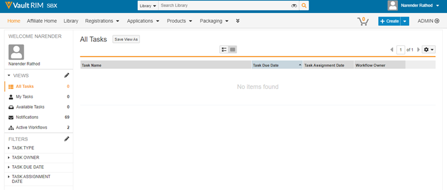

1. Sélectionner **[!UICONTROL Bibliothèque]** , puis sélectionnez **[!UICONTROL Créer]** dans le coin supérieur droit.

   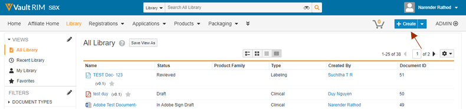

1. Sélectionner **[!UICONTROL Télécharger et continuer]**.

1. Chargez n’importe quel document à partir de votre lecteur local.

1. Dans la boîte de dialogue qui s’affiche, sélectionnez **[!UICONTROL Type]** comme *[!UICONTROL Clinique]* , puis sélectionnez un élément **[!UICONTROL Sous-type]** et **[!UICONTROL Classification]**, si nécessaire.

   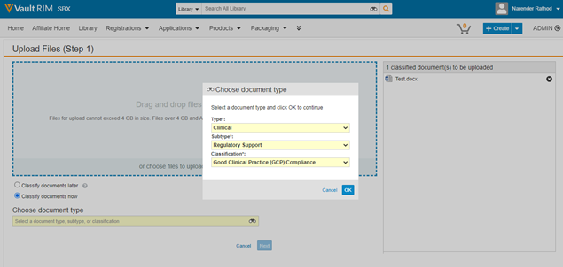

1. Sélectionner **[!UICONTROL Ok]** pour fermer la boîte de dialogue.

1. Sélectionner **[!UICONTROL Suivant]**.

1. Dans la fenêtre qui s’affiche, renseignez tous les champs requis dans la section Métadonnées et sélectionnez **[!UICONTROL Enregistrer]**.

   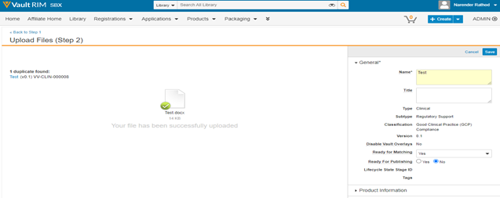

1. Il crée un document test dans **[!UICONTROL Brouillon]** , comme illustré ci-dessous.

   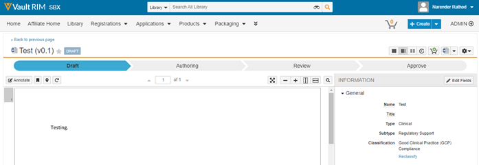

1. Dans le coin supérieur droit, sélectionnez  , puis sélectionnez **[!UICONTROL Commencer la révision]**.

   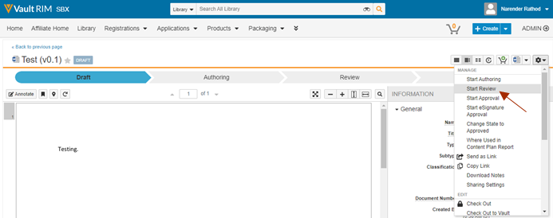

1. Sélectionnez le fichier **[!UICONTROL Réviseur]** et **[!UICONTROL Date d&#39;échéance]**.

1. Sélectionner **[!UICONTROL Début]**. L’état du document est remplacé par [!UICONTROL EN COURS DE RÉVISION].

   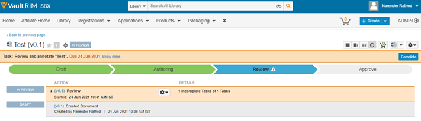

1. Effectuez la tâche affectée au nom des réviseurs. Une fois que vous avez terminé, l’état du document est remplacé par [!UICONTROL RÉVISÉ].

   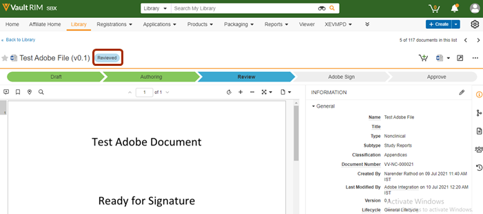

1. Sélectionner  , puis sélectionnez **[!UICONTROL Adobe Sign]**.

   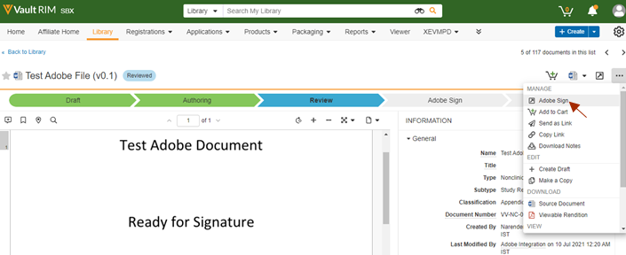

1. Dans la fenêtre iFrame qui s’ouvre dans Vault, saisissez l’adresse e-mail du destinataire et sélectionnez **[!UICONTROL Suivant]**.

   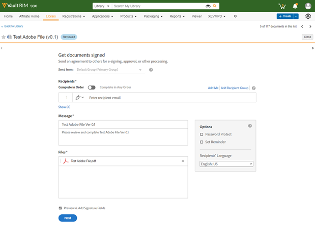

   **Remarque :** S’il n’existe aucun compte utilisateur Adobe Sign pour l’adresse e-mail de l’expéditeur, la fenêtre iFrame affiche un message, comme indiqué ci-dessous. Il envoie également à l’utilisateur un e-mail contenant les instructions d’activation du compte.

   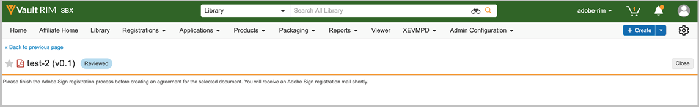

   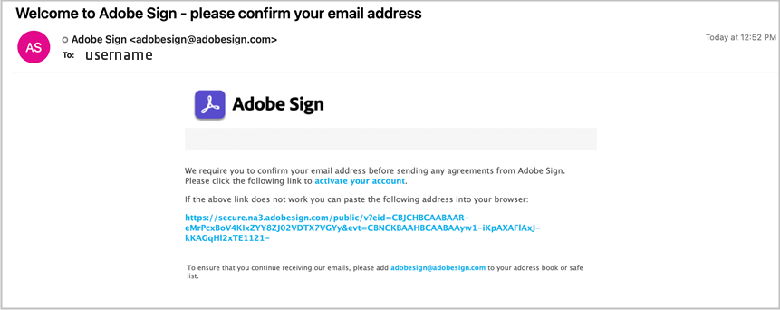

   Toutefois, si *Configurer automatiquement les utilisateurs Sign* est désactivée, la création d’utilisateurs Adobe Sign échoue et la fenêtre iFrame affiche un message demandant à l’utilisateur de contacter son administrateur de compte Adobe Sign. L’administrateur de compte Adobe Sign peut effectuer l’une des actions suivantes :

   * Activez la *Configurer automatiquement les utilisateurs Sign* pour le compte.
   * Créez l’utilisateur dans Adobe Sign avant d’utiliser l’intégration Veeva Vault Adobe Sign.

   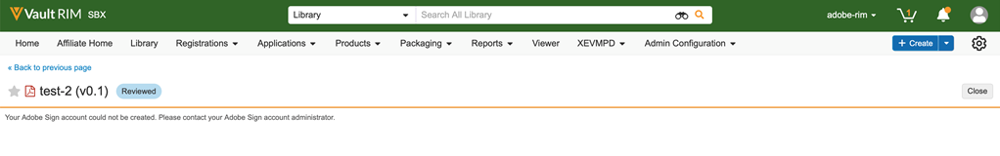

1. Une fois le document traité, faites glisser les champs de signature depuis le panneau de droite et sélectionnez **[!UICONTROL Envoyer]**.

   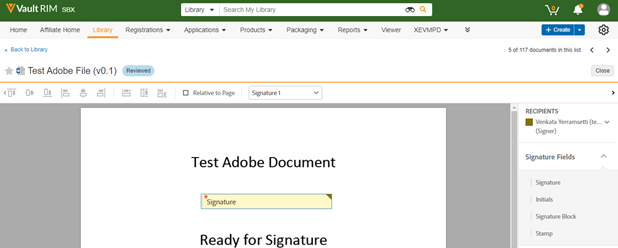

1. Il envoie le document au destinataire pour signature. Une fois que le destinataire reçoit l’e-mail du document, l’état du document change de [!UICONTROL Révisé] à [!UICONTROL En Adobe Signature].

   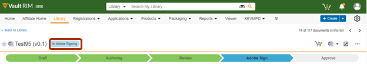

1. Une fois toutes les signatures capturées et complétées dans Adobe Sign, le statut du document dans le coffre devient [!UICONTROL Approuvé].

1. Sélectionner **[!UICONTROL Fichiers document]** et développez l&#39;élément **[!UICONTROL Rendus]** dans le coffre-fort. Une fois le document approuvé, un nouveau format associé nommé &quot;Adobe Sign Format associé&quot; est automatiquement créé.

   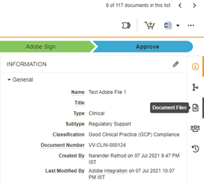

1. Téléchargez le rendu Adobe Sign pour valider la signature du destinataire.

   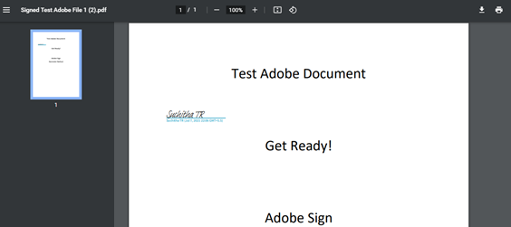

## Annulation d’un accord avec Adobe Sign pour [!DNL Veeva Vault] {#cancel-sign-vault-agreement}

1. Accédez à l’onglet [[!DNL Veeva Vault] page de connexion](https://login.veevavault.com/) et entrez votre nom d’utilisateur et votre mot de passe. Elle ouvre la page d&#39;accueil de votre chambre forte, comme indiqué ci-dessous.

   

1. Sélectionner **[!UICONTROL Bibliothèque]** , puis sélectionnez le document. Le statut du document peut être : [!UICONTROL Dans Adobe Sign Draft], [!UICONTROL Dans la création Adobe Sign], ou [!UICONTROL En Adobe Signature].

   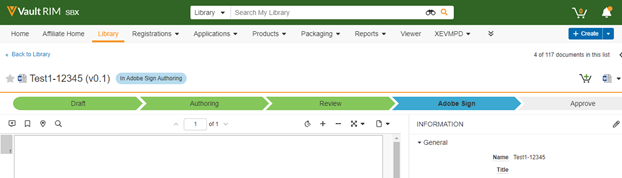

1. Sélectionner **[!UICONTROL Annuler Adobe Sign]**.

   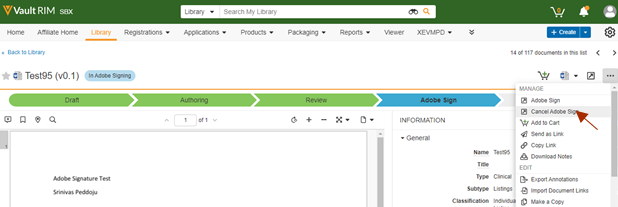

1. Il déclenche l’action Web et charge la fenêtre iFrame dans [!UICONTROL Vault].

   

1. Le statut du document devient automatiquement [!UICONTROL Révision].

   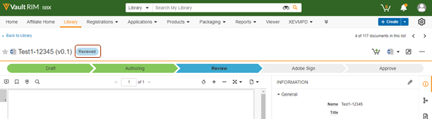

Une fois que le statut du document est remplacé par Révision, vous pouvez à nouveau l’envoyer pour signature.
