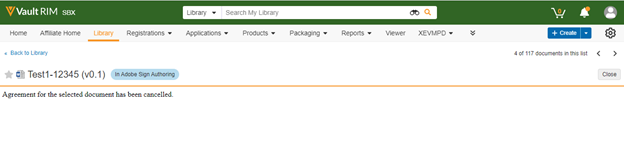

# Adobe Sign pour [!DNL Veeva Vault] : Guide de l’utilisateur {#veeva-vault-user-guide}

[**Contacter le support technique Adobe Sign**](https://adobe.com/go/adobesign-support-center_fr)

Ce document est conçu pour aider [!DNL Veeva Vault] les clients à apprendre à utiliser l’intégration Adobe Sign pour [!DNL Veeva Vault] afin d’envoyer un accord.

## Présentation {#overview}

L’intégration d’Adobe Sign avec [!DNL Veeva Vault] facilite le processus d’obtention d’une signature ou d’une approbation pour toute documentation nécessitant des signatures légales ou un traitement de documents vérifiable.

Le processus global d’envoi de documents pour signature est similaire à l’envoi d’un courrier électronique. Il est donc facile à adopter pour la plupart des utilisateurs.

L’intégration d’Adobe Sign avec [!DNL Veeva Vault] simplifie et accélère vos processus de signature et de document. En utilisant le flux de travaux d’intégration, vous pouvez :

* Gagnez du temps et économisez les ressources consacrées au courrier postal, à la surveillance et au fax.
* Envoyer des contrats pour signature électronique ou approbation par [!DNL Veeva Vault], accéder à l’historique des contrats en temps réel et consulter les contrats enregistrés.
* Suivez les accords en temps réel dans l’ensemble de votre organisation et obtenez des mises à jour lorsque les accords sont affichés, signés, annulés ou refusés.
* eSign est disponible dans plus de 20 langues et prend en charge le service de télécopie dans plus de 50 langues à travers le monde.
* Créez des modèles d’accord réutilisables pour les options d’envoi.

## Envoyer un accord à l’aide d’Adobe Sign pour [!DNL Veeva Vault] {#send-sign-vault-agreement}

Pour envoyer un accord via Adobe Sign pour Veeva :

1. Accédez à la [[!DNL Veeva Vault] page de connexion](https://login.veevavault.com/) et entrez votre nom d&#39;utilisateur et votre mot de passe. Il ouvre la page d&#39;accueil de votre coffre-fort, comme illustré ci-dessous.

   

1. Sélectionnez l&#39;onglet **[!UICONTROL Bibliothèque]**, puis **[!UICONTROL Créer]** dans le coin supérieur droit.

   

1. Sélectionnez **[!UICONTROL Télécharger et Continuer]**.

1. Téléchargez un document depuis votre lecteur local.

1. Dans la boîte de dialogue qui s’affiche, sélectionnez **[!UICONTROL Type]** en tant que *[!UICONTROL Clinique]*, puis sélectionnez un **[!UICONTROL Sous-type]** et **[!UICONTROL Classification]**, si nécessaire.

   

1. Sélectionnez **[!UICONTROL Ok]** pour fermer la boîte de dialogue.

1. Sélectionnez **[!UICONTROL Suivant]**.

1. Dans la fenêtre qui s’affiche, renseignez tous les champs requis dans la section des métadonnées et sélectionnez **[!UICONTROL Enregistrer]**.

   

1. Il crée un document test dans l’état **[!UICONTROL Brouillon]**, comme indiqué ci-dessous.

   

1. Dans le coin supérieur droit, sélectionnez l&#39;icône d&#39;engrenage ](images/icon-gear.png) dans le menu déroulant et sélectionnez **[!UICONTROL Commencer la révision]**.

1. Sélectionnez **[!UICONTROL Réviseur]** et **[!UICONTROL Date d&#39;échéance de la révision]**.

1. Sélectionnez **[!UICONTROL Démarrer]**. Il définit l’état du document sur [!UICONTROL EN RÉVISION].

   

1. Terminer la tâche assignée pour le compte des réviseurs. Une fois que vous avez terminé, le statut du document devient [!UICONTROL REVIEWED].

   

1. Sélectionnez  dans le menu déroulant et sélectionnez **[!UICONTROL Adobe Sign]**.

   

1. Dans la fenêtre iFrame qui s’ouvre dans Vault, entrez l’adresse électronique du destinataire et sélectionnez **[!UICONTROL Suivant]**.

   

1. Une fois le document traité, faites glisser et déposez les champs de signature dans le panneau de droite et sélectionnez **[!UICONTROL Envoyer]**.

   

1. Il envoie le document au destinataire pour signature. Une fois que le destinataire reçoit l’e-mail du document, l’état du document passe de [!UICONTROL Révisé] à [!UICONTROL Signature en Adobe].

   

1. Une fois toutes les signatures capturées et remplies dans Adobe Sign, l’état du document dans Vault passe à [!UICONTROL Approuvé].

1. Sélectionnez l’option **[!UICONTROL Fichiers de document]** et développez la section **[!UICONTROL Renditions]** dans Vault. Une fois que le document est dans l’état Approuvé, un nouveau rendu appelé &quot;Adobe Sign Rendition&quot; est automatiquement créé.

   

1. Téléchargez le fichier Adobe Sign Rendition pour valider la signature du destinataire.

   

## Annuler un accord à l’aide d’Adobe Sign pour [!DNL Veeva Vault] {#cancel-sign-vault-agreement}

1. Accédez à la [[!DNL Veeva Vault] page de connexion](https://login.veevavault.com/) et entrez votre nom d&#39;utilisateur et votre mot de passe. Il ouvre la page d&#39;accueil de votre coffre-fort, comme illustré ci-dessous.

   

1. Sélectionnez l’onglet **[!UICONTROL Bibliothèque]**, puis sélectionnez le document. L’état du document peut être : [!UICONTROL Dans Adobe Sign Draft], [!UICONTROL In Adobe Sign Authoring] ou [!UICONTROL In Adobe Signing].

   

1. Sélectionnez **[!UICONTROL Annuler Adobe Sign]**.

   

1. Il déclenche l’action Web et charge la fenêtre iFrame dans [!UICONTROL Vault].

   

1. L’état du document passe automatiquement en [!UICONTROL Révision].

   

Une fois l’état du document modifié en Révision, vous pouvez à nouveau l’envoyer pour signature.
