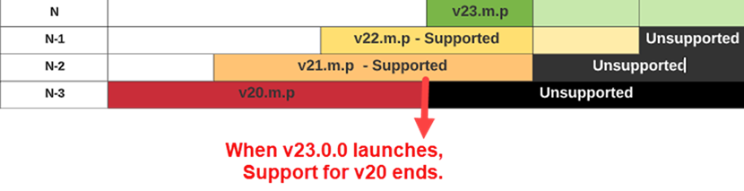
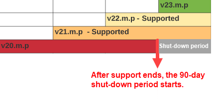

# Versions du produit et cycle de vie {#version}

La convention de contrôle de version d’Adobe Sign et le cycle de vie de prise en charge des services intégrés s’alignent sur les autres produits Adobe que vous connaissez peut-être déjà.

## Numéros de version

La version du package utilise un système de numérotation en trois parties pour identifier le numéro de version séquentiel de la version publiée et l’importation relative de la mise à niveau en termes de contenu nouveau ou modifié.

Le numéro de version suit ce modèle : N.m.p

Où, N = version majeure ; m = version mineure ; p = Version corrigée.

Par exemple, une version de package d’intégration 23.2.1 indique l’état de version suivant :

* Version majeure : 23
* Version mineure : 2
* Version du correctif : 1

Lorsque les ingénieurs développent de nouvelles &quot;versions&quot; du package, ils incrémentent le numéro de version en fonction de la nature des mises à jour du code.

* Les modifications majeures de la version impliquent un ajout significatif de fonctionnalités ou une modification importante des systèmes principaux.
* Les mises à jour mineures incluent des mises à jour de fonctionnalités et des correctifs de sécurité plus petits. Adobe Sign peut nécessiter une mise à niveau vers la dernière version corrigée en cas de mises à jour de sécurité ou pour résoudre un problème signalé.
* Les versions de correctifs sont presque exclusivement des correctifs de bugs et des ajustements de l’interface utilisateur.

>[!NOTE]
>
>Toutes les versions ne sont pas rendues publiques au fur et à mesure du développement du produit. Il peut donc y avoir des sauts importants dans la version du correctif entre les versions.

Les administrateurs doivent tenir leur version à jour pour s’assurer que le compte dispose d’un accès complet à toutes les fonctionnalités et que tous les problèmes de sécurité connus sont corrigés. Adobe Sign peut nécessiter une mise à niveau vers la dernière version corrigée en cas de problème de sécurité ou pour résoudre un problème système critique.

## Cycle de vie de support des versions

Le cycle de vie de la prise en charge des versions d’un produit d’intégration Adobe Sign est défini en fonction de la version majeure du package et indique la période pendant laquelle Adobe Sign prend en charge activement la version individuelle de l’intégration.

Adobe Sign prend en charge la version actuelle d’un package et les deux versions majeures précédentes (y compris toutes les mises à jour mineures et correctifs associés). Les versions majeures sont exprimées comme suit :

* Version actuelle (N) : la dernière version majeure du package.
* Version précédente (N-1) : une version majeure antérieure à la dernière version.
* Dernière version prise en charge (N-2) : deux versions majeures antérieures à la version actuelle.

Par exemple, si la version actuelle du package est 23.2.1, alors :

* Version majeure actuelle (N) : 23.
* La version majeure précédente (N-1) de ce package est 22.
* Dernière version majeure prise en charge (N-2) de ce package : 21.
* Toutes les versions antérieures à la version 21.0.0 ne sont plus prises en charge.

## Cycle de vie du service de version

Le cycle de vie du service de version définit la portée complète pendant tout le laps de temps où le service est utilisable. Le calendrier correspond au cycle de vie de la prise en charge des versions, plus une période de grâce de 90 jours qui permet aux clients de terminer leur mise à niveau.

* Pendant la période de grâce d’une version non prise en charge, la prise en charge est uniquement fournie pour la mise à niveau vers une version plus récente, et non pour la maintenance d’une version non prise en charge
* Après la période de grâce, la version n’est plus disponible

* Adobe Sign n’acceptera pas les requêtes provenant de versions hors service
* Une fois l’intégration mise à niveau vers la version actuelle, les communications entre Adobe Sign et l’intégration reprennent normalement

Si vous avez des questions, contactez votre revendeur ou le service clientèle.
