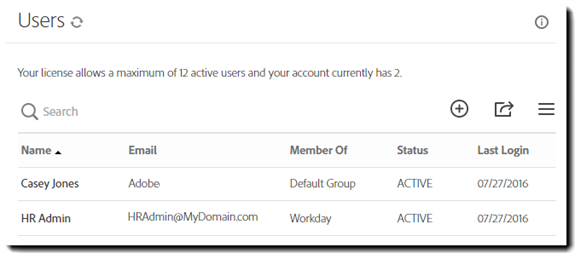

# [!DNL Workday] Guide d’installation{#workday-installation-guide}

[**Contacter le support technique Adobe Sign**](https://adobe.com/go/adobesign-support-center_fr)

## Présentation {#overview}

Ce document explique comment intégrer Adobe Sign dans votre client [!DNL Workday]. Pour utiliser Adobe Sign dans [!DNL Workday], vous devez savoir comment créer et modifier des éléments [!DNL Workday] tels que :

* Cadre des processus métier
* Configuration et configuration du client
* Intégration de Reporting and [!DNL Workday] studio

Les étapes de haut niveau permettant de terminer l’intégration sont les suivantes :

* Activer votre compte d’administration dans Adobe Sign (nouveaux clients uniquement)
* Configuration d’un groupe dans Adobe Sign pour qu’il contienne l’utilisateur d’intégration [!DNL Workday]
* Établir la relation OAuth entre [!DNL Workday] et Adobe Sign

## Activation de votre compte Adobe Sign {#activating-your-adobe-sign-account}

Les clients existants disposant de comptes établis peuvent passer à la rubrique [Configurer Adobe Sign pour [!DNL Workday]](#config).

Pour les clients qui ne sont pas nouveaux à Adobe Sign et qui ne disposent pas d&#39;une connexion préexistante, un spécialiste de l&#39;Adobe à l&#39;intégration met votre compte (à Adobe Sign) pour [!DNL Workday]. Une fois terminé, vous recevez un e-mail de confirmation comme indiqué ci-dessous.

Vous devez suivre les instructions de l’e-mail pour initialiser votre compte et accéder à votre [!UICONTROL page d’accueil ] Adobe Sign.

## Configurer Adobe Sign pour [!DNL Workday] {#config}

Pour configurer Adobe Sign pour [!DNL Workday], vous devez générer les deux objets dédiés suivants dans le système Adobe Sign :

* **Un  [!DNL Workday] groupe** :  [!DNL Workday] nécessite un &quot;groupe&quot; dédié au sein du compte Adobe Sign pour activer la fonctionnalité d’intégration. Le groupe Adobe Sign est utilisé pour contrôler uniquement l&#39;utilisation [!DNL Workday] de Adobe Sign. Toute autre utilisation potentielle, telle que Salesforce.com ou Arriba, n’est pas affectée. Les notifications par e-mail sont supprimées dans le groupe [!DNL Workday] de sorte que les utilisateurs [!DNL Workday] ne reçoivent des notifications que dans leur boîte de réception [!DNL Workday].

* **Un utilisateur qui s’authentifie pour détenir la clé** d’intégration : Un  [!DNL Workday] groupe ne doit avoir qu’un seul administrateur de niveau groupe, qui est le détenteur autorisé de la clé d’intégration. Nous recommandons à l’administrateur d’utiliser une adresse e-mail fonctionnelle telle que `HR@MyDomain.com` au lieu d’une adresse e-mail personnelle afin de réduire le risque de désactiver l’utilisateur à l’avenir et, par conséquent, de désactiver l’intégration.

### Création d’un utilisateur et d’un groupe dans Adobe Sign {#create-a-user-and-group-in-adobe-sign}

Création d’un utilisateur dans Adobe Sign :

1. Connectez-vous à Adobe Sign en tant qu’administrateur de compte.
1. Accédez à **[!UICONTROL Compte]** > **[!UICONTROL Utilisateurs]**.
1. Cliquez sur l&#39;icône  pour créer un nouvel utilisateur.

   

1. Dans la boîte de dialogue qui s’ouvre, fournissez les détails du nouvel utilisateur :

   * Fournissez un courrier électronique fonctionnel auquel vous pouvez accéder.
   * Entrez une valeur de prénom et de nom appropriée.
   * Sélectionnez **[!UICONTROL Créer un groupe pour cet utilisateur]** dans le groupe d&#39;utilisateurs.
   * Fournissez le **[!UICONTROL Nouveau nom de groupe]** avec un nom intuitif tel que *[!DNL Workday]*.

   

1. Cliquez sur **[!UICONTROL Enregistrer]**.

   Elle vous ramène à la page [!UICONTROL Utilisateurs] qui répertorie le nouvel utilisateur avec un état **[!UICONTROL CREATED]**.

   

Pour vérifier l’adresse électronique de l’utilisateur avec l’état &quot;Créé&quot; :

1. Connectez-vous à l’adresse e-mail du nouvel utilisateur.
2. Recherchez l’e-mail &quot;Bienvenue dans Adobe Sign&quot;.
3. Cliquez à l&#39;endroit où il est indiqué **[!UICONTROL Cliquez ici pour définir votre mot de passe]**.
4. Définissez le mot de passe.

Une fois l’adresse électronique vérifiée, l’état de l’utilisateur passe de [!UICONTROL CREATED] à [!UICONTROL ACTIVE].

### Définition de l’utilisateur d’authentification {#define-the-authenticating-user}

Pour promouvoir le nouvel utilisateur dans le groupe [!DNL Workday] :

1. Accédez à la page [!UICONTROL Utilisateurs] (si ce n&#39;est pas déjà fait).
2. Cliquez deux fois sur l’utilisateur dans le groupe [!DNL Workday].

   Cela ouvre une page [!UICONTROL Modifier] pour les autorisations utilisateur.

3. Vérifiez **[!UICONTROL Administrateur de groupe]**.
4. Cliquez sur **[!UICONTROL Enregistrer]**.

## Configuration du client [!DNL Workday] {#configure-workday}

Pour terminer la connexion entre le client [!DNL Workday] et Adobe Sign, nous devons établir une relation de confiance entre les services. Une fois cette opération terminée, nous pouvons ajouter une étape de révision de document qui active le processus de signature via Adobe Sign.

>[!NOTE]
>
>Adobe Sign est étiqueté comme Adobe Document Cloud dans tout l&#39;environnement [!DNL Workday].

Pour établir la relation de confiance :

1. Connectez-vous à [!DNL Workday] en tant qu&#39;administrateur de compte.
1. Ouvrez la page **[!UICONTROL Modifier la configuration du client - Processus métier]**.
1. Recherchez la section [!UICONTROL Configuration de la signature électronique] :

   

1. Cliquez sur **[!UICONTROL Authentifier avec l&#39;Adobe]**.

   La séquence d’authentification OAuth2.0 démarre.

1. Lorsque vous y êtes invité, fournissez les informations d’identification de l’administrateur du groupe Adobe Sign que vous avez créé précédemment.
1. Approuver l’accès à Adobe Sign.

>[!NOTE]
>
>Avant de continuer, assurez-vous de vous déconnecter complètement de toute autre instance Adobe Sign.

Une fois connecté, la case Configuration Adobe activée est cochée et vous pouvez commencer à utiliser Adobe Sign avec [!DNL Workday].

### Configuration de l’étape de révision de document {#configure-review}

Le document pour l’étape de révision de document peut être l’un des suivants :

* Un document statique
* Un document généré par une étape Générer un document au sein du même processus métier
* Rapport formaté créé avec le concepteur de rapports [!DNL Workday]

Vous pouvez ajouter l’un de ces documents avec des balises de texte d’Adobe ](https://adobe.com/go/adobesign_text_tag_guide_fr) pour contrôler l’aspect et la position des composants spécifiques de la signature d’Adobe. [ La source du document doit être spécifiée dans la définition du processus métier. Il n’est pas possible de télécharger un document ad hoc lors de l’exécution du processus métier.

La possibilité d’avoir des groupes de signataires sérialisés est unique pour utiliser Adobe Sign avec une étape de révision de document. Cela vous permet de spécifier un ordre de signature en fonction de groupes établis selon des rôles définis. Adobe Sign ne prend pas en charge les groupes de signature parallèles.

Pour obtenir de l’aide sur la configuration de l’étape de révision de document, consultez le [guide de démarrage rapide](https://adobe.com//go/adobesign_workday_quick_start){target=&quot;_blank&quot;}.

## Assistance technique {#support}

### [!DNL Workday] support {#workday-support}

[!DNL Workday]Propriétaire de l’intégration,  devra être votre premier point de contact pour toute question concernant l’intégration, les demandes relatives aux fonctionnalités ou les problèmes de fonctionnement général de l’intégration.

Vous pouvez vous référer aux articles de la communauté [!DNL Workday] suivants sur la façon de dépanner l&#39;intégration et de générer des documents :

* [Dépannage des intégrations de signature électronique](https://doc.workday.com/#/reader/3DMnG~27o049IYFWETFtTQ/zhA~hYllD3Hv1wu0CvHH_g)
* [Étape de révision des documents](https://doc.workday.com/#/reader/3DMnG~27o049IYFWETFtTQ/TboWWKQemecNipWgxLAjqg)
* [Génération de documents dynamiques](https://community.workday.com/saml/login?destination=/articles/176443)
* [Proposer des conseils sur la génération de documents](https://community.workday.com/node/183242)

### Prise en charge d’Adobe Sign {#adobe-sign-support}

En tant que partenaire de l’intégration, Adobe Sign doit être contacté lorsque l’intégration ne peut obtenir des signatures ou lorsque la notification de signatures en attente fait défaut.

Pour obtenir une assistance, les utilisateurs Adobe Sign doivent contacter leur responsable du succès client. Vous pouvez également contacter le support technique au 1-866-318-4100. Patientez jusqu’à l’annonce de la liste des produits, puis saisissez 4, puis 2 (lorsque vous y êtes invité).

* [Ajout de balises de texte d’Adobe aux documents](https://adobe.com/go/adobesign_text_tag_guide)
* [Vérifiez la configuration du document et les exemples](https://experienceleague.adobe.com/docs/dc-sign-integrations/using/workday/quick-start.html?lang=en){target=&quot;_blank&quot;}

## Questions courantes {#faq}

### Pourquoi l’état n’est-il pas mis à jour dans [!DNL Workday] même lorsque le document est entièrement signé ? {#why-is-the-status-not-being-updated-within-workday-even-the-document-is-fully-signed}

L’état du document dans [!DNL Workday] peut ne pas refléter si le candidat ne clique pas sur le bouton &quot;[!UICONTROL Envoyer]&quot; après avoir signé dans Adobe Sign.

Conformément à la tâche [!DNL Workday] Vérifier l’état de signature électronique : Pour lancer le processus, l&#39;utilisateur peut soumettre la tâche de boîte de réception associée.

Selon [!DNL Workday] Développement : La signature d’origine ne termine le processus que si l’utilisateur envoie la tâche de boîte de réception après avoir signé le document. Après la signature, l’iframe est fermé et l’utilisateur est redirigé vers la même tâche où il peut cliquer sur le bouton [!UICONTROL Envoyer] pour terminer le processus.
