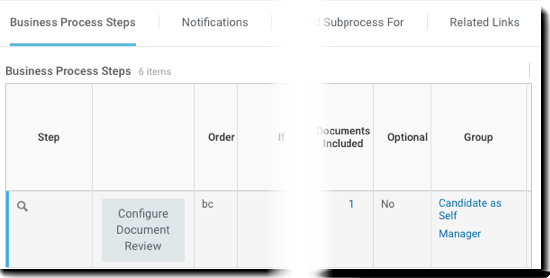
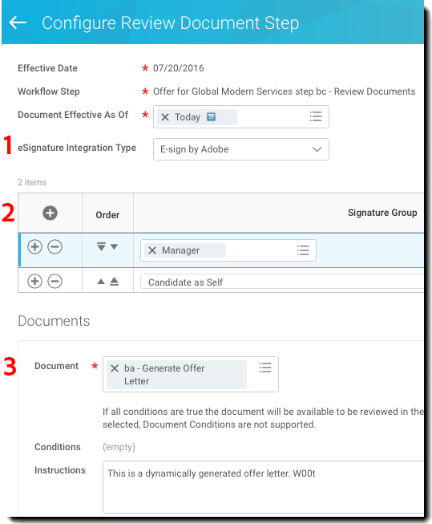
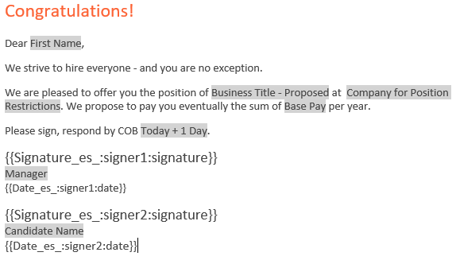
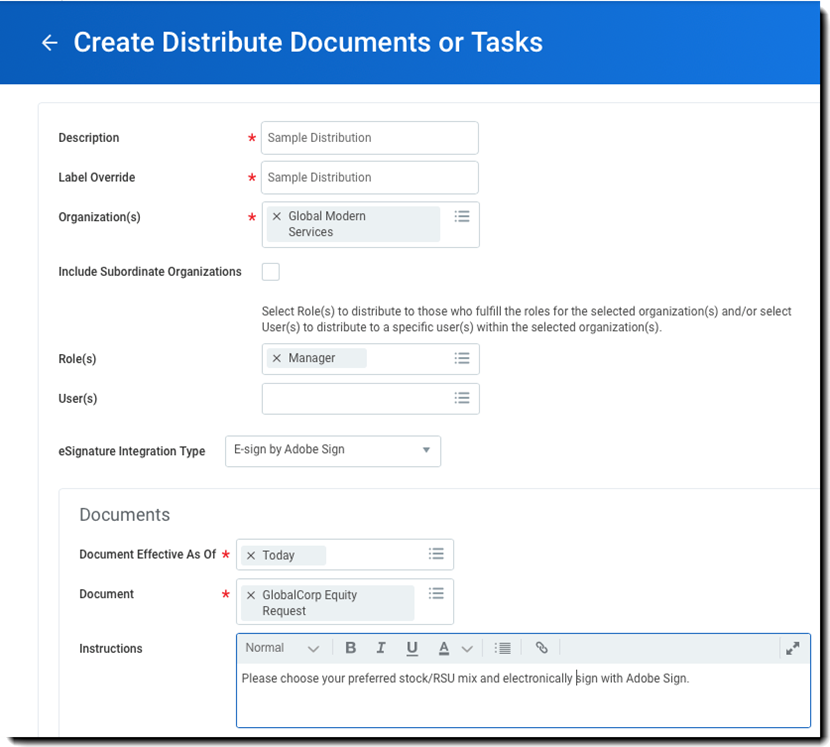

# [!DNL Workday] Guide de démarrage rapide{#workday-quick-start-guide}

[**Contacter le support technique Adobe Sign**](https://www.adobe.com/go/adobesign-support-center)

## Présentation {#overview}

Ce document est conçu pour vous aider [!DNL Workday] les administrateurs savent comment personnaliser le fichier [!DNL Workday] Processus métier incluant Adobe Sign pour l’obtention de signatures électroniques. Pour utiliser Adobe Sign dans [!DNL Workday], vous devez savoir comment créer et modifier [!DNL Workday] des éléments tels que :

* [!UICONTROL Business Process Framework]
* Configuration et configuration du client
* Rapports et [!DNL Workday] Intégration de Studio

## Accès à Adobe Sign dans [!DNL Workday] {#access-adobe-sign}

[!UICONTROL Fonctionnalité de signature électronique d&#39;Adobe Sign] apparaît sous la forme [!UICONTROL Étape de révision de document] dans le fichier [!UICONTROL Business Process Framework (BPF)] et en tant que tâche de distribution de documents.

## [!UICONTROL Étape de Review Document (Révision de document)] {#review-document-step}

Adobe Sign pour [!DNL Workday] est exposée via le panneau [!UICONTROL Étape de révision de document] que vous pouvez ajouter à l&#39;un des plus de 400 processus métier [!DNL Workday], y compris [!UICONTROL Offre], [!UICONTROL Distribution de documents et de tâches], [!UICONTROL Proposer une rémunération], etc.

Vous pouvez vous référer à la [[!DNL Workday] articles de la communauté [!UICONTROL Étape de révision de document]](https://doc.workday.com/#/reader/3DMnG~27o049IYFWETFtTQ/TboWWKQemecNipWgxLAjqg).

Il existe une relation 1:1 entre [!UICONTROL [!UICONTROL Étape de révision de document]s] et les transactions facturables avec Adobe Sign. Vous pouvez combiner plusieurs documents au sein d’un même document [!UICONTROL Étape de révision de document] et ils sont présentés sous la forme d’un package unique pour signature.

**Remarque**: Un seul fichier *Dynamique* document peut être référencé dans un fichier [!UICONTROL Étape de révision de document].

Pour définir une fonction [!UICONTROL Étape de révision de document]:

1. Insérez un élément [!UICONTROL Étape de révision de document].
1. Spécifiez les groupes (rôles) qui peuvent agir sur le [!UICONTROL Étape de révision de document].

Pour configurer le fichier [!UICONTROL Étape de révision de document]:

1. Spécifiez le *[!UICONTROL Type d’intégration eSignature]* comme *[!UICONTROL Signature électronique par Adobe]*.

1. Ajoutez des lignes à la grille de signatures.

   * La grille de signatures spécifie l’ordre séquentiel dans lequel le document est envoyé pour signature. Chaque ligne peut contenir un ou plusieurs rôles et chaque ligne représente une étape du processus de signature..
   * Chaque membre du rôle dans une étape particulière est informé qu’un événement de signature est en attente.
   * Une fois qu’une seule personne du rôle signe, l’étape de ligne est terminée et le document passe à l’étape de ligne suivante.
   * Lorsque toutes les lignes ont été signées, la [!UICONTROL Étape de révision de document] est terminée.

1. Spécifiez le document à signer. Si le document est un fichier [!UICONTROL Offre BP], vous pouvez l’utiliser à partir d’une étape Générer le document . Sinon, sélectionnez un document ou un rapport existant.

1. Répétez l’étape 3 en fonction du nombre de documents nécessaire..

   

1. Éventuellement, ajoutez un utilisateur de redirection pour capturer les actions de refus de signature. Lorsque les utilisateurs refusent, [!DNL Workday] redirige les documents vers un groupe de sécurité configuré pour révision.

Dans le menu des actions associées d’un [!UICONTROL Étape de révision de document], sélectionnez **[!UICONTROL Processus métier]** > **[!UICONTROL Conserver la redirection]**. Ensuite, sélectionnez l’une des options suivantes :

* **[!UICONTROL Retour]**: Pour permettre aux membres du groupe de sécurité de renvoyer une étape à une étape précédente du processus métier. Le processus métier redémarre à partir de cette étape.
* **[!UICONTROL Passer à l’étape suivante]**: Pour permettre aux membres du groupe de sécurité de passer à l&#39;étape suivante du processus métier.
* **[!UICONTROL Groupes de sécurité]**: Pour rediriger les étapes du flux de processus métier. Les groupes de sécurité qui s&#39;affichent à cette invite sont sélectionnés dans la stratégie de sécurité des processus métier de la section Rediriger.

## Notes sur les étapes du processus métier {#business-process-step-notes}

[!UICONTROL Cadre des processus métier] est puissant ; cependant, vous devez vous assurer que :

* Chaque processus métier doit comporter une étape d&#39;achèvement, qui se situe idéalement à la fin du processus métier.

* Une étape de fin est définie à partir du menu d’actions associées de l’icône de recherche. Cela n&#39;est possible que lorsque vous &quot;visualisez&quot; le PM et non lorsque vous le &quot;modifiez&quot;.

* Chaque étape du processus métier est exécutée séquentiellement.

   Vous pouvez modifier l’ordre d’une étape en modifiant la valeur de l’ordre. Par exemple, pour insérer une étape entre les éléments &quot;c&quot; et &quot;d&quot;, spécifiez un nouvel élément comme &quot;ca&quot;.

### Exemple : offre {#example-offer}

Le PM d&#39;offre est un sous-processus du [!UICONTROL Demande d&#39;emploi Dynamic BP] qui doit être configuré pour exécuter le PM d&#39;offre. Il est déclenché lorsque l’état de l’application de travail est déplacé vers &quot;[!UICONTROL Offre]&quot; ou &quot;[!UICONTROL Faire une offre]&quot;.

Dans l’exemple ci-dessous, un élément [!UICONTROL Étape de révision de document] utilise une étape de document dynamique pour l’Amérique du Nord et le Japon.

![[!DNL Workday]Exemple d’un processus métier ](images/bp-for-offersmaller-575.png)

Ce PM permet d’effectuer les opérations suivantes :

* Demande à l&#39;initiateur du PM de proposer une compensation pour le candidat (étape b).
* Utilise une condition d’étape pour tester si le pays actuel n’est PAS le Japon.

   Si true, il exécute l&#39;étape &quot;ba&quot; qui utilise un document en anglais.

   Si la valeur est false, il exécute l&#39;étape &quot;bb&quot; qui utilise un document en langue japonaise.

* Définit le processus de signature dans le [!UICONTROL Étape de révision de document] &quot;bc&quot;.
* Définit le point de décision pour faire une offre à l&#39;étape d&#39;achèvement requise &quot;d&quot;.

Le document dynamique créé lors de l’étape « ba » est appelé [!UICONTROL Offer Letter] (Lettre d’offre), et contient un seul bloc de texte appelé [!UICONTROL Rapid Offer] (Offre rapide). Vous pouvez ajouter plusieurs blocs de texte tels que l’en-tête, les salutations, la rémunération, les actions, la clôture, les conditions, etc., selon vos besoins.

![[!DNL Workday] page afficher le document](images/offer-letter-575.png)

La lettre d’offre dynamique ci-dessous est créée dans le [!DNL Workday] éditeur de texte enrichi. Les éléments mis en évidence dans *gris* sont [!DNL Workday] objets fournis qui font référence à des données contextuelles.

Les éléments entre {{accolades}} sont des [balises de texte Adobe](https://adobe.com/go/adobesign_text_tag_guide_fr).

Dans le [!UICONTROL Étape de révision de document], le document dynamique est référencé à partir de l’étape précédente et définit le processus de signature séquentiel via deux groupes de signature.

Le comportement illustré ci-dessous achemine d’abord le document généré dynamiquement vers le gestionnaire d’embauche, puis vers le candidat.

![[!DNL Workday] groupes de signature en cours de définition](images/configure-rd-stepsmaller-575.png)

### Exemple : Distribution de documents {#example-distribute-documents}

Introduit dans [!DNL Workday] 30, la tâche Distribuer en masse des documents ou des tâches peut être utilisée pour envoyer un seul document à un grand groupe (&lt;20K) de signataires individuels. Elle consiste en une seule signature par document. La création d’une distribution s’effectue en accédant au[!UICONTROL Créer des documents ou des tâches distribués]dans la barre de recherche.

Exemple : Envoyez un formulaire de choix d&#39;équité salariale à tous les gestionnaires avec [!UICONTROL Global Modern Services]. Si vous le souhaitez, vous pouvez le filtrer davantage pour chaque responsable.

Vous pouvez également accéder à la **Afficher Distribuer des documents ou des tâches** pour suivre la progression de la distribution.

### Exemple : création de rapports {#example-reporting}

[!DNL Workday] propose une puissante infrastructure de création de rapports. Pour obtenir un aperçu détaillé du processus d’Adobe Sign, consultez les informations concernant le processus *Review Document Event* (Révision l’évènement du document).

Vous trouverez ci-dessous un rapport simple et personnalisé pouvant être exécuté dans tous les PM pour rechercher les transactions ainsi que les états associés Adobe Sign.

![[!DNL Workday]Exemple d’un rapport personnalisé ](images/review-document-eventsmaller-575.png)

Le rapport suivant a été généré grâce à la recherche des PM suivants : Offer (Offre), Onboarding (Accueil et Intégration), et Propose Compensation (Proposer une rémunération) dans le client d’implémentation.

Vous pouvez consulter :

* Les documents envoyés en vue de leur signature
* L’étape PM associée
* La prochaine personne devant signer

![[!DNL Workday]Exemple d’un rapport généré avec trois éléments](images/workday-reportsmaller-575.png)

## Documents signés {#signed-documents}

La [!DNL Workday] le cycle de signature supprime toutes les notifications par courrier électronique envoyées par Adobe Sign. Les utilisateurs sont informés des actions en attente dans leur [!DNL Workday] boîte de réception.

Une fois qu’un document est signé par tous les groupes de signature, une copie du document signé est distribuée à tous les membres du groupe de signature par courrier électronique.

Pour supprimer ce comportement, vous pouvez contacter votre [!UICONTROL Adobe Sign Success Manager] ou le [Équipe de support Adobe Sign](https://adobe.com/go/adobesign-support-center).

Dans [!DNL Workday], vous pouvez accéder aux documents signés sur l’enregistrement du processus complet. Vous pouvez trouver :

* Documents du collaborateur sur le profil du collaborateur, et
* Documents du candidat (lettres d&#39;offre) sur le profil du candidat.

L&#39;image ci-dessous montre une lettre d&#39;offre signée pour le candidat Chris Foxx.

![Exemple [!DNL Workday] lettre d&#39;offre](images/offer.png)

## Assistance technique {#support}

### [!DNL Workday] support {#workday-support}

[!DNL Workday]Propriétaire de l’intégration,  devra être votre premier point de contact pour toute question concernant l’intégration, les demandes relatives aux fonctionnalités ou les problèmes de fonctionnement général de l’intégration.

La [!DNL Workday] La communauté dispose de plusieurs articles intéressants sur la façon de résoudre les problèmes d’intégration et de générer des documents :

* [Dépannage des intégrations de signature électronique](https://doc.workday.com/#/reader/3DMnG~27o049IYFWETFtTQ/zhA~hYllD3Hv1wu0CvHH_g)
* [Étape de révision de documents](https://doc.workday.com/#/reader/3DMnG~27o049IYFWETFtTQ/TboWWKQemecNipWgxLAjqg)
* [Création de documents dynamiques](https://community.workday.com/node/176443)
* [Conseils pour la configuration de la création de documents d’offre](https://community.workday.com/node/183242)

### Support Adobe Sign {#adobe-sign-support}

En tant que partenaire de l’intégration, Adobe Sign doit être contacté lorsque l’intégration ne peut obtenir des signatures ou lorsque la notification de signatures en attente fait défaut.

Les clients Adobe Sign doivent contacter leur gestionnaire de la réussite client pour obtenir de l’aide. Alternativement, [!UICONTROL Support technique Adobe] est accessible par téléphone : 1-866-318-4100, attendez la liste des produits, puis entrez : 4 puis 2 (lorsque vous y êtes invité).

* [Ajout de balises de texte Adobe sur des documents](https://www.adobe.com/go/adobesign_text_tag_guide)

<!--
[Download PDF](images/adobe-sign-for-workday-quick-start-guide-2016.pdf)
-->
