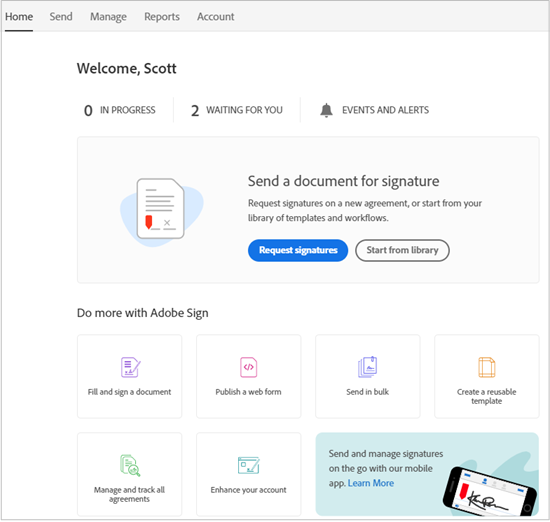

# [!DNL Workday] Installation de la version d’évaluation{#workday-trial-installation}

## Présentation {#overview}

Ce document est conçu pour aider [!DNL Workday] les clients à apprendre à activer un compte d&#39;évaluation avec Adobe Sign, puis à l&#39;intégrer dans [!DNL Workday] le client. Pour utiliser Adobe Sign dans [!DNL Workday], vous devez savoir comment créer et modifier des éléments [!DNL Workday] tels que :

* Cadre des processus métier
* Configuration et configuration du client
* Intégration de Reporting and [!DNL Workday] Studio

**Remarque** : Si vous disposez d’un compte Adobe Sign existant, il n’est pas nécessaire de lancer une version d’évaluation. Vous pouvez contacter votre Client Success Manager pour demander l&#39;intégration de [!DNL Workday].

La procédure avancée permettant d’effectuer l’intégration comprend :

* Activation du compte d’évaluation avec Adobe Sign
* Génération d’une clé d’intégration dans Adobe Sign
* Installer la clé d&#39;intégration dans le client [!DNL Workday]

## Activation de votre compte d’évaluation Adobe Sign {#activate-sign-trial-account}

Pour demander une version d&#39;essai de 30 jours d&#39;Adobe Sign, vous devez remplir ce [formulaire d&#39;inscription](https://land.echosign.com/esign-trial-workday-registration.html).

**Remarque** : Nous vous recommandons vivement d’utiliser une adresse e-mail fonctionnelle valide pour créer la version d’évaluation et non un courrier électronique temporaire. Vous devez accéder à cet e-mail pour vérifier le compte. L’adresse doit donc être valide.

Dans un délai d&#39;un jour ouvrable, un spécialiste Adobe Sign de l&#39;intégration vous réserve votre compte (à Adobe Sign) pour [!DNL Workday]. Une fois terminé, vous recevez un e-mail de confirmation comme indiqué ci-dessous.

Suivez les instructions de l’e-mail pour initialiser votre compte et accéder à votre page d’accueil [!UICONTROL Adobe Sign ].

## Génération d’une clé d’intégration {#generate-an-integration-key}

Pour les nouvelles installations, vous devez générer une clé d&#39;intégration dans Adobe Sign, puis la saisir dans [!DNL Workday]. Cette clé authentifie les environnements Adobe Sign et [!DNL Workday] pour se faire confiance et partager du contenu.

Création d’une clé d’intégration dans Adobe Sign :

1. Ouvrez une session administrateur dans Adobe Sign..
1. Accédez à **[!UICONTROL **Compte]** > **[!UICONTROL Préférences personnelles]** > **[!UICONTROL Jetons d’accès**]**.
1. Cliquez sur l&#39;icône **plus cerclé** sur le côté droit de la fenêtre.

   Il ouvre l&#39;interface [!UICONTROL Créer une clé d&#39;intégration].

   

1. Fournissez un nom intuitif pour votre clé, tel que [!DNL Workday].

   Les éléments de la clé d’intégration suivants doivent être activés :

   * agreement_read
   * agreement_write
   * agreement_send
   * widget_read
   * library_read

   

1. Cliquez sur **[!UICONTROL Enregistrer]**.

   La page [!UICONTROL Jetons d’accès] apparaît et indique les clés associées à votre compte.

1. Cliquez sur la définition de clé créée pour [!DNL Workday].

   Le lien [!UICONTROL Clé d&#39;intégration] apparaît en haut de la définition.

1. Cliquez sur le lien **[!UICONTROL Clé d&#39;intégration]**.

   Elle expose la clé d’intégration.

   

1. Copiez cette clé et enregistrez-la à un emplacement sécurisé pour l’étape suivante.
1. Cliquez sur **[!UICONTROL OK]**.

   

## Configuration du client [!DNL Workday] {#configuring-the-workday-tenant}

### Installation de la clé d’intégration {#install-the-integration-key}

L&#39;installation de la clé d&#39;intégration dans le client [!DNL Workday] établit la relation d&#39;approbation avec Adobe Sign. Une fois cette relation établie, un [!UICONTROL processus métier peut avoir ajouté une étape de révision de document] qui active le processus de signature.

**Remarque**[!DNL Workday] : Adobe Sign est appelé « Adobe Document Cloud » dans l’ensemble de l’environnement 

Installation de la clé d’intégration :

1. Connectez-vous à [!DNL Workday] en tant qu&#39;administrateur de compte.
1. Recherchez et ouvrez la page **[!UICONTROL Modifier la configuration du client - Processus métier]**.

1. Fournir des informations pour les quatre champs suivants :

   * **[!UICONTROL Remerciements]** Adobe Document Cloud : Un accusé de réception fixe de l’intégration.

   * **[!UICONTROL Clé]** API Adobe Document Cloud : Emplacement d’installation de la clé d’intégration

   * **[!UICONTROL Adresse électronique]** de l&#39;expéditeur Adobe Document Cloud : Adresse électronique de l’administrateur de groupe à Adobe Sign

   * **[!UICONTROL Supprimer les documents en attente de signature électronique lorsque le document est annulé]** : Configuration facultative qui supprime des documents du cycle de signature si un document est annulé dans  [!DNL Workday].

   

1. Ensuite, terminez l’installation :

   1. Collez votre clé d’intégration dans le champ [!UICONTROL Clé d’intégration d’API Adobe Sign].
   1. Saisissez l’adresse électronique de l’administrateur Adobe Sign dans le champ [!UICONTROL Adresse électronique de l’expéditeur Adobe Document Cloud].
   1. Cliquez sur **[!UICONTROL OK]**.

   

La fonctionnalité Adobe Sign peut désormais être ajoutée à tout processus métier en ajoutant une [!UICONTROL étape de révision de document] et en la configurant pour utiliser **[!UICONTROL eSign par Adobe]** comme type de signature électronique.

### Configuration de l’étape de révision de document {#configure-the-review-document-step}

Le document pour l’étape de révision de document peut être un document statique ; un document généré par une étape Générer le document au sein du même processus métier ; ou un rapport formaté créé avec le concepteur de rapports [!DNL Workday]. Les [balises de texte Adobe](https://adobe.com/go/adobesign_text_tag_guide_fr) peuvent être utilisées dans tous les cas précédemment mentionnés pour modifier l’apparence et le positionnement des éléments spécifiques d’Adobe Sign. La source du document doit être spécifiée dans la définition du processus métier. Il est impossible de télécharger un document ad hoc pendant l’exécution du processus métier.

La possibilité d’avoir des groupes de signataires sérialisés est unique pour utiliser Adobe Sign avec une étape de révision de document. Les groupes de signataires vous permettent de spécifier les groupes basés sur des rôles qui se connectent en séquence. Adobe Sign ne prend pas en charge les groupes de signature parallèles.

Pour obtenir de l’aide sur la configuration de l’étape de révision de document, consultez le [Guide de démarrage rapide](https://adobe.com//go/adobesign_workday_quick_start){target=&quot;_blank&quot;}.

## Assistance technique {#support}

### [!DNL Workday] support {#workday-support}

[!DNL Workday]Propriétaire de l’intégration,  devra être votre premier point de contact pour toute question concernant l’intégration, les demandes relatives aux fonctionnalités ou les problèmes de fonctionnement général de l’intégration.

La communauté [!DNL Workday] a plusieurs bons articles sur la façon de résoudre les problèmes d&#39;intégration et de générer des documents :

* [Dépannage des intégrations de signature électronique](https://doc.workday.com/#/reader/3DMnG~27o049IYFWETFtTQ/zhA~hYllD3Hv1wu0CvHH_g)
* [Étape de révision de documents](https://doc.workday.com/#/reader/3DMnG~27o049IYFWETFtTQ/TboWWKQemecNipWgxLAjqg)
* [Création de documents dynamiques](https://community.workday.com/node/176443)

* [Conseils pour la configuration de la création de documents d’offre](https://community.workday.com/node/183242)

### Prise en charge d’Adobe Sign {#adobe-sign-support}

En tant que partenaire de l’intégration, Adobe Sign doit être contacté lorsque l’intégration ne peut obtenir des signatures ou lorsque la notification de signatures en attente fait défaut.

Pour obtenir une assistance, les utilisateurs Adobe Sign doivent contacter leur responsable du succès client. Vous pouvez également contacter le support technique Adobe par téléphone : 1-866-318-4100; attendez la liste des produits, puis entrez : 4, puis 2 (à l’invite).

* [Ajout de balises de texte Adobe sur des documents](https://adobe.com/go/adobesign_text_tag_guide)

* [Configuration et exemples de la fonctionnalité de révision de document](https://www.adobe.com//go/adobesign_workday_quick_start)

[**Contacter le support technique Adobe Sign**](https://adobe.com/go/adobesign-support-center_fr)
