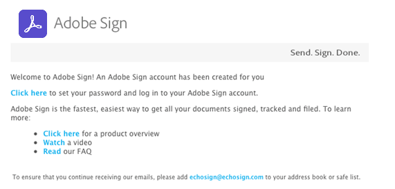

# [!DNL Workday] Installation de la version d’évaluation{#workday-trial-installation}

## Présentation {#overview}

Ce document est conçu pour vous aider [!DNL Workday] les clients apprennent à activer un compte d’essai avec Adobe Sign, puis à l’intégrer à [!DNL Workday] client. Pour utiliser Adobe Sign dans [!DNL Workday], vous devez savoir comment créer et modifier [!DNL Workday] des éléments tels que :

* Framework de processus métier
* Configuration et configuration du client
* Rapports et [!DNL Workday] Intégration de Studio

**Remarque**: Si vous disposez déjà d’un compte Adobe Sign, il n’est pas nécessaire de commencer une évaluation. Vous pouvez contacter votre responsable du succès client pour demander [!DNL Workday] intégration.

La procédure avancée permettant d’effectuer l’intégration comprend :

* Activation du compte d’évaluation avec Adobe Sign
* Génération d’une clé d’intégration dans Adobe Sign
* Installez la clé d’intégration dans le [!DNL Workday] Client

## Activation de votre compte d’essai Adobe Sign {#activate-sign-trial-account}

Pour demander une version d’essai de 30 jours d’Adobe Sign, vous devez remplir ce champ [formulaire d&#39;inscription](https://land.echosign.com/esign-trial-workday-registration.html).

**Remarque**: Nous vous recommandons vivement d’utiliser une adresse électronique fonctionnelle valide pour créer la version d’essai, et non une adresse électronique temporaire. Vous devez accéder à cet e-mail pour vérifier le compte. L’adresse doit donc être valide.

Dans un délai d’un jour ouvrable, un spécialiste de l’intégration Adobe Sign provisionne votre compte (dans Adobe Sign) pour [!DNL Workday]. Une fois l’opération terminée, vous recevrez un e-mail de confirmation, comme indiqué ci-dessous.

Pour initialiser votre compte et accéder à votre Adobe Sign [!UICONTROL Accueil] , suivez les instructions dans l’e-mail .

## Génération d’une clé d’intégration {#generate-an-integration-key}

Pour les nouvelles installations, vous devez générer une clé d’intégration dans Adobe Sign, puis la saisir dans le champ [!DNL Workday]. Cette clé authentifie l’Adobe Sign et [!DNL Workday] pour se faire confiance et partager du contenu.

Création d’une clé d’intégration dans Adobe Sign :

1. Ouvrez une session administrateur dans Adobe Sign..
1. Accédez à **[!UICONTROL **Compte]** > **[!UICONTROL Préférences personnelles]** > **[!UICONTROL Jetons d’accès **]**.
1. Cliquez sur le bouton **icône plus entourée** sur le côté droit de la fenêtre.

   Cela ouvre la boîte de dialogue [!UICONTROL Créer une clé d’intégration] l&#39;interface.

   

1. Donnez un nom intuitif à votre clé, tel que [!DNL Workday].

   Les éléments de la clé d’intégration suivants doivent être activés :

   * agreement_read
   * agreement_write
   * agreement_send
   * widget_read
   * library_read

   

1. Cliquez sur **[!UICONTROL Enregistrer]**.

   La page [!UICONTROL Jetons d’accès] apparaît et indique les clés associées à votre compte.

1. Cliquez sur la définition de clé créée pour [!DNL Workday].

   La [!UICONTROL Clé d’intégration] est affiché en haut de la définition.

1. Cliquez sur le bouton **[!UICONTROL Clé d’intégration]** lien.

   La clé d’intégration s’affiche.

   

1. Copiez cette clé et conservez-la en lieu sûr pour l’étape suivante.
1. Cliquez sur **[!UICONTROL OK]**.

   

## Configurez le fichier [!DNL Workday] client {#configuring-the-workday-tenant}

### Installation de la clé d’intégration {#install-the-integration-key}

Installation de la clé d’intégration dans le [!DNL Workday] établit la relation de confiance avec Adobe Sign. Une fois cette relation en place, tout processus métier peut avoir un [!UICONTROL Étape de révision de document] qui active le processus de signature.

**Remarque**[!DNL Workday] : Adobe Sign est appelé « Adobe Document Cloud » dans l’ensemble de l’environnement 

Installation de la clé d’intégration :

1. Se connecter à [!DNL Workday] en tant qu’administrateur de compte.
1. Recherchez et ouvrez le fichier **[!UICONTROL Modifier les paramètres Client - Processus métier]** s&#39;affiche.

1. Fournissez des informations pour les quatre champs suivants :

   * **[!UICONTROL Remerciements Adobe Document Cloud]**: Un accusé de réception textuel fixe de l’intégration.

   * **[!UICONTROL Clé API Adobe Document Cloud]**: Emplacement d’installation de la clé d’intégration

   * **[!UICONTROL Adresse électronique de l’expéditeur Adobe Document Cloud]**: Adresse e-mail de l’administrateur de groupe dans Adobe Sign

   * **[!UICONTROL Supprimer les documents en attente de signature électronique lorsque le document est annulé]**: Configuration facultative qui supprime des documents du cycle de signature si un document est annulé dans [!DNL Workday].

   

1. Ensuite, terminez l’installation :

   1. Collez votre clé d’intégration dans le [!UICONTROL Clé d’intégration API Adobe Sign] .
   1. Saisissez l’adresse électronique de l’administrateur Adobe Sign dans le champ [!UICONTROL Adresse électronique de l’expéditeur Adobe Document Cloud] .
   1. Cliquez sur **[!UICONTROL OK]**.

   

La fonctionnalité Adobe Sign peut désormais être ajoutée à n’importe quel processus métier en ajoutant un élément [!UICONTROL Étape de révision de document] et en le configurant pour utiliser **[!UICONTROL Signature électronique par Adobe]** comme type de signature électronique.

### Configuration de l’étape de révision de document {#configure-the-review-document-step}

Le document pour l’étape de révision de document peut être un document statique ; un document généré par une étape Générer le document dans le même processus métier ; ou, un rapport formaté créé avec le fichier [!DNL Workday] Concepteur de rapports. Les [balises de texte Adobe](https://adobe.com/go/adobesign_text_tag_guide_fr) peuvent être utilisées dans tous les cas précédemment mentionnés pour modifier l’apparence et le positionnement des éléments spécifiques d’Adobe Sign. La source du document doit être spécifiée dans la définition du processus métier. Il n’est pas possible de télécharger un document ad hoc pendant l’exécution du processus métier.

L’utilisation d’Adobe Sign avec une étape de révision de document se caractérise uniquement par la possibilité d’avoir des groupes de signataires sérialisés. Les groupes de signataires vous permettent de spécifier des groupes basés sur un rôle qui se connectent dans l’ordre. Adobe Sign ne prend pas en charge les groupes de signature parallèles.

Pour obtenir de l’aide sur l’étape de révision de document, consultez la page [Guide de démarrage rapide](https://adobe.com//go/adobesign_workday_quick_start){target=&quot;_blank&quot;}.

## Assistance technique {#support}

### [!DNL Workday] support {#workday-support}

[!DNL Workday]Propriétaire de l’intégration,  devra être votre premier point de contact pour toute question concernant l’intégration, les demandes relatives aux fonctionnalités ou les problèmes de fonctionnement général de l’intégration.

La [!DNL Workday] La communauté dispose de plusieurs articles intéressants sur la façon de résoudre les problèmes d’intégration et de générer des documents :

* [Dépannage des intégrations de signature électronique](https://doc.workday.com/#/reader/3DMnG~27o049IYFWETFtTQ/zhA~hYllD3Hv1wu0CvHH_g)
* [Étape de révision de documents](https://doc.workday.com/#/reader/3DMnG~27o049IYFWETFtTQ/TboWWKQemecNipWgxLAjqg)
* [Création de documents dynamiques](https://community.workday.com/node/176443)

* [Conseils pour la configuration de la création de documents d’offre](https://community.workday.com/node/183242)

### Support Adobe Sign {#adobe-sign-support}

En tant que partenaire de l’intégration, Adobe Sign doit être contacté lorsque l’intégration ne peut obtenir des signatures ou lorsque la notification de signatures en attente fait défaut.

Pour obtenir une assistance, les utilisateurs Adobe Sign doivent contacter leur responsable du succès client. Vous pouvez également contacter le support technique de l’Adobe par téléphone : 1-866-318-4100 ; attendez la liste de produits, puis entrez : 4 puis 2 (lorsque vous y êtes invité).

* [Ajout de balises de texte Adobe sur des documents](https://adobe.com/go/adobesign_text_tag_guide)

* [Configuration et exemples de révision de document](https://www.adobe.com//go/adobesign_workday_quick_start){target=&quot;_blank&quot;}

[**Contacter le support technique Adobe Sign**](https://www.adobe.com/go/adobesign-support-center)
